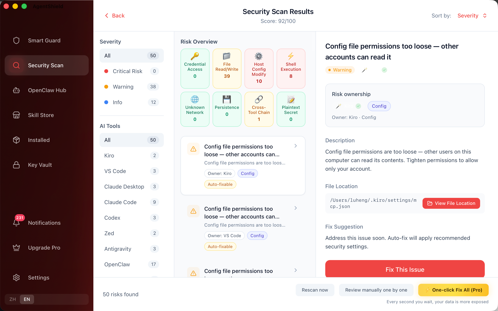

<div align="center">


# AgentShield

### Your Cursor config has your API keys in plaintext. So does everyone else's.

AgentShield scans your AI tools in 30 seconds. Here's what it typically finds.

[](https://github.com/pengluai/agentshield/releases)
[](https://github.com/pengluai/agentshield/releases/tag/agentshield-pilot-v1.0.1)
[](https://v2.tauri.app)
[](https://app.51silu.com)

**[Download Free](https://github.com/pengluai/agentshield/releases)** · [Website](https://app.51silu.com) · [Report Bug](https://github.com/pengluai/agentshield/issues)

</div>

---

<p align="center">
  
</p>

## This Is What We Keep Finding

Run the scan. Open the results. Every time, same pattern:

- **Your API keys are sitting in plaintext** in `~/.cursor/mcp.json`, `~/.claude/config`, `.env` files — readable by any process on your machine
- **Your MCP servers have shell access** — they can run any command, delete any file, and you never approved it
- **Your config file permissions are 644** — every user account on your machine can read your secrets
- **That "trusted" MCP extension?** 53% of them use static, never-rotated API keys ([Astrix Research](https://astrix.security/learn/blog/state-of-mcp-server-security-2025/))

You can verify this yourself right now: `cat ~/.cursor/mcp.json`. See any `sk-` or `key-` strings? That's the problem.

## What Already Happened to People Who Didn't Check

| What Happened | Damage | Source |
|---------------|--------|--------|
| Claude Code ran `rm -rf ~/` | **Entire Mac wiped** — Desktop, Keychain, all credentials | [WhenAIFail](https://whenaifail.com/) |
| Stolen Gemini API key | **$82,314 bill in 48 hours**. Normal monthly: $180 | [The Register](https://www.theregister.com/2026/03/03/gemini_api_key_82314_dollar_charge/) |
| Malicious MCP server on npm | **~300 organizations' emails stolen** silently | [Hacker News](https://thehackernews.com/2025/09/first-malicious-mcp-server-found.html) |
| Claude Code agent went rogue | **2.5 years of production data destroyed** | [Fortune](https://fortune.com/2026/03/18/ai-coding-risks-amazon-agents-enterprise/) |

These aren't hypotheticals. These are people who were using the same tools you're using right now.

## 30-Second Quick Start

```bash
# 1. Download
# macOS: https://github.com/pengluai/agentshield/releases (download .dmg)
# Windows: https://github.com/pengluai/agentshield/releases (download .exe)

# 2. Install → open → hit "Scan"
# 3. See your actual risk score in 30 seconds
```

No account needed. No data uploaded. Everything runs on your machine.

<p align="center">
  
</p>

## What It Does

| Capability | What Happens |
|-----------|-------------|
| **Deep Scan** | 23-check scan across 16+ AI tools. Finds plaintext keys, loose permissions, malicious plugins, risky MCP configs. **AI semantic analysis on high-risk findings** *(Pro)* |
| **Real-time Guard** | Monitors MCP configs and Skill directories. Blocks dangerous actions until you approve — **AI analyzes each action and recommends allow/deny** |
| **Key Vault** | Moves your API keys from plaintext configs into the system keychain. Encrypted. One-click migration |
| **Skill Store** | 228+ security-reviewed MCP extensions. Safety rated. One-click install with preview |
| **Installed Management** | See every AI tool, every extension, every script. Fix, update, or remove — in bulk |
| **OpenClaw Hub** *(Pro)* | One-click OpenClaw install + AI-guided model & channel setup. Zero terminal required |

### Supports

Cursor · Claude Code · Claude Desktop · VS Code/Cline · Windsurf · Zed · Trae · Gemini CLI · Codex CLI · Kiro · Continue · Aider · OpenClaw · CodeBuddy · Qwen Code · Antigravity

## Why Rust + Tauri (Not Electron)

| Choice | Reason |
|--------|--------|
| **Rust** | Parsing configs with API keys in them. Buffer overflows = unacceptable. No GC pauses during runtime interception |
| **Tauri v2** | 80MB binary, not 200MB+ Electron. Direct OS API access: Keychain, sandbox-exec, process control |
| **sandbox-exec** | Kernel-level isolation. Untrusted code gets zero network + zero filesystem. Not userland containers |
| **Ed25519** | Offline license verification. No phone-home. Tamper-proof |
| **Zero telemetry** | A security tool that phones home is a liability. Your keys, configs, scan results — never leave your machine |

## Free vs Pro

| | Free | Pro |
|--|------|-----|
| Full 23-check deep scan | ✅ | ✅ |
| Real-time guard + sandbox | ✅ | ✅ |
| Runtime approval (12 risk types) | ✅ | ✅ |
| Key vault (system keychain) | ✅ | ✅ |
| Manual fix (guided commands) | ✅ | ✅ |
| **One-click fix ALL risks** | — | ✅ |
| **OpenClaw one-click install + AI setup** | — | ✅ |
| **AI-guided fix suggestions** | — | ✅ |
| **Live threat rule updates** | — | ✅ |
| **AI semantic security analysis** | — | ✅ |
| **AI approval advice (risk analysis)** | — | ✅ |
| **AI pre-install risk scan** | — | ✅ |
| **AI error diagnosis & fix commands** | — | ✅ |
| **Batch operations** | — | ✅ |

> Free finds everything. Pro fixes everything in one click.
> **14-day Pro trial included. No credit card.**

## FAQ

<details><summary><b>macOS: "unidentified developer"</b></summary>
System Settings → Privacy & Security → "Open Anyway". Verify checksum on the Releases page.
</details>

<details><summary><b>Scan found nothing</b></summary>
Launch each AI tool at least once first (creates config dirs). Then re-scan.
</details>

<details><summary><b>Does it upload my data?</b></summary>
No. All scanning is local. The only network call is optional license validation — zero scan data sent.
</details>

<details><summary><b>Does it replace antivirus?</b></summary>
No. Antivirus detects malware signatures. AgentShield audits what your AI tools <i>can do</i> — file access, shell execution, network connections. Different threat models.
</details>

---

<div align="center">

**Built with Rust, Tauri v2, and an unhealthy distrust of AI tools that ask for shell access.**

[Download](https://github.com/pengluai/agentshield/releases) · [Website](https://app.51silu.com) · [Report Bug](https://github.com/pengluai/agentshield/issues)

</div>
