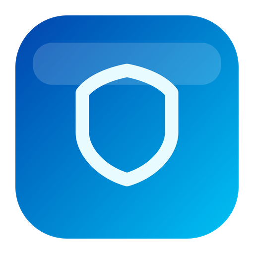

<div align="center">



# AgentShield 智盾

**守护本机 AI 工具生态的桌面安全应用**

[](https://github.com/pengluai/agentshield/releases)
[](https://github.com/pengluai/agentshield/releases/tag/agentshield-pilot-v1.0.1)
[](https://v2.tauri.app)

[中文](#-中文) | [English](#-english)

</div>

---

## 🇨🇳 中文

AgentShield 是一款**专门保护本机 AI 工具生态**的桌面安全应用。

它不是传统杀毒软件。它更像一个 **"AI 工具安全助手"**，帮你看清电脑里哪些 AI 工具、MCP、Skill 和本地配置正在运行，哪些可能带来密钥泄露、危险权限、恶意插件或高风险自动化问题。

### 🎯 解决什么问题

| 痛点 | AgentShield 的解决方式 |
|------|------------------------|
| AI 工具越来越多，不知道谁在读配置、拿权限 | 一键扫描，全盘可视化 |
| MCP / Skill 风险难以分辨 | 智能风险标签 + 归属映射 |
| 密钥泄露和权限失控发现太晚 | 密钥保险库 + 实时安全审查 |
| 危险操作缺少确认机制 | 删除/修复/卸载前强制确认 |

### ✨ 核心功能

- 🔍 **安全扫描** — 扫描本机 AI 工具和 MCP / Skill 配置
- 🚨 **风险识别** — 检测危险配置、弱权限、密钥暴露和高风险自动化
- 🗺️ **安全映射** — 显示哪个 MCP / Skill 属于哪个 AI 工具
- 🔐 **密钥保险库** — 系统钥匙串支持的安全密钥存储
- 🛒 **技能商店** — 浏览和安装安全审核过的 MCP / Skill
- 🤖 **AI 安全助手** — 智能分析和修复建议
- ⚙️ **OpenClaw 一键部署** — 快速配置安全工具环境

### 🛡️ 支持扫描的 AI 工具

Codex CLI · Cursor · VS Code / Cline · Claude Code / Claude Desktop · Windsurf · Zed · Trae · Gemini CLI · Continue · Aider · Antigravity · OpenClaw

### 📦 下载安装

| 平台 | 下载链接 | 说明 |
|------|----------|------|
| 🍎 **macOS** (Apple Silicon) | [AgentShield-pilot-1.0.1-macos-arm64.dmg](https://github.com/pengluai/agentshield/releases/download/agentshield-pilot-v1.0.1/AgentShield-pilot-1.0.1-macos-arm64.dmg) | 首次打开需在「隐私与安全性」中允许 |
| 🪟 **Windows** (x64) | [AgentShield-pilot-1.0.1-windows-x64-setup.exe](https://github.com/pengluai/agentshield/releases/download/agentshield-pilot-v1.0.1/AgentShield-pilot-1.0.1-windows-x64-setup.exe) | 如遇安全提示，确认来源后继续安装 |

### 💰 版本说明

| 版本 | 功能 |
|------|------|
| **免费版** | 完整扫描 + 风险审查 + 逐项修复 |
| **专业版** (14天试用) | 一键批量修复 + 自动化操作加速 |

---

## 🇺🇸 English

AgentShield is a desktop safety app built for **local AI tool ecosystems**.

It is not a traditional antivirus. Think of it as an **AI tool safety companion** — helping you see which AI tools, MCP servers, Skills, and local configs are running on your machine, and which may expose secrets, overreach permissions, or trigger unsafe automation.

### 🎯 What Problem This Solves

| Pain Point | How AgentShield Helps |
|------------|----------------------|
| Too many AI tools, no visibility into configs | One-click scan, full visibility |
| Hard to tell risky MCP / Skill from safe ones | Smart risk labels + ownership mapping |
| Secret leaks and permission drift discovered too late | Key vault + real-time security review |
| Dangerous operations lack confirmation | Forced confirmation before delete/fix/uninstall |

### ✨ Core Features

- 🔍 **Security Scan** — Scan local AI tools and MCP / Skill configs
- 🚨 **Risk Detection** — Detect risky configs, weak permissions, secret exposure
- 🗺️ **Security Map** — Show which MCP / Skill belongs to which AI tool
- 🔐 **Key Vault** — System-keychain-backed secret storage
- 🛒 **Skill Store** — Browse and install security-vetted MCP / Skills
- 🤖 **AI Security Advisor** — Smart analysis and fix suggestions
- ⚙️ **OpenClaw One-Click Deploy** — Quick security tool environment setup

### 🛡️ Supported AI Tools

Codex CLI · Cursor · VS Code / Cline · Claude Code / Claude Desktop · Windsurf · Zed · Trae · Gemini CLI · Continue · Aider · Antigravity · OpenClaw

### 📦 Download

| Platform | Download | Note |
|----------|----------|------|
| 🍎 **macOS** (Apple Silicon) | [AgentShield-pilot-1.0.1-macos-arm64.dmg](https://github.com/pengluai/agentshield/releases/download/agentshield-pilot-v1.0.1/AgentShield-pilot-1.0.1-macos-arm64.dmg) | May need to allow in Privacy & Security |
| 🪟 **Windows** (x64) | [AgentShield-pilot-1.0.1-windows-x64-setup.exe](https://github.com/pengluai/agentshield/releases/download/agentshield-pilot-v1.0.1/AgentShield-pilot-1.0.1-windows-x64-setup.exe) | Accept trust warning after verifying source |

### 💰 Plans

| Plan | Features |
|------|----------|
| **Free** | Full scan + risk review + per-item fix |
| **Pro** (14-day trial) | One-click batch fix + automation acceleration |

---

<div align="center">

### 🏗️ Tech Stack / 技术架构

</div>

```
┌─────────────────────────────────────────────────┐
│              AgentShield 智盾 v1.0.1             │
├─────────────────────┬───────────────────────────┤
│   Frontend 前端      │   Backend 后端 (Rust)      │
├─────────────────────┼───────────────────────────┤
│ React 19 + TS       │ Tauri v2                  │
│ Tailwind CSS        │ 69 IPC Commands           │
│ Zustand (7 stores)  │ tokio async runtime       │
│ Framer Motion       │ keyring (系统钥匙串)       │
│ Radix UI            │ Ed25519 签名验证           │
│ Recharts            │ sysinfo + walkdir          │
└─────────────────────┴───────────────────────────┘
```

---

## 🚀 快速开始 / Quick Start

1. 从上方下载对应平台的安装包 / Download the installer for your platform
2. 安装并打开应用 / Install and open the app
3. 完成新手引导 / Complete the onboarding wizard
4. 运行首次全盘扫描 / Run your first full scan
5. 查看风险报告并处理 / Review the risk report and take action

## ❓ 常见问题 / FAQ

<details>
<summary><b>macOS 提示「无法验证开发者」/ macOS says "unverified developer"</b></summary>

打开「系统设置 → 隐私与安全性」，点击「仍要打开」即可。

Go to System Settings → Privacy & Security, then click "Open Anyway".
</details>

<details>
<summary><b>Windows 提示「未知发布者」/ Windows shows "unknown publisher"</b></summary>

这是因为安装包尚未使用代码签名证书。确认下载来源是本仓库的 Release 页面后，点击「仍要运行」继续安装。

The installer is not code-signed yet. After verifying the download source, click "Run anyway" to proceed.
</details>

<details>
<summary><b>扫描没有发现任何 AI 工具 / No AI tools detected</b></summary>

请确保 AI 工具已安装在本机，并至少运行过一次（以创建配置目录），然后重新扫描。

Make sure the AI tool is installed and has been launched at least once, then scan again.
</details>

---

<div align="center">

**Made with ❤️ by AgentShield Team**

</div>
