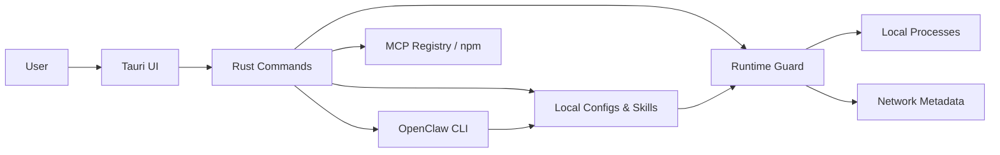

## Executive summary

AgentShield 当前最重要的风险主题不是传统 Web 漏洞，而是 **本地 AI 代理生态的执行控制不足**：仓库已经实现了 `MCP / Skill` 的发现、静态审查、受控启动和网络 allowlist，但对 `file_delete / email_delete / credential_export / browser_submit / payment_submit` 这类高危动作还没有动作级中介。最高风险区域是 `src-tauri/src/commands/runtime_guard.rs`、`src-tauri/src/commands/scan.rs`、`src-tauri/src/commands/install.rs` 与 `src-tauri/src/commands/license.rs`。

## Scope and assumptions

- **In-scope paths**
  - `src-tauri/src/commands/runtime_guard.rs`
  - `src-tauri/src/commands/scan.rs`
  - `src-tauri/src/commands/install.rs`
  - `src-tauri/src/commands/store.rs`
  - `src-tauri/src/commands/license.rs`
  - `src/components/pages/openclaw-wizard.tsx`
  - `src/components/pages/installed-management.tsx`
  - `src/components/pages/security-scan.tsx`
  - `src/components/pages/smart-guard-home.tsx`

- **Out-of-scope**
  - 系统级杀毒、内核驱动、所有非 AI 应用的通用防护
  - 云端 SaaS 多租户控制面（仓库中不存在）
  - 第三方支付后端（仓库中不存在）

- **Explicit assumptions**
  - 该产品是本地 Tauri 桌面应用，通过 GitHub 分发给 `macOS / Windows` 用户。
  - 主要资产是本地文件、密钥、MCP/Skill 配置、OpenClaw 配置、运行时会话与授权决策。
  - 主要攻击者是：恶意 Skill / MCP 作者、恶意网页 / 邮件内容提供方、诱导用户安装第三方生态组件的供应链攻击者。
  - 不假设攻击者已经拥有系统管理员权限。

- **Open questions**
  - 是否计划引入独立的 license service 与支付后端。
  - 是否允许 AgentShield 代理 OpenClaw 的高危工具调用，而不是只做旁路守卫。
  - 是否接受在 Windows 上读取更多安装路径或注册表以提高宿主发现率。

## System model

### Primary components

- **React/Tauri 前端**：负责扫描页、OpenClaw 管理、已安装管理、审批与设置 UI。  
  Evidence: `src/components/pages/security-scan.tsx`, `src/components/pages/openclaw-wizard.tsx`, `src/App.tsx`
- **扫描引擎**：发现宿主 AI 工具、枚举 MCP / Skill、扫描密钥与静态风险。  
  Evidence: `src-tauri/src/commands/scan.rs`
- **运行时守卫**：记录组件、识别进程、收集网络连接、kill/quarantine、审批。  
  Evidence: `src-tauri/src/commands/runtime_guard.rs`, `src-tauri/src/types/runtime_guard.rs`
- **OpenClaw 安装管理**：安装 / 更新 / 卸载 OpenClaw，清理相关配置。  
  Evidence: `src-tauri/src/commands/install.rs`
- **商店 / 安装管理**：从内置目录或 MCP Registry 拉取条目，向宿主配置写入/删除 server。  
  Evidence: `src-tauri/src/commands/store.rs`
- **许可证子系统**：本地读写 license 文件，签名校验 activation code。  
  Evidence: `src-tauri/src/commands/license.rs`

### Data flows and trust boundaries

- User → React/Tauri UI  
  - Data: 点击、审批、安装/卸载请求、配置修改  
  - Channel: WebView UI / Tauri invoke  
  - Security: 无网络边界；取决于本地 UI 逻辑与 Tauri command 映射  
  - Validation: 前端输入校验有限，核心依赖 Rust command

- UI → Rust Commands  
  - Data: 扫描请求、安装请求、许可激活码、审批决策  
  - Channel: Tauri IPC  
  - Security: 桌面壳中真实可用；浏览器壳需降级  
  - Validation: `license.rs` 做签名校验；其他命令多为逻辑校验

- Rust Scan / Install → Local Filesystem  
  - Data: MCP config、Skill roots、OpenClaw config、license.json  
  - Channel: 本地文件读写  
  - Security: 取决于本机文件权限  
  - Validation: 扫描器识别已知路径与格式；部分文件权限有静态检查

- Runtime Guard → Local Processes / Network Metadata  
  - Data: 进程名、命令行、PID、TCP/UDP 连接  
  - Channel: `sysinfo` + `lsof` / `netstat`  
  - Security: 旁路观测 + 事后 kill  
  - Validation: 通过 token matching 与 allowlist 逻辑匹配

- Store / Install → Third-party registries / npm  
  - Data: MCP registry catalog、npm install/uninstall/update  
  - Channel: HTTPS / CLI subprocess  
  - Security: 依赖第三方源完整性与 TLS；仓库内未见额外签名校验  
  - Validation: 仅做基础解析与部分风险说明

#### Diagram

## Assets and security objectives

| Asset | Why it matters | Security objective (C/I/A) |
| --- | --- | --- |
| 本地密钥与 token | 泄露后可直接导致账号或资金损失 | C |
| 本地文件与工作区 | 被误删/误改会造成直接业务损失 | I/A |
| 邮件 / 消息 / OpenClaw 渠道配置 | 可触发不可逆外发或批量删除 | C/I |
| MCP / Skill 配置 | 决定 agent 能执行什么、连哪里 | I |
| Runtime guard policy / approvals | 决定哪些组件能启动、能联网 | I |
| Installed item metadata | 影响来源识别、升级/卸载正确性 | I |
| License / activation state | 影响收费闭环与能力门控 | I/A |
| Update/install sources | 供应链被劫持会直接变成执行入口 | I/C |

## Attacker model

### Capabilities

- 发布恶意 Skill / MCP，诱导用户安装或手动导入。
- 通过网页、邮件、Issue、文档等非可信内容影响 agent 行为。
- 利用本地 `OpenClaw` / MCP 网关或弱授权边界触发越权调用。
- 借助 brand confusion / 供应链包名 / registry 条目投递恶意组件。
- 在没有管理员权限的前提下，利用用户已有权限访问其本地工作区与密钥。

### Non-capabilities

- 不默认假设攻击者已经拿到系统 root / admin。
- 不默认假设攻击者能够修改 AgentShield 二进制本身。
- 不默认假设存在公网暴露的多租户服务端 API。

## Entry points and attack surfaces

| Surface | How reached | Trust boundary | Notes | Evidence (repo path / symbol) |
| --- | --- | --- | --- | --- |
| 扫描入口 | UI 点击 Scan | User → UI → Rust | 会读取本机宿主工具与配置 | `src/components/pages/security-scan.tsx`, `src-tauri/src/commands/scan.rs::scan_full` |
| OpenClaw 安装/更新/卸载 | UI 点击 OpenClaw Hub | User → UI → subprocess | 直接调用 `npm` / `openclaw` | `src/components/pages/openclaw-wizard.tsx`, `src-tauri/src/commands/install.rs` |
| 商店安装 | UI 安装条目 | User → UI → config write / npm | 可把 server 写入宿主配置 | `src-tauri/src/commands/store.rs::install_store_item` |
| 手动 Skill/MCP 发现 | 本机目录变化或扫描 | Filesystem → Scan / Guard | 进入 registry 与风险分析 | `src-tauri/src/commands/scan.rs`, `src-tauri/src/commands/runtime_guard.rs::observe_path_change` |
| 受控启动 | Installed 页面点击启动 | User → UI → subprocess | 受 `trust_state` 和审批影响 | `src-tauri/src/commands/runtime_guard.rs::launch_runtime_guard_component` |
| 网络外联监测 | 进程运行后 | Process → Network Metadata | 发现后 kill / 审批 | `src-tauri/src/commands/runtime_guard.rs::collect_network_connections_for_pid` |
| 许可证试用/激活 | Upgrade Pro 页面 | User → UI → local file | 无远端服务 | `src-tauri/src/commands/license.rs` |

## Top abuse paths

1. 攻击者发布恶意 Skill → 用户安装到 `skills` 目录 → 静态规则漏检 → Skill 在受控启动后读取本地密钥并外发。
2. 用户打开恶意网页 / 邮件 → OpenClaw 或相关本地 agent 被污染输入驱动 → 触发未被动作级审批覆盖的删除/发送行为。
3. 攻击者诱导用户手动加入未知 MCP → 组件以 `manual` 来源进入系统 → 首次外联前虽可被拦，但本地 destructive 行为不会被动作级中介阻断。
4. Windows 用户安装了 GUI AI 宿主但未生成配置目录 → AgentShield 未识别宿主存在 → 相关 MCP / Skill 不进入受控范围。
5. 恶意或被劫持的 npm 包替换 `openclaw@latest` 或相关依赖 → OpenClaw 安装/更新命令直接获取并执行受污染包。
6. 用户删除本地 `license.json` → 试用状态被重置 → 付费能力门控失效，收费模式被绕过。
7. 受限组件使用未列入 allowlist 的外联地址 → Runtime Guard 只能在连接已出现后 kill，存在 race window。

## Threat model table

| Threat ID | Threat source | Prerequisites | Threat action | Impact | Impacted assets | Existing controls (evidence) | Gaps | Recommended mitigations | Detection ideas | Likelihood | Impact severity | Priority |
| --- | --- | --- | --- | --- | --- | --- | --- | --- | --- | --- | --- | --- |
| TM-001 | 恶意 Skill 作者 | 用户安装或导入 Skill；静态匹配未命中 | Skill 读取本地文件/密钥并外发 | 密钥泄露、文件泄露 | 本地密钥、本地文件 | `inspect_skill_for_risks` 做模式匹配；`runtime_guard` 可审批准入与外联 allowlist (`src-tauri/src/commands/scan.rs`, `src-tauri/src/commands/runtime_guard.rs`) | 静态规则启发式；无执行级 syscall / file operation 中介 | 增加语义级审查、AIBOM/哈希信誉、动作级 `credential_export` / `file_read_sensitive` 授权 | Skill 安装时记录哈希；运行时比对文件哈希与异常外联 | medium | high | high |
| TM-002 | 恶意网页/邮件/Issue 内容 | 宿主 agent 可读非可信内容，且拥有工具权限 | 通过 prompt injection 触发越权操作 | 删除邮件/发送消息/改文件 | 邮件、消息、文件、账号 | 现有文档已识别该痛点 (`docs/specs/17-...md`)；OpenClaw 官方支持 sandbox / tool profiles | 仓库中尚无 taint state / input origin enforcement | 引入 `input_origin`、污染输入隔离、对非可信输入驱动高危工具默认阻断 | 审计链记录 input origin，统计 tainted → high-risk 尝试 | high | high | critical |
| TM-003 | 未知手动 MCP 作者 | 用户手动添加 MCP，组件被发现 | 组件运行后访问未知地址或执行高权限命令 | 数据外泄、远端控制 | 文件、密钥、工作区 | `trust_state=unknown`、首次启动审批、外联审批 (`runtime_guard.rs`) | 只覆盖 launch / external_connection，不能预览 destructive targets | 动作级审批；在 launch 前展示 exec preview、权限范围、路径范围 | 记录 `unknown_component_external_connection` 频率 | medium | high | high |
| TM-004 | 本地 AI 代理 / OpenClaw 本身 | 用户允许启动或 agent 已在运行 | 执行文件删除、批量改写、邮件删除、浏览器提交 | 不可逆数据损失 | 文件、邮件、第三方账号 | 当前仅有 launch/network 审批元数据 (`runtime_guard.rs::approval_action_metadata`) | 无 `file_delete / email_delete / payment_submit` 等 action kinds | 扩展 `RuntimeApprovalRequest` 与守卫协议，所有 destructive 操作必须 preview+ticket | 针对 destructive actions 写审计日志和回滚元数据 | high | high | critical |
| TM-005 | 生态发现缺口 | Windows GUI 宿主已安装但无 CLI/配置痕迹 | AgentShield 未发现宿主，导致相关组件不被治理 | 防护盲区 | 宿主工具配置、MCP/Skill 清单 | 扫描器支持多种配置路径 (`scan.rs`) | `ToolDef.app_paths` 偏 macOS；Windows GUI path coverage 不足 | 补 Program Files / 注册表 / 常见安装位置探测；做 Win11 干净机回归 | 发现率指标：已安装宿主 vs 被识别宿主 | high | medium | high |
| TM-006 | 供应链攻击者 / 被劫持 registry | 用户点击一键安装 / 更新 | 通过 `npm install -g openclaw@latest` 拉入恶意包 | 任意代码执行、供应链投毒 | OpenClaw 安装链、用户机器 | 当前有安装/卸载命令，且有后续扫描 | 安装时无版本 pin、无包完整性或签名校验 | 固定版本策略、来源校验、安装后立即做哈希与官方 audit | 记录包名、版本、来源与哈希 | medium | high | high |
| TM-007 | 普通用户 / 灰产 | 本地能改动 `~/.agentshield/license.json` | 重置 trial、迁移激活码 | 商业门控失效 | License state、收费闭环 | activation code 有签名校验 (`license.rs`) | 状态仅本地；无设备绑定、无 revoke、trial 可删文件重开 | 接入远端 license service、设备绑定、签发短期 token、trial 14 天且不可本地重置 | 记录激活设备、重试次数、异常试用重置 | high | medium | high |

## Criticality calibration

- **critical**
  - 能直接导致未授权删文件 / 删邮件 / 付款提交的执行缺口
  - 能通过非可信内容操控本地 agent 做高危动作
  - 能使大量用户在不知情下被恶意 Skill / MCP 持续接管

- **high**
  - 恶意 Skill / MCP 导致密钥泄露或持续外联
  - Windows 宿主发现失效导致整类组件完全不受治理
  - 供应链安装链可被污染且缺少完整性校验

- **medium**
  - 浏览器壳降级失真导致用户误判产品状态
  - 发现率不稳定但仍可通过手动同步补救
  - 构建产物 chunk 过大但不直接构成安全边界破坏

- **low**
  - 非关键 UI 文案不一致
  - 可解释且有 workaround 的非阻断级错误提示

## Focus paths for security review

| Path | Why it matters | Related Threat IDs |
| --- | --- | --- |
| `src-tauri/src/commands/runtime_guard.rs` | 决定 launch approval、外联观测、kill/quarantine 与审批模型 | TM-002, TM-003, TM-004 |
| `src-tauri/src/types/runtime_guard.rs` | 决定能否表达动作级审批与审计字段 | TM-004 |
| `src-tauri/src/commands/scan.rs` | 决定宿主发现、Skill/MCP 静态风险识别与 OpenClaw audit 接入 | TM-001, TM-005 |
| `src-tauri/src/commands/install.rs` | 决定 OpenClaw 安装/更新/卸载链和供应链暴露面 | TM-006 |
| `src-tauri/src/commands/store.rs` | 决定商店条目安装、配置写入与卸载正确性 | TM-003, TM-006 |
| `src-tauri/src/commands/license.rs` | 决定试用、激活码与收费能力门控 | TM-007 |
| `src/components/pages/openclaw-wizard.tsx` | 零基础用户对安装/升级/卸载真实性的感知入口 | TM-006 |
| `src/components/pages/security-scan.tsx` | 安全扫描与解释层入口，影响用户对风险理解 | TM-001, TM-004 |
| `src/components/pages/installed-management.tsx` | 运行时守卫决策与组件状态可视化入口 | TM-003, TM-004 |
| `docs/specs/17-基于真实用户痛点的MCP与Skill高风险防护整改方案.md` | 已经定义了动作级审批与 taint 隔离方向，可作为设计基线 | TM-002, TM-004 |

## Quality check

- 已覆盖发现到的主要入口：扫描、安装、商店、受控启动、许可证、运行时外联。
- 已覆盖主要 trust boundary：UI→IPC、IPC→Filesystem、IPC→Subprocess、Process→Network Metadata、Install→Registry/npm。
- 已区分 runtime 行为与 CI/dev/tooling。
- 已显式记录关键假设与未知项。
- 已把用户给出的商业目标（零基础、OpenClaw/MCP/Skill 聚焦、GitHub 分发、收费逻辑）反映进风险优先级。
