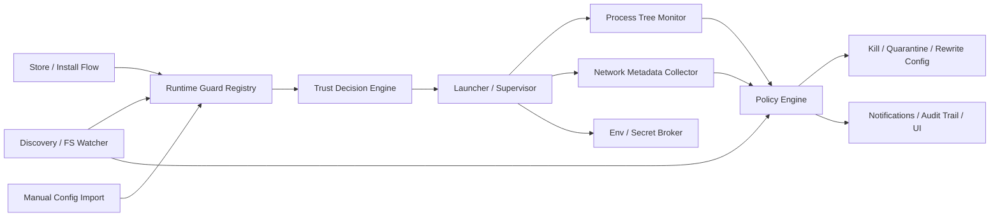

# 11 - 用户态运行时防护施工方案

更新日期: 2026-03-09
适用范围: AgentShield 桌面端 `macOS` / `Windows`
状态: 可施工

## 1. 执行摘要

本方案的目标不是把 AgentShield 立刻做成系统级杀毒软件，而是在现有 Tauri + Rust 架构上，先落地一套**真实可用的用户态运行时防护闭环**：

- 新增 MCP / Skill 时立即发现
- 首次执行前完成指纹化、静态扫描、信任判定
- 所有受控组件统一走 AgentShield launcher / supervisor
- 运行后持续采集进程树、启动项变更、关键目录变更、网络连接元数据
- 触发策略后自动 `kill / quarantine / rewrite config / notify`

该方案适合当前快速推向市场验证。它可以支撑“AI 工具 MCP / Skill 安装管理、安全扫描、实时监控与自动化处置”的对外表述，但**不能**对外表述为“系统级拦截宿主机上一切恶意行为”。

## 2. 问题定义与范围

### 2.1 当前问题

当前仓库已经具备三类真实能力：

- 安装与配置管理: [store.rs](/Users/luheng/Downloads/ai01/agentshield/src-tauri/src/commands/store.rs) [install.rs](/Users/luheng/Downloads/ai01/agentshield/src-tauri/src/commands/install.rs)
- 扫描与风险判定: [scan.rs](/Users/luheng/Downloads/ai01/agentshield/src-tauri/src/commands/scan.rs)
- 文件级实时防护: [protection.rs](/Users/luheng/Downloads/ai01/agentshield/src-tauri/src/commands/protection.rs)

但当前实时防护仍主要发生在：

- 配置文件变更后
- Skill 目录变更后
- 重新扫描时

它尚未覆盖以下高损失路径：

- 已启动 MCP / Skill 的子进程链
- 运行时外联目标
- 受控组件的来源、签名、哈希漂移
- 启动前的信任决策
- 组件运行时的环境变量暴露面

### 2.2 本期范围

本期只做用户态运行时防护，不做系统扩展或驱动。

在范围内:

- 组件发现与登记
- 信任状态管理
- 首次执行 gating
- 受控 launcher / supervisor
- 进程树监控
- 网络连接元数据监控
- 启动项 / 配置 / 关键目录变更联动
- Secret broker 与环境变量最小暴露
- 自动 kill / quarantine / notify

不在范围内:

- macOS Endpoint Security System Extension
- macOS Network Extension 内容过滤
- Windows WFP 驱动级预连接阻断
- 系统调用级文件打开拦截
- 绕过 AgentShield launcher 的宿主机全局强制拦截

## 3. 当前状态与约束

### 3.1 仓库现状

- 命令注册中心: [lib.rs](/Users/luheng/Downloads/ai01/agentshield/src-tauri/src/lib.rs)
- 文件级实时防护服务: [protection.rs](/Users/luheng/Downloads/ai01/agentshield/src-tauri/src/commands/protection.rs)
- 发现快照与系统扫描入口: [discovery.rs](/Users/luheng/Downloads/ai01/agentshield/src-tauri/src/commands/discovery.rs)
- MCP / Skill 提取与风险规则: [scan.rs](/Users/luheng/Downloads/ai01/agentshield/src-tauri/src/commands/scan.rs)
- 商店安装与已安装管理: [store.rs](/Users/luheng/Downloads/ai01/agentshield/src-tauri/src/commands/store.rs)

### 3.2 关键约束

- 现有桌面端是 Tauri 应用，适合增加 Rust 服务与 sidecar，但不适合直接宣称主机级拦截。
- 用户态方案可以对**经 AgentShield 管理和启动**的组件形成强约束。
- 用户态方案对“绕过 AgentShield 直接从外部启动的恶意进程”只能依赖发现、监控和联动处置，不能实现内核级强制阻断。
- 用户态方案无法在不借助 OS 原生防火墙 / 系统扩展的前提下，对所有本地进程实现真正的预连接网络拦截。

## 4. 目标架构总览

## 5. 组件设计

### 5.1 Runtime Guard Registry

新增 Rust 服务 `RuntimeGuardService`，负责持久化组件元数据与信任状态。

建议持久化文件:

- `~/.agentshield/runtime-guard-components.json`
- `~/.agentshield/runtime-guard-events.json`
- `~/.agentshield/runtime-guard-policy.json`

核心字段:

- `component_id`
- `component_type`: `mcp` | `skill`
- `name`
- `platform_id`
- `source_kind`: `builtin_store` | `registry_store` | `manual_config` | `manual_skill` | `openclaw` | `discovered`
- `install_channel`
- `config_path`
- `exec_command`
- `exec_args`
- `file_hash`
- `signing_state`
- `trust_state`: `unknown` | `trusted` | `restricted` | `blocked` | `quarantined`
- `network_mode`: `inherit` | `allowlist` | `observe_only`
- `allowed_domains`
- `allowed_env_keys`
- `first_seen_at`
- `last_seen_at`
- `last_launched_at`
- `last_parent_pid`
- `last_supervisor_session_id`

### 5.2 Trust Decision Engine

新增信任决策函数，对新组件做首次判定。

判定输入:

- 静态扫描结果
- 来源渠道
- catalog review 状态
- 是否带远端 URL
- 是否包含 shell / eval / child_process / subprocess
- 是否发生哈希漂移

默认策略:

- 商店内置且 review 通过的条目: `trusted`
- 商店远端但未审查条目: `restricted`
- 用户手动新增条目: `unknown`
- 命中高危规则的条目: `blocked`
- 已被自动隔离: `quarantined`

补充约束:

- `unknown` 状态组件不得通过运行时守卫受控启动
- `unknown + manual_*` 组件若在未审批状态下尝试外联，应自动终止
- `restricted` 组件允许启动，但若配置了 allowlist，则未知外联必须自动处置

### 5.3 Launcher / Supervisor

新增受控启动路径，所有受 AgentShield 管理的 MCP / Skill 都应优先从该路径启动。

能力:

- 使用 Tauri sidecar 或 Rust 受控进程启动
- 保存 `PID / PPID / component_id / session_id`
- 采集 stdout / stderr 片段
- 清理默认环境变量
- 仅注入 allowlist 环境变量
- 记录启动来源与调用链

实现约束:

- 这一步对“由 AgentShield 发起的启动”可强制执行
- 对“外部工具直接自行启动的组件”无法强制接管，只能依赖发现与联动
- Skill 仅在能从目录结构可靠解析出本地入口时才允许受控启动，当前支持 shell / node / python 常见入口约定

### 5.4 Network Metadata Collector

本期实现目标是**用户态网络元数据监控**，不是驱动级拦截。

MVP 实现:

- 对受控 session 记录 PID
- 周期性按 PID 采集已建立连接
- 将目标 `IP / port / protocol / process tree / timestamp` 写入事件流

macOS 建议实现:

- 优先采集 `lsof -nP -i`
- 必要时补充 `nettop` 或系统日志相关 collector

Windows 建议实现:

- 优先采集 `netstat -ano`
- 必要时补充 PowerShell `Get-NetTCPConnection`

策略语义:

- `trusted`: 允许已知行为，异常外联告警
- `restricted`: 未命中 allowlist 的新外联立即 `kill + quarantine`
- `unknown`: 默认不允许启动；若临时放行，则任何未知外联立即 `kill`

技术说明:

- 对本地可执行型 MCP / Skill，本期只能做到“发现未经授权的外联后快速处置”，不能做到每个 socket 建立前的系统级阻断。
- 对由 AgentShield 自己代理的远端 MCP，后续可增加“预请求 allowlist 校验”和代理转发。

### 5.5 Secret Broker

本期不做系统调用级文件读取拦截，改为减少暴露面。

最小实现:

- 启动受控组件时默认不继承完整宿主机环境变量
- 仅按组件策略注入允许的 env key
- API key 等敏感值优先从 Vault 按需读取
- 审计每次密钥发放记录

这意味着：

- 可以降低密钥泄露面
- 不能阻止恶意组件自行读取用户磁盘上的任意文件
- 因此需要与关键目录监控和自动隔离联动使用

### 5.6 Policy Engine

新增统一策略执行器，对以下事件做判定：

- 新组件发现
- 启动前 trust check
- 哈希漂移
- 外联目标越权
- 子进程链异常
- 改写启动项
- 修改关键配置 / Skill 目录 / `.env`

动作:

- `allow`
- `restrict`
- `block`
- `kill`
- `quarantine`
- `rewrite_config`
- `notify`

### 5.7 Event Pipeline

统一事件类型:

- `component_discovered`
- `component_trust_changed`
- `session_started`
- `session_exited`
- `network_violation`
- `process_tree_violation`
- `config_tamper_detected`
- `component_quarantined`

前端实时监听事件并刷新：

- 已安装管理
- 安全扫描
- 通知中心
- Smart Guard 首页

## 6. 数据模型与接口契约

### 6.1 新增后端命令

- `list_runtime_guard_components()`
- `sync_runtime_guard_components()`
- `update_component_trust_state(component_id, trust_state, reason)`
- `get_runtime_guard_policy()`
- `update_runtime_guard_policy(policy)`
- `list_runtime_guard_events()`
- `clear_runtime_guard_events()`

### 6.2 新增事件

- `runtime-guard-component-changed`
- `runtime-guard-event`
- `runtime-guard-session`

### 6.3 与现有模块的耦合点

- `store::install_store_item`
  - 安装成功后写入 registry
  - 内置审查项默认 `trusted`
- `store::uninstall_item`
  - 卸载时清理 registry 与 session
- `protection::handle_watch_event`
  - 新文件/目录事件触发 registry upsert
  - 命中高危规则时同步 trust state 为 `blocked` 或 `quarantined`
- `scan::scan_installed_mcps`
  - 作为 registry 同步基线

## 7. 非功能要求

### 7.1 安全

- 不夸大能力边界
- 所有 trust state 变更必须有事件和时间戳
- 所有自动 kill / quarantine 必须留审计记录
- 所有 secret 发放必须可审计

### 7.2 可靠性

- registry 和 event store 崩溃后可恢复
- 文件损坏时回退到空结构，不导致主程序不可启动
- 任何 collector 故障不能拖垮主应用

### 7.3 性能

- 首次同步应控制在可接受范围，复用 discovery 快照
- collector 轮询默认低频，先保守正确
- 每个 session 事件写入需限流，避免日志爆炸

### 7.4 成本

- 本期不引入系统扩展签名与驱动发布成本
- 尽量复用现有 Rust 服务和 Tauri 事件通道

## 8. ADR

### ADR-001: 先做用户态运行时防护，不直接做系统扩展

决策:

- 先用用户态 runtime guard 验证需求和价值

备选:

- 直接做 macOS Endpoint Security / Windows WFP

理由:

- 当前目标是快速推市场
- 系统扩展会显著增加签名、权限、兼容性和售后复杂度

后果:

- 本期能对受控组件形成强约束
- 对绕过 launcher 的宿主机全局行为只能做发现与联动

### ADR-002: Network policy 先做元数据监控 + 联动处置，不承诺全局预连接阻断

决策:

- 对本地组件先做“观察 + kill + quarantine”

备选:

- 在本期承诺默认拒绝所有未知外联

理由:

- 用户态应用无法对所有本地进程实现稳定的预连接拦截

后果:

- 商业表述必须严格限定为“实时监控与自动化处置”

### ADR-003: Secret broker 先做最小暴露，不承诺任意文件读取拦截

决策:

- 通过 env allowlist + Vault 按需发放降低暴露面

后果:

- 仍需依赖关键目录监控与风险评分配合

## 9. 风险登记

| 风险 | 概率 | 影响 | 分值 | 处理 |
|------|------|------|------|------|
| 用户绕过 AgentShield 直接启动恶意组件 | 4 | 5 | 20 | 明确能力边界，后续评估系统扩展 |
| 用户态网络 collector 误报或漏报 | 3 | 4 | 12 | 先做 observe-only 校准，再启用自动 kill |
| 组件 trust state 误判导致误拦截 | 3 | 4 | 12 | 增加 restricted 模式，避免只存在 allow/block 两档 |
| 文件监听与 registry 同步冲突 | 2 | 3 | 6 | 事件去重 + 幂等 upsert |

## 10. 交付路线

### M1: Registry 与首次执行 gating

交付项:

- RuntimeGuardService
- 组件 registry 持久化
- 新增组件 trust state
- 商店安装成功后自动登记
- 手动新增组件默认 unknown/restricted

验收:

- 用户新加一个 MCP 或 Skill，5 秒内能在 registry 中看到
- 命中高危规则时自动变为 `blocked` 或 `quarantined`

### M2: Supervisor 与 session 事件

交付项:

- 受控 launcher
- session 记录
- 进程树采集
- stdout/stderr 摘要

验收:

- 受控组件启动后能看到 session 和 parent-child 关系

### M3: 网络元数据与联动处置

交付项:

- macOS / Windows collector
- allowlist policy
- 越权外联 kill / quarantine

验收:

- restricted 组件对未知域名发起外联时能被记录并触发自动处置

## 11. 运行手册基线

- 若 runtime guard 数据文件损坏，自动重建空 store 并发通知
- 若 network collector 失败，降级为 `observe_only`
- 若 session 无法受控启动，组件不能被标记为 `trusted`

## 12. 本期实现边界说明

这份方案里的“实时防御”在本期严格定义为：

- 新增组件实时发现
- 启动前信任判定
- 运行期元数据监控
- 违规后自动化处置

它不等于：

- 系统调用级文件访问拦截
- 全局网络驱动拦截
- 绕过 AgentShield 后仍能被强制预执行阻断

## 13. 来源与依据

仓库依据:

- [lib.rs](/Users/luheng/Downloads/ai01/agentshield/src-tauri/src/lib.rs)
- [protection.rs](/Users/luheng/Downloads/ai01/agentshield/src-tauri/src/commands/protection.rs)
- [scan.rs](/Users/luheng/Downloads/ai01/agentshield/src-tauri/src/commands/scan.rs)
- [discovery.rs](/Users/luheng/Downloads/ai01/agentshield/src-tauri/src/commands/discovery.rs)
- [store.rs](/Users/luheng/Downloads/ai01/agentshield/src-tauri/src/commands/store.rs)

外部依据:

- Tauri sidecar / shell capability 文档，确认当前架构适合做受控 sidecar 与受控执行，检索日期 2026-03-09: [Tauri sidecar](https://v2.tauri.app/develop/sidecar/) [Tauri permissions](https://v2.tauri.app/learn/security/permissions/)
- MCP 规范安全最佳实践，确认本地 MCP server 存在命令执行与数据外传风险，检索日期 2026-03-09: [MCP security best practices](https://github.com/modelcontextprotocol/specification/blob/main/docs/specification/draft/basic/security_best_practices.mdx)
- Apple 关于 macOS kernel extension 已废弃、系统扩展替代方案的官方说明，检索日期 2026-03-09: [Apple system extension guidance](https://developer.apple.com/support/kernel-extensions/)
- macOS 监控实践资料，用于说明用户态可先做进程树与网络元数据关联，检索日期 2026-03-09: [Dropbox macOS monitoring](https://dropbox.tech/security/macos-monitoring-the-open-source-way)
