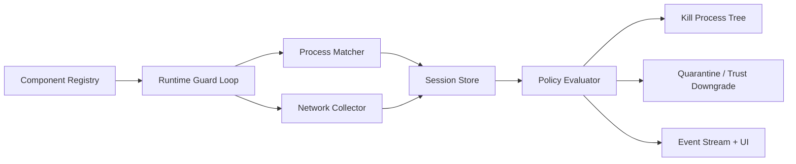

# 12 - 运行时守卫 M2 / M3 实施细则

更新日期: 2026-03-09
依赖基础: [11-用户态运行时防护施工方案.md](/Users/luheng/Downloads/ai01/agentshield/docs/specs/11-用户态运行时防护施工方案.md)
状态: 可开发

## 1. 目标

本细则定义 `M2` 与 `M3` 的一起落地方式：

- `M2`: 会话监督与进程树
- `M3`: 网络元数据采集与策略联动

本期要达到的真实效果：

1. AgentShield 后台持续轮询本机进程，识别已安装 MCP / Skill 对应的运行实例。
2. 一旦发现匹配进程，立即登记为 `session`，记录 `pid / ppid / commandline / exe / cwd / component_id`。
3. 对 `blocked / quarantined` 组件，发现运行即自动终止并记审计事件。
4. 对 `restricted` 组件，采集网络连接元数据；若已配置 allowlist，则命中未知远端时自动终止并隔离；若未配置 allowlist，至少产生明确告警。
5. 对 `unknown + manual_*` 组件，若在未审批状态下尝试外联，则自动终止该进程。
6. 前端可查看组件运行时状态、最近会话、最近处置事件，并对组件执行审批、allowlist 保存与受控启动。

## 2. 设计原则

- 以真实可运行的后台服务为准，不使用随机进度或模拟状态。
- 只对“当前用户态可观察、可终止”的范围做强承诺。
- 将“监控”和“阻断”拆开：先保证稳定识别，再对高置信事件自动处置。
- 对误报风险较高的路径使用 `observe_only` 或 `restricted`，不做一刀切。

## 3. 当前代码接缝

本细则直接扩展以下文件：

- 后端入口: [lib.rs](/Users/luheng/Downloads/ai01/agentshield/src-tauri/src/lib.rs)
- 运行时守卫注册表: [runtime_guard.rs](/Users/luheng/Downloads/ai01/agentshield/src-tauri/src/commands/runtime_guard.rs)
- 类型定义: [runtime_guard.rs](/Users/luheng/Downloads/ai01/agentshield/src-tauri/src/types/runtime_guard.rs)
- 文件级发现联动: [protection.rs](/Users/luheng/Downloads/ai01/agentshield/src-tauri/src/commands/protection.rs)
- 前端已安装详情页: [installed-management.tsx](/Users/luheng/Downloads/ai01/agentshield/src/components/pages/installed-management.tsx)

## 4. 目标架构

## 5. 数据模型

### 5.1 新增 RuntimeGuardSession

字段：

- `session_id`
- `component_id`
- `component_name`
- `platform_id`
- `pid`
- `parent_pid`
- `child_pids`
- `observed`
- `supervised`
- `status`: `running` | `terminated` | `exited`
- `commandline`
- `exe_path`
- `cwd`
- `started_at`
- `last_seen_at`
- `ended_at`
- `network_connections`
- `last_violation`

### 5.2 新增 RuntimeConnection

字段：

- `pid`
- `protocol`
- `local_address`
- `remote_address`
- `remote_host_hint`
- `state`
- `observed_at`

### 5.3 新增 RuntimeGuardStatus

字段：

- `enabled`
- `polling`
- `last_poll_at`
- `active_sessions`
- `blocked_actions`
- `last_violation`

## 6. 进程匹配设计

### 6.1 可识别对象

- 本地 MCP 进程
- Skill 脚本或解释器进程
- 受控或外部启动但命令行可识别的组件

### 6.2 匹配规则

按优先级：

1. `exec_command + args` 精确匹配
2. `npx package@version` 包名匹配
3. `exe path` / `cwd` / `config_path` 片段匹配
4. Skill 根目录名匹配

### 6.3 会话去重

- 同一 `component_id + pid` 只保留一个活动 session
- 进程退出后状态改为 `exited`
- 历史 session 保留最近固定数量

### 6.4 Skill 受控启动约定

本期不虚构 Skill 统一协议，而是只支持**可从本地目录可靠解析出入口**的 Skill：

- Shell:
  - macOS: `run.sh` / `start.sh` / `launch.sh`
  - Windows: `run.cmd` / `start.cmd` / `launch.cmd` / `run.bat` / `start.bat` / `launch.bat` / `run.ps1`
- Node:
  - `package.json.main`
  - `package.json.module`
  - `package.json.bin`
  - 根目录 `index.js` / `main.js` / `server.js` 及 `mjs` / `cjs` 变体
- Python:
  - `main.py` / `server.py` / `run.py` / `app.py` / `__main__.py`

约束：

- 仅当入口文件真实存在时才允许受控启动
- 解析不到入口的 Skill，前端仍可显示组件，但受控启动会被明确拒绝
- `unknown` 状态组件不允许从运行时守卫直接启动，必须先审批为 `restricted` 或 `trusted`

## 7. 网络采集设计

### 7.1 macOS

MVP collector:

- `lsof -nP -i -a -p <pid>`

用途:

- 获取某个受监控 PID 的活动网络连接
- 输出可解析为 `protocol / local / remote / state`

### 7.2 Windows

MVP collector:

- `netstat -ano -p tcp`
- `netstat -ano -p udp`

用途:

- 获取系统级连接表
- 再按 `PID` 过滤到 session

说明:

- Microsoft Learn 仍将 `netstat -ano` 和 `Get-NetTCPConnection` 作为定位进程端口占用与连接归属的正式排障手段。检索日期 2026-03-09: [netstat | Microsoft Learn](https://learn.microsoft.com/de-de/windows-server/administration/windows-commands/netstat)

### 7.3 网络策略判定

- `inherit`: 只记录，不拦截
- `observe_only`: 记录并产生 violation，不自动 kill
- `allowlist`: 若存在 allowlist，则远端不在 allowlist 时触发自动处置

本期约束：

- 对未配置 allowlist 的受限组件，只做观测告警，不强杀
- 对 `blocked / quarantined` 组件，只要发现进程存在，即直接 kill
- 对 `unknown + manual_*` 组件，未审批前若发生非本地外联，即自动 kill

## 8. 策略联动

### 8.1 必须自动处置的场景

- `blocked` 组件被发现正在运行
- `quarantined` 组件被发现正在运行
- `restricted + allowlist` 组件访问未知远端

动作：

- 终止主进程
- 尝试终止子进程链
- 记录事件
- 降级 trust state 或维持 blocked
- 发送通知

### 8.2 本期只记录不处置的场景

- `trusted` 组件出现新远端
- `restricted` 组件尚未配置 allowlist
- 仅凭 `cwd` / 名称模糊匹配到的低置信进程

## 9. 前端暴露面

本期不新开页面，先接入“已安装管理”右侧详情：

- 运行时守卫状态
- 网络模式
- 最近风险摘要
- 最近活动会话数量
- 手动切换 `trusted / restricted / blocked`
- 手动同步 registry

## 10. 实现顺序

### 阶段 A

- 扩展类型与持久化文件
- 新增 RuntimeGuardService
- 启动后台 poll loop

### 阶段 B

- 实现 process matcher
- 实现 active session store
- 暴露 `list_runtime_guard_sessions`

### 阶段 C

- 实现 macOS / Windows network collector
- 实现 network policy evaluator
- 实现 kill/quarantine 联动

### 阶段 D

- 前端展示会话与策略
- 测试与回归

## 11. 验收

### M2 验收

- 启动一个与已注册组件匹配的本地进程后，5 秒内可在 session 列表中看到
- `blocked` 组件运行时，5 秒内会被自动终止并生成事件

### M3 验收

- 受监控 session 存在网络连接时，可在 session 中看到连接元数据
- 对配置了 allowlist 的 `restricted` 组件，访问未知远端会触发自动终止与事件记录

## 12. 风险与处理

- `lsof` / `netstat` 输出格式会随平台略有差异
  - 处理: 解析器按保守模式实现，并以失败不崩溃为原则
- Windows 某些进程命令行需要更高权限才可见
  - 处理: 优先依赖 PID+连接表与基础命令信息，匹配失败则只做部分识别
- 外部工具直接启动的组件无法被 launch-time 预防
  - 处理: 本期以 poll loop 做快速发现与事后自动处置

## 13. 外部依据

- Tauri sidecar / shell 权限模型，检索日期 2026-03-09: [Tauri sidecar](https://v2.tauri.app/develop/sidecar/) [Tauri permissions](https://v2.tauri.app/learn/security/permissions/)
- Microsoft Learn `netstat` 命令说明，检索日期 2026-03-09: [netstat | Microsoft Learn](https://learn.microsoft.com/de-de/windows-server/administration/windows-commands/netstat)
- Apple 关于 system extension 替代 kernel extension 的官方说明，检索日期 2026-03-09: [If you get an alert about a system extension on Mac](https://support.apple.com/120363)
