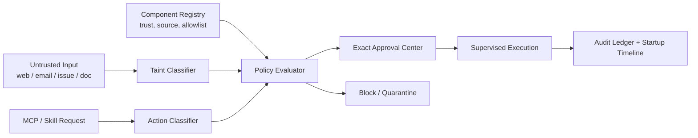

# 17 - 基于真实用户痛点的 MCP / Skill 高风险防护整改方案

更新日期: 2026-03-10  
适用范围: AgentShield 桌面端 `macOS` / `Windows`  
状态: 待评审

## 1. 执行摘要

本方案不是基于“理论上可能有风险”做泛化整改，而是基于 2025-04 至 2026-03 公开可验证的新闻、社区讨论、官方文档与 GitHub issue，提炼当前用户对 `OpenClaw / MCP / skill` 生态的真实痛点，再把这些痛点映射为 AgentShield 的产品和工程整改项。

核心结论只有一条:

- 当前用户最担心的不是“AI 工具不够强”，而是“高危动作会不会在我没真正确认时直接执行”。

因此，AgentShield 下一阶段的重点不应继续偏向“更重的后台扫描”，而应优先补齐以下四类用户感知最强的能力：

- 精确到动作级别的高危审批
- 非可信内容驱动高危工具时的污染隔离
- MCP / skill 的最小权限与来源透明度
- 启动期和后台行为的可解释性

## 2. 研究方法与约束

### 2.1 时间范围

- 外部研究时间窗: 2025-04-01 至 2026-03-10
- 仓库状态基线: 当前工作区 `agentshield`

### 2.2 证据来源

- 新闻媒体: Times of India, PCMag, The Hacker News
- 社区讨论: Reddit, Hacker News
- 官方文档: OpenClaw docs, MCP Specification, Anthropic research, Tauri v2 docs
- 仓库内证据: `docs/specs`, `src-tauri/src/commands/runtime_guard.rs`, `src/components/pages/installed-management.tsx`, `src/App.tsx`, `src/stores/settingsStore.ts`

### 2.3 本次研究失败项

- `X/Twitter` 搜索接口返回 `401`，未纳入证据
- 中文热榜聚合工具证书异常，未纳入证据

处理原则:

- 对失败来源不做补写或臆测
- 只保留可验证的公开来源

## 3. 当前已验证的外部用户痛点

### 3.1 痛点总览

| 编号 | 已验证痛点 | 证据与时间 | 对 AgentShield 的直接含义 |
| --- | --- | --- | --- |
| P-01 | 用户最怕 AI agent 在未获真正确认时执行删除、发送、改写等不可逆动作 | 2026-02-24，Times of India 报道 OpenClaw 误删邮箱事件；同类舆论被多家媒体与社区转述 | 单纯“首次运行审批”不够，必须落到“具体动作审批” |
| P-02 | 非可信网页、邮件、Issue、文档可通过 prompt injection 驱动工具误操作 | 2025-04-09，Simon Willison；2025-04，The Hacker News；2025-11-24，Anthropic Research | 需要“污染输入”模型，不能只靠系统提示词 |
| P-03 | MCP / skill 权限边界不透明，用户不知道能读写什么、能发什么、能连哪里 | 2025-11-25 MCP 规范；2026-03-10 检索到的 OpenClaw Security / FAQ 文档 | 需要可视化能力边界与默认最小权限 |
| P-04 | 第三方 MCP server / skill 有供应链与配置漂移风险 | 2025-07-01 The Hacker News；2026-03 检索到 OpenClaw security audit 与 threat model 文档 | 需要来源、签名、哈希、权限 diff |
| P-05 | skill / 上下文装载过重，用户看不见哪些规则真的生效，安全指令会被稀释 | 2026-03-10 检索到的 Reddit / HN 讨论 | 需要已加载 skill / 风险能力 / 审批链路可见 |
| P-06 | 启动空白、错误提示混乱、后台行为不可见，会直接转化为不信任 | 2026-03-10 检索到 OpenClaw GitHub issue 与官方 FAQ/troubleshooting | 需要安全启动时间线和诊断模式 |

### 3.2 重点痛点说明

#### P-01 高危动作未经精确确认

用户不是只怕“安装一个危险 MCP”，而是怕它在以下动作上直接出手：

- 删邮件
- 发消息
- 发 webhook
- 下单 / 支付 / 购买
- 改系统设置
- 删文件 / 批量改文件

这类担忧已经从“理论风险”变成“公开舆论事件”。用户的真实诉求不是“看到一个泛化警告”，而是：

- 这次到底要删什么
- 这次到底要发给谁
- 这次到底会改哪几个文件
- 如果我拒绝，会不会还有后台残留进程继续执行

#### P-02 非可信内容污染工具链

当前公开研究的共识已经比较明确：

- Prompt injection 不是只发生在“别人给 agent 发消息”时
- 只要 agent 会读网页、邮件、Issue、附件、日志、文档，这些内容都可能携带恶意指令
- 一旦该 agent 同时拥有 `filesystem / email / browser / shell / payment` 等高危工具，风险会从“读错”迅速升级为“做错”

这意味着 AgentShield 不能只做“组件级信任”，还要做“输入来源级信任”。

#### P-03 权限模型不透明

对普通用户来说，“这个 skill 有风险”太抽象。用户需要的是一眼能看懂的权限语言，例如：

- 可读取: 哪些目录
- 可写入: 哪些目录
- 可联网: 哪些域名
- 可操作: 邮件 / 消息 / 浏览器 / shell / 支付
- 是否来自商店审查 / 手动导入 / 本地发现

没有这层透明度，审批再多也会变成“用户不知道自己到底在批准什么”。

## 4. 当前仓库的能力基线与缺口

### 4.1 已有基础

当前仓库已经有一部分可复用底座：

- 运行时守卫注册表、会话、事件、审批队列已存在
- 组件信任态 `unknown / restricted / trusted / blocked / quarantined` 已存在
- 网络模式 `inherit / allowlist / observe_only` 已存在
- 对敏感能力的初步识别与首次运行审批已存在
- 已安装管理页已能展示运行时状态、事件、审批数
- 自动后台扫描默认已收紧为手动
- 外链打开能力已做了 `https://` 与系统设置深链范围收紧

### 4.2 当前缺口

已有能力与用户真实痛点之间，仍有 7 个明显缺口：

1. 现在的审批仍以“组件启动”与“未知外联”为主，不是“具体高危动作审批”。
2. 还没有“污染输入”模型，网页/邮件/文档内容与高危工具之间没有硬边界。
3. 还没有“动作分类”，例如 `email_delete` 和 `shell_exec` 现在没有统一的产品级语义。
4. 还没有版本漂移 / 签名 / 权限 diff 的可视化。
5. 还没有“启动时间线”，用户看不到应用启动时到底做了什么。
6. 还没有“安全模式启动”，空白屏或异常时无法快速排除后台行为干扰。
7. 还没有“最小权限配置向导”，尤其缺少邮箱、消息、支付类高危工具的低权限接入建议。

## 5. 目标与非目标

### 5.1 目标

- 将审批粒度从“组件级”下沉到“动作级”
- 将风险判定从“组件风险”扩展到“输入来源 + 动作类型 + 权限范围”
- 让用户在 3 秒内理解一次高危请求的目标、来源、后果和可回退性
- 对高危不可逆动作默认失败关闭，而不是默认尝试执行
- 将“启动异常 / 空白 / VPN 误会 / 后台动作不透明”转化为可解释的诊断信息

### 5.2 非目标

- 不承诺系统级拦截所有宿主机进程的任意行为
- 不承诺在用户绕过 AgentShield 直接运行第三方 agent 时仍能强制控制全部动作
- 不把“看起来像风险”的所有行为都自动 kill，避免误杀正常工作流

## 6. 设计原则

1. 高危动作必须是“显式批准”，不能只靠历史信任态复用。
2. 非可信内容默认只能驱动读操作，不能直接驱动高危写操作。
3. 不能解释清楚的动作，不允许执行。
4. 优先展示真实动作细节，而不是抽象风险分数。
5. 对用户最敏感的路径，优先做“可见性”和“可控性”，再做“自动化”。

## 7. 目标方案总览

## 8. P0 / P1 / P2 整改清单

### 8.1 P0: 动作级高危审批中心

#### 要解决的真实痛点

- 用户最怕“说了不要动，它还是动了”
- 用户最怕“我看到一个审批弹窗，但不知道自己在批准什么”

#### 产品要求

新增统一动作分类，至少覆盖：

- `file_delete`
- `file_write_outside_root`
- `bulk_file_modify`
- `email_send`
- `email_delete_or_archive`
- `message_send`
- `browser_submit`
- `payment_submit`
- `shell_exec`
- `credential_export`

每次审批必须展示：

- 动作类型
- 发起组件
- 动作来源
- 精确目标
- 影响范围
- 是否可回退
- 是否批量
- 是否由非可信内容驱动

审批规则：

- 单个高危动作不复用“历史已信任组件”作为豁免
- 批量动作必须二次确认
- 无法生成精确目标预览的高危动作默认阻断
- 对 `payment_submit`、`email_delete_or_archive`、`bulk_file_modify` 强制要求 preview

#### 后端改造点

- 在 `runtime_guard` 新增 `action_kind`、`action_targets`、`action_preview`、`action_origin`
- 审批请求从“启动/外联请求”扩展到“执行前动作请求”
- 审批通过后只发放一次性执行票据，不做永久放行

#### 前端改造点

- 将现有审批弹窗升级为“动作审批中心”
- 支持查看批量目标摘要、示例项、差异预览
- 支持“仅本次允许”“仅相同目标模板允许”“永久拒绝”

#### 验收标准

- 组件尝试批量归档邮件时，用户能看到邮件数量、筛选条件、示例标题
- 组件尝试删文件时，用户能看到具体路径和数量
- 无法列出目标对象时，审批按钮不可用

### 8.2 P0: 非可信内容污染隔离

#### 要解决的真实痛点

- 用户担心打开网页、邮件、Issue 后，隐藏指令劫持工具

#### 产品要求

定义输入来源信任级别：

- `trusted_local`
- `trusted_store`
- `user_entered`
- `untrusted_web`
- `untrusted_email`
- `untrusted_issue`
- `untrusted_attachment`

规则：

- 非可信输入默认只能触发读取、总结、分类
- 非可信输入驱动高危动作时，审批必须升级为“污染高危审批”
- 审批界面必须明确显示“该请求来自非可信内容”
- 可选提供“读写分离”模式: 先用只读代理读取内容，再把摘要传给主 agent

#### 后端改造点

- 在事件链中记录 `input_origin` 与 `taint_state`
- 新增 `tainted_high_risk_blocked`、`tainted_high_risk_approved` 事件
- 让策略引擎把 `taint_state` 纳入决策，而不是只看 `trust_state`

#### 前端改造点

- 在组件详情页显示最近一次高危动作的来源链
- 在审批中心增加“来源卡片”

#### 验收标准

- 来自网页抓取结果的删除邮件请求会显示污染标记
- 来自邮件正文的 shell 执行请求默认被拦截

### 8.3 P0: 最小权限配置向导

#### 要解决的真实痛点

- 用户不知道一个 MCP / skill 到底能碰哪里
- 用户担心邮箱、消息、支付这类工具权限过大

#### 产品要求

安装或首次同步时，引导用户选择：

- 文件可读根目录
- 文件可写根目录
- 允许外联域名
- 是否允许邮件 / 消息 / 浏览器提交 / 支付 / shell
- 使用主账号还是低权限专用账号

对高风险连接器提供默认模板：

- Gmail / Outlook: 默认只读或草稿箱模式
- Slack / Discord / Telegram: 默认仅测试空间或机器人专用频道
- 支付类: 默认禁用
- 浏览器自动化: 默认禁止表单提交

#### 后端改造点

- 扩展组件策略模型，新增 `allowed_action_kinds`
- 文件系统策略从“仅扫描判断”升级到“读写根目录限制”
- 服务端票据与本地策略绑定，执行前再次校验

#### 前端改造点

- 首次接入向导新增“权限配置”步骤
- 已安装管理页显示“允许动作矩阵”

#### 验收标准

- 手动导入的 skill 默认不可写主目录
- 邮件连接器默认不允许删除/归档
- 支付类工具未显式开启前不可执行提交动作

### 8.4 P0: 启动透明度与安全模式

#### 要解决的真实痛点

- 空白页、卡死、VPN 误会、后台行为不透明

#### 产品要求

新增“启动时间线”与“安全模式启动”：

- 启动时间线显示本次启动执行了哪些步骤
- 明确区分 UI 初始化、运行时守卫、后台扫描、外部审计、通知注册
- 安全模式仅加载最小 UI 与事件诊断，不触发后台扫描与外部诊断
- 显示“本机排除名单摘要”，让用户知道 VPN / 代理不会被误识别为受控组件

#### 后端改造点

- 为启动阶段补齐结构化事件
- 将关键启动事件持久化到最近启动日志

#### 前端改造点

- 在首页或设置页增加“最近启动发生了什么”
- 新增“以安全模式重启”入口

#### 验收标准

- 用户能看到启动后是否触发过扫描
- 用户能在 10 秒内判断“VPN 被关闭”是否与 AgentShield 相关

### 8.5 P1: 供应链与能力漂移可视化

#### 要解决的真实痛点

- 用户怕第三方 server / skill 升级后偷偷多能力

#### 产品要求

- 展示来源渠道、版本、哈希、签名状态
- 更新前展示“权限 diff”
- 哈希漂移但版本未变时标红处理
- 支持“仅允许审查通过的商店项自动更新”

#### 验收标准

- 任一组件更新后，用户可以一眼看到新增了哪些高危能力
- 未签名且哈希漂移的组件默认降级为 `restricted`

### 8.6 P1: Skill / 上下文装载可见性

#### 要解决的真实痛点

- 用户不知道当前到底加载了哪些 skill
- 安全策略可能被上下文挤压，实际不生效

#### 产品要求

- 展示当前已加载的 skill / MCP 列表
- 展示高危能力标签与上下文占用摘要
- 对高危 skill 默认按需加载
- 提供“最小上下文安全模式”

#### 验收标准

- 用户能在 UI 中看到当前活跃的高危能力来源
- 禁用某个高危 skill 后，不再出现在活跃上下文清单

### 8.7 P1: 审批审计账本与事故导出

#### 要解决的真实痛点

- 用户事后很难还原“到底发生了什么”

#### 产品要求

- 记录每次审批请求、用户决策、执行结果、后续外联
- 支持导出最近一次事故摘要
- 对外部事件提供最短可读链路：谁发起、基于什么内容、执行了什么、是否成功

#### 验收标准

- 一次误操作后可以在 1 分钟内导出完整事件链

### 8.8 P2: OpenClaw / 第三方 agent 专项加固向导

#### 要解决的真实痛点

- 用户不知道第三方 agent 该怎么配才算相对安全

#### 产品要求

针对 OpenClaw 单独提供加固向导，至少覆盖：

- `gateway.auth.token`
- `trustedProxies`
- loopback / lan / tailnet 绑定差异
- mention gating / DM policy
- `web_search` / `web_fetch` / `browser` 的启停建议
- `openclaw security audit --deep` 结果解释

#### 验收标准

- 用户可以按步骤完成“更安全但仍可用”的 OpenClaw 基线配置

## 9. 推荐实施顺序

### M1: 用户信任止血

- P0 动作级高危审批中心
- P0 非可信内容污染隔离
- P0 启动透明度与安全模式

目标:

- 先解决“我不敢用”和“我不知道刚才发生了什么”

### M2: 权限边界成型

- P0 最小权限配置向导
- P1 供应链与能力漂移可视化

目标:

- 让用户能在安装和升级时看懂边界

### M3: 可运营与可复盘

- P1 Skill / 上下文装载可见性
- P1 审批审计账本
- P2 OpenClaw 专项加固向导

目标:

- 让产品进入“可解释、可复盘、可推广”状态

## 10. 指标与质量门槛

### 10.1 产品指标

- 高危动作 preview 覆盖率 `>= 95%`
- 高危动作无 preview 阻断率 `= 100%`
- 用户可见启动事件覆盖率 `>= 95%`
- 已安装组件最小权限配置完成率 `>= 80%`

### 10.2 工程门槛

- 所有高危动作必须有测试样例
- 审批链路必须有前后端集成测试
- 所有时间敏感文档必须带日期和来源
- 不引入“自动提权修复”

## 11. 风险与应对

| 风险 | 概率 | 影响 | 分数 | 应对 |
| --- | --- | --- | --- | --- |
| 审批过多导致打扰 | 4 | 3 | 12 | 只对高危不可逆动作强制审批，低危保留 observe_only |
| 目标预览难以标准化 | 3 | 5 | 15 | 对无法预览的动作默认阻断，不做模糊放行 |
| 第三方工具协议不统一 | 4 | 4 | 16 | 先覆盖 OpenClaw / 已知 MCP / 受控 skill，保留兼容层 |
| 用户误以为 AgentShield 能系统级拦截一切 | 3 | 5 | 15 | 在产品文案中明确边界，避免过度承诺 |

## 12. 这份方案对应的下一步代码工作

按当前仓库状态，下一轮真正值得动手的代码工作建议是：

1. 先做 P0 动作级审批模型与类型系统
2. 再做 P0 污染输入链路与策略扩展
3. 接着做启动时间线与安全模式
4. 最后再补首次安装时的最小权限向导

原因:

- 这四项直接对准用户当前最强痛点
- 不需要先做很重的底层重构
- 能最快改善“误删邮件 / 乱发消息 / 后台不透明 / 权限不清楚”这些真实担忧

## 13. 参考来源

### 新闻与媒体

- 2026-02-24, Times of India: [Meta Director says OpenClaw AI agent deleted her entire Gmail Inbox, shares screenshots of conversation with AI bot](https://timesofindia.indiatimes.com/technology/tech-news/meta-director-says-openclaw-ai-agent-deleted-her-entire-inbox-shares-screenshots-of-conversation-with-ai-bot/articleshow/128746253.cms)
- 2026-02 检索到, PCMag: [Meta security researcher says OpenClaw accidentally deleted her emails](https://www.pcmag.com/news/meta-security-researchers-openclaw-ai-agent-accidentally-deleted-her-emails)
- 2025-04, The Hacker News: [Researchers Demonstrate How MCP Prompt Injection Can Be Used for Both Attack and Defense](https://thehackernews.com/2025/04/experts-uncover-critical-mcp-and-a2a.html)
- 2025-07-01, The Hacker News: [Critical Vulnerability in Anthropic's MCP Exposes Developer Machines to Remote Exploits](https://thehackernews.com/2025/07/critical-vulnerability-in-anthropics.html)

### 官方与研究文档

- 2025-11-25, MCP Specification: [Model Context Protocol Specification](https://modelcontextprotocol.io/specification/2025-11-25)
- 2025-11-24, Anthropic Research: [Prompt Injection Defenses](https://www.anthropic.com/research/prompt-injection-defenses)
- 2026-03-10 检索, OpenClaw Docs: [Security](https://docs.openclaw.ai/gateway/security)
- 2026-03-10 检索, OpenClaw Docs: [FAQ](https://docs.openclaw.ai/help/faq)
- 2026-03-10 检索, Tauri v2 Docs: [Opener Plugin](https://v2.tauri.app/plugin/opener/)
- 2026-03-10 检索, Tauri v2 Docs: [Shell Plugin](https://v2.tauri.app/plugin/shell/)

### 社区与生态信号

- 2026-03-10 检索, Reddit: [PSA: Your Claude Code plugins are probably loading every skill...](https://www.reddit.com/r/ClaudeAI/comments/1rij9tr/psa_your_claude_code_plugins_are_probably_loading/)
- 2026-03-10 检索, Hacker News: [Discussion thread on MCP security and tool visibility](https://news.ycombinator.com/item?id=46552254)

