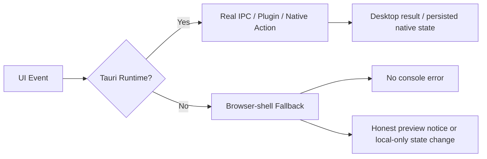

# 18 — 浏览器壳兼容与关键用户流修复方案

## 1. Executive Summary

本方案用于修复 AgentShield 在 `pnpm preview` 浏览器壳与首屏真实用户路径中的 5 个已确认问题，并收口本轮深度检查中暴露出的同源缺陷：

1. 浏览器壳启动时无条件调用 Tauri IPC，首屏即报错。
2. 通知中心 Store 假定 Tauri 一定存在，空态操作也会报错。
3. 首次引导组件存在但真实用户无法进入。
4. 英文模式仍混入硬编码中文文案。
5. `lint` 质量门无法执行。

本次修复的核心目标不是“让浏览器壳具备全部桌面能力”，而是：

- 浏览器壳路径不报错；
- 桌面专属功能诚实降级；
- 首次引导真实可达；
- 中英切换一致；
- 声明的质量门真实可运行。

## 2. Problem Statement and Scope

### 2.1 现状问题

2026-03-10 的真实回归表明：

- `App` 启动阶段直接调用 `check_license_status`，在浏览器壳中触发 `invoke` 异常。
- 通知中心、技能商店、OpenClaw、密钥保险库、许可证激活等页面在浏览器壳中存在直接 IPC 调用，用户点击后出现报错。
- `OnboardingWizard` 仅在 `isOnboarding === true` 时渲染，但当前默认状态固定为 `false`，缺少首次运行入口。
- 首页保护说明有硬编码中文，语言切换后仍残留中文。
- `package.json` 定义了 `lint`，但仓库没有 `eslint` 依赖与配置。

### 2.2 本次修复范围

本次只修复已证实且能直接影响用户路径或质量门的内容：

- 浏览器壳与桌面壳的运行边界收口；
- 首次引导入口与持久化；
- 国际化一致性；
- `lint` 可执行性；
- 业务动作级回归验证。

### 2.3 明确不在本次范围

- 不把浏览器壳伪装成可执行本机扫描/安装/钥匙串写入的环境；
- 不新增 Tier C / UNKNOWN 可写能力；
- 不改动与本轮问题无关的视觉细节和模块命名。

## 3. Current State and Constraints

### 3.1 代码与流程约束

- 项目为 `React + Vite + Tauri v2`。
- 仓库已将 `pnpm preview + Playwright` 作为浏览器壳 smoke 验证路径。
- 同时项目也通过 `pnpm tauri dev` 启动原生桌面壳。
- `Fail fast on lint/typecheck/test/audit` 为仓库规则。

### 3.2 平台边界

- Tauri `invoke()` 依赖桌面 WebView 运行时与 runtime authority。
- 通知权限、自启动等依赖 Tauri 插件，只在桌面壳中真实可用。
- 浏览器壳可用于：
  - 页面渲染；
  - 路由切换；
  - 本地状态交互；
  - 文案/空态/降级路径验证。
- 浏览器壳不可用于：
  - 原生命令调用；
  - 系统通知权限申请；
  - 自启动开关；
  - 钥匙串读写；
  - 本机环境检测与受控启动。

## 4. Target Architecture Overview

### 4.1 目标原则

1. 所有浏览器壳可进入页面必须首屏无红字。
2. 浏览器壳中的桌面专属动作必须给出诚实提示，而不是抛异常。
3. 首次引导必须由“真实首次运行状态”驱动，而不是死值。
4. 国际化文案必须只从 `i18n.ts` 读取。
5. 声明的质量门必须可运行且可复现。

## 5. Detailed Component Design

### 5.1 Tauri 环境边界统一

新增公共环境判断函数：

- 文件：`src/services/tauri.ts`
- 导出：
  - `isTauriEnvironment()`
  - `tauriInvoke()`

约定：

- 所有“浏览器壳也可进入”的页面，禁止直接假设 `invoke` 存在。
- 若当前不在 Tauri 环境，必须在调用前短路。

### 5.2 App 启动阶段修复

文件：`src/App.tsx`

调整：

- 启动时先判断运行环境。
- 若为浏览器壳：
  - 不调用 `check_license_status`；
  - 启动时间线记录为 `skipped`；
  - 许可证沿用默认 `free` 状态；
  - 通知中心走本地降级路径。
- 若为 Tauri：
  - 保持现有真实 IPC 加载逻辑。

### 5.3 Notification Store 降级策略

文件：`src/stores/notificationStore.ts`

策略：

- 浏览器壳中：
  - `loadNotifications` 只完成 hydration，不打后端；
  - `markAsRead` / `markAllAsRead` / `removeNotification` / `clearAll` 只做本地状态更新；
  - `pushNotification` 在本地插入临时通知，不写入后端。
- Tauri 中：
  - 保持当前持久化行为。

### 5.4 浏览器壳桌面专属页的诚实降级

涉及页面：

- `src/components/pages/skill-store.tsx`
- `src/components/pages/openclaw-wizard.tsx`
- `src/components/pages/key-vault.tsx`
- `src/components/pages/upgrade-pro.tsx`
- `src/components/pages/smart-guard-home.tsx`
- `src/components/pages/security-scan.tsx`

统一规则：

- 页面首屏不打印 `console.error`；
- 页面可渲染空态或预览提示；
- 点击桌面专属动作时：
  - 不发起原生 IPC；
  - 返回“当前为浏览器预览模式，仅桌面版可用”的提示；
  - 不伪造成功状态。

扫描页额外要求：

- 在浏览器壳中点击扫描，不再显示“修复失败 / 权限错误”这类误导信息；
- 应显示“预览模式提示”。

### 5.5 首次引导真实可达

文件：`src/stores/appStore.ts`

设计：

- 新增本地持久化键：`agentshield-onboarding-completed`
- 初始逻辑：
  - 若该键不是 `true`，则 `isOnboarding = true`
  - 完成引导后写入 `true`
- 这样满足：
  - 首次运行可达；
  - 后续启动不重复弹出；
  - 不依赖后端状态。

### 5.6 国际化收口

文件：

- `src/constants/i18n.ts`
- `src/components/pages/smart-guard-home.tsx`

要求：

- 将首页保护说明硬编码迁移到 i18n；
- 同时为浏览器壳提示增加中英双语键。

### 5.7 Lint 质量门恢复

文件：

- `package.json`
- `eslint.config.js`

实施：

- 补充 `eslint` 与最小可维护依赖；
- 新增 flat config；
- 规则以“当前代码库可稳定运行”为准，不额外引入严格但未准备好的规范。

## 6. Data Model and Interface Contracts

### 6.1 Local Storage Contract

| Key | Type | Meaning |
|---|---|---|
| `agentshield-onboarding-completed` | `string` (`true` / absent) | 是否已完成首次引导 |
| `agentshield-language` | `string` | 当前语言 |

### 6.2 Browser-shell Contract

当 `isTauriEnvironment() === false` 时：

- Native IPC：禁止调用；
- Store 持久化：仅保留本地内存行为；
- 用户文案：显示预览模式提示；
- 控制台：不出现预期内错误。

## 7. Non-Functional Requirements

### 7.1 Reliability

- 浏览器壳首页打开后控制台错误数 = `0`
- 浏览器壳点击以下动作后控制台错误数仍 = `0`
  - 扫描
  - 清空通知
  - 技能商店刷新
  - OpenClaw 首屏加载
  - 密钥保存
  - 试用 / 激活

### 7.2 UX Honesty

- 对桌面专属功能必须提示“桌面端可用”，不能假装成功。

### 7.3 Testability

- `pnpm lint`
- `pnpm typecheck`
- `pnpm test`
- `pnpm test:e2e`
- `cargo test`

均必须可执行。

## 8. ADRs

### ADR-01：浏览器壳是受支持验证环境，但不是原生能力环境

- **Decision**：保留浏览器壳 smoke 能力，但对原生功能做显式降级。
- **Alternatives**：
  - A. 浏览器壳继续直接报错；
  - B. 浏览器壳伪造成功；
  - C. 浏览器壳诚实降级。
- **Chosen**：C
- **Rationale**：既保留前端回归速度，也不误导用户。
- **Consequence**：需要统一环境判断入口和提示文案。

### ADR-02：首次引导使用本地持久化，而非后端状态

- **Decision**：引导完成状态使用 localStorage。
- **Alternatives**：
  - A. 固定死值；
  - B. 后端存储；
  - C. 本地持久化。
- **Chosen**：C
- **Rationale**：实现最小、跨浏览器壳与桌面壳一致、无需额外 IPC。
- **Consequence**：App 级测试需显式设置已完成状态。

### ADR-03：Lint 恢复为“最小可运行基线”

- **Decision**：先恢复可执行 lint，再逐步收严规则。
- **Alternatives**：
  - A. 删除 lint；
  - B. 一次性上严格规则；
  - C. 最小 flat config。
- **Chosen**：C
- **Rationale**：满足当前质量门，避免一次性引入大量无关整改。
- **Consequence**：后续可迭代增强规则集。

## 9. Risk Register and Mitigation

| Risk | Probability | Impact | Score | Mitigation |
|---|---:|---:|---:|---|
| 浏览器壳仍残留直接 `invoke` 调用 | 4 | 4 | 16 | 统一复用 `isTauriEnvironment()`，补 e2e 动作级验证 |
| 首次引导状态与测试环境冲突 | 3 | 3 | 9 | App 级测试显式写入 localStorage |
| ESLint 新配置引出历史噪音 | 3 | 3 | 9 | 使用最小规则集，先恢复执行能力 |
| 用户误解“预览不可用”为功能损坏 | 2 | 3 | 6 | 使用统一“预览模式提示”文案 |

## 10. Delivery Roadmap and Milestones

### Milestone 1 — 边界与入口

- 增加 `isTauriEnvironment()`
- 修复 App 启动
- 修复 Notification Store
- 修复首次引导入口

### Milestone 2 — 页面降级与文案

- 修复 Skill Store / OpenClaw / Key Vault / Upgrade Pro 浏览器壳降级
- 修复扫描页预览提示
- 修复首页硬编码文案

### Milestone 3 — 质量门与回归

- 恢复 lint
- 补 App / Store / e2e 回归
- 重新执行全量验证命令

## 11. Runbook and Observability Baseline

### 11.1 手动验证步骤

1. 浏览器壳：
   - `pnpm preview`
   - 打开首页
   - 检查控制台无错误
   - 点击扫描，看到“预览模式提示”
   - 打开通知中心并点击“清空”
   - 打开技能商店并点击“刷新目录”
   - 打开密钥保险库并尝试保存
   - 打开升级 Pro 并点击试用
2. 桌面壳：
   - `pnpm tauri dev --no-watch`
   - 确认应用能正常启动
3. 质量门：
   - `pnpm lint`
   - `pnpm typecheck`
   - `pnpm test`
   - `pnpm test:e2e`
   - `cargo test`

### 11.2 观测基线

- 浏览器壳控制台错误数
- 首次引导是否自动进入
- e2e 是否覆盖动作级降级路径
- lint 是否稳定为 0 退出码

## 12. Acceptance Criteria

### P1

- 浏览器壳首屏无 `invoke` 报错
- 浏览器壳通知中心空态操作无报错
- 首次运行真实进入引导
- 扫描动作在浏览器壳中显示预览提示而不是误导性失败

### P2

- 英文模式无首页硬编码中文
- `pnpm lint` 可执行并通过

## 13. Source References with Dates

### 外部资料

1. Tauri v2 Runtime Authority  
   https://v2.tauri.app/security/runtime-authority/  
   检索日期：2026-03-10
2. Tauri v2 Calling Rust from the Frontend  
   https://v2.tauri.app/develop/calling-rust/  
   检索日期：2026-03-10
3. Tauri v2 Notification Plugin  
   https://v2.tauri.app/plugin/notification/  
   检索日期：2026-03-10
4. Tauri v2 Autostart Plugin  
   https://v2.tauri.app/plugin/autostart/  
   检索日期：2026-03-10

### 本地依据

1. `/Users/luheng/Downloads/ai01/agentshield/src/App.tsx`
2. `/Users/luheng/Downloads/ai01/agentshield/src/stores/notificationStore.ts`
3. `/Users/luheng/Downloads/ai01/agentshield/src/stores/appStore.ts`
4. `/Users/luheng/Downloads/ai01/agentshield/src/components/pages/smart-guard-home.tsx`
5. `/Users/luheng/Downloads/ai01/agentshield/src/components/pages/security-scan.tsx`
6. `/Users/luheng/Downloads/ai01/agentshield/src/components/pages/skill-store.tsx`
7. `/Users/luheng/Downloads/ai01/agentshield/src/components/pages/openclaw-wizard.tsx`
8. `/Users/luheng/Downloads/ai01/agentshield/src/components/pages/key-vault.tsx`
9. `/Users/luheng/Downloads/ai01/agentshield/src/components/pages/upgrade-pro.tsx`
10. `/Users/luheng/Downloads/ai01/agentshield/package.json`
