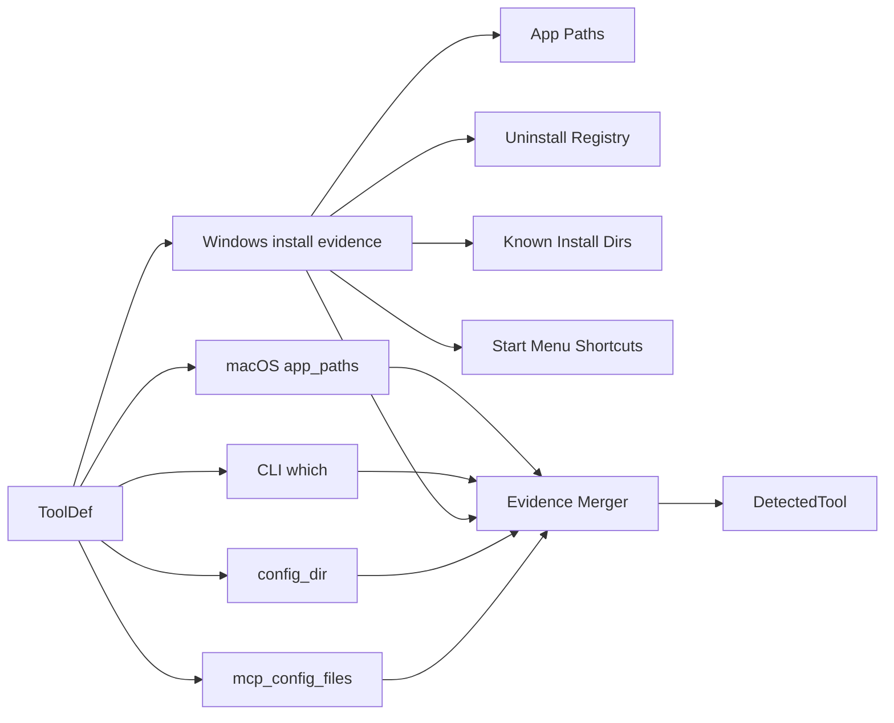

# 20 Windows 宿主发现可靠性修复方案

- 文档状态：已审查，可实施
- 适用范围：`AgentShield` Windows 首次扫描阶段的 AI 宿主发现
- 文档日期：2026-03-11
- 对应问题：`src-tauri/src/commands/scan.rs` 在 Windows 上无法稳定发现新安装但尚未生成配置痕迹的 GUI 宿主
- 目标用户：零基础用户；关注 `OpenClaw`、`skill`、`MCP` 所在 AI 宿主的发现与后续安全扫描

## 1. Executive Summary

当前 `detect_tool()` 的发现链路以 macOS `.app` 路径、CLI 可执行、配置目录、MCP 配置文件为主。该设计在 Windows 上存在结构性盲区：`Cursor`、`Claude Desktop`、`Windsurf`、`Trae`、`Zed`、`OpenClaw` 这类 GUI 宿主即使已经安装，只要尚未生成配置目录或未暴露 CLI，就会在首次扫描中被漏报。

本方案将 Windows 发现能力改造成“多证据、分层置信度、无管理员权限”的本机探测链路：

1. 保留现有 macOS / CLI / 配置发现逻辑。
2. 新增 Windows 安装证据采集层。
3. 以注册表卸载项、`App Paths`、常见安装目录为强证据。
4. 以开始菜单快捷方式为弱证据，只用于补充 `detected`，不直接提升 `host_detected`。
5. 不修改前端 `DetectedTool` 对外契约，只扩展 `detection_sources` 语义。

该方案的目标不是“扫描所有软件”，而是只围绕 `OpenClaw` 与 `MCP/skill` 生态相关宿主，在用户首次打开应用时给出可信的“你本机装了哪些 AI 工具”结果，为后续配置扫描、风险解释、一键安装与卸载引导提供正确入口。

## 2. Problem Statement and Scope

### 2.1 问题定义

当前 `src-tauri/src/commands/scan.rs` 中的 `ToolDef.app_paths` 几乎全部为 macOS `.app` 包路径。Windows 上：

- GUI 宿主通常不存在 `.app` 目录。
- 很多宿主默认不写入 `PATH`。
- 很多宿主第一次运行前不会创建配置目录。
- 因此“刚安装、未打开、未配置”的真实用户状态会被系统误判为“未安装”。

这直接破坏三条商用主路径：

1. 首次扫描无法准确告诉用户“你本机有哪些 AI 宿主”。
2. 后续无法定位这些宿主的 `skill` / `MCP` 配置入口。
3. 一键安装、一键修复、升级引导的入口条件不成立。

### 2.2 本次范围

本次只覆盖 Windows 上与 `OpenClaw` / `MCP` / `skill` 生态直接相关的宿主发现：

- `Cursor`
- `VS Code`
- `Claude Desktop`
- `Windsurf`
- `Claude Code`
- `Antigravity`
- `Codex CLI`
- `Gemini CLI`
- `Trae`
- `Continue`
- `Aider`
- `Zed`
- `Cline/Roo`
- `OpenClaw`

### 2.3 明确不在范围内

- 不做全盘任意软件发现。
- 不做微软商店应用的完整包管理器适配。
- 不在本次引入管理员权限、驱动、内核或杀软能力。
- 不把系统中其它普通应用纳入扫描对象。

## 3. Current State and Constraints

### 3.1 当前实现

`detect_tool(def)` 当前按以下顺序判断：

1. `app_paths`
2. `which::which(cli_name)`
3. `config_dir`
4. `mcp_config_files`

当前判断规则的结果：

- `detected = true`：任一条件满足
- `host_detected = true`：仅 `app_paths` 或 `cli` 成功时成立
- `install_target_ready = host_detected || (has_mcp && def.id == "continue_dev")`

### 3.2 约束

- 必须无管理员权限可运行。
- 首次扫描必须快，不能全盘遍历。
- 不能依赖用户先打开应用一次。
- 不能显著增加误报，尤其不能把残留配置误当成真实安装。
- 尽量不改前端结构，避免额外联动风险。

### 3.3 非功能要求

- 单次 Windows 宿主发现阶段新增耗时目标：`< 500ms` 常见机器、`< 1200ms` 较慢机器。
- 发现逻辑必须支持 `HKCU` 与 `HKLM` 双域。
- 发现逻辑必须兼容 64 位系统下的 `WOW6432Node`。
- 发现结果必须可解释，前端可以通过 `detection_sources` 告知用户“是根据什么发现的”。

## 4. Target Architecture Overview

### 4.1 总体策略

Windows 宿主发现采用“四层强弱证据融合”：

1. **强证据 A：App Paths 注册**
   - 适合发现注册了可执行入口的 GUI 宿主。
2. **强证据 B：卸载注册表项**
   - 适合发现标准安装器安装的 GUI 宿主。
3. **强证据 C：常见安装目录中的可执行文件**
   - 适合发现每用户安装或便携式安装。
4. **弱证据 D：开始菜单快捷方式**
   - 只作为补充发现信号，不单独认定为可安装目标。

保留现有三类证据：

5. `cli`
6. `config_dir`
7. `mcp_config`

### 4.2 目标流程图



## 5. Detailed Component Design

### 5.1 `ToolDef` 扩展

为每个工具增加 Windows 元数据，建议新增：

```rust
struct WindowsDetectionHints {
    display_names: &'static [&'static str],
    executable_names: &'static [&'static str],
    install_subdirs: &'static [&'static str],
    start_menu_terms: &'static [&'static str],
}
```

并在 `ToolDef` 中追加：

```rust
windows: Option<WindowsDetectionHints>
```

说明：

- `display_names`：用于匹配卸载注册表中的 `DisplayName`
- `executable_names`：用于匹配 `App Paths` 与安装目录中的 `.exe`
- `install_subdirs`：用于拼接 `%LOCALAPPDATA%\\Programs`、`%ProgramFiles%`、`%ProgramFiles(x86)%` 下的候选目录
- `start_menu_terms`：用于匹配开始菜单快捷方式名称

### 5.2 新增证据结构

建议增加内部结构：

```rust
#[derive(Clone, Debug)]
struct InstallEvidence {
    source: &'static str,
    path: Option<String>,
    host_confidence: u8,
    detected: bool,
    host_detected: bool,
}
```

置信度建议：

- `app`: 100
- `cli`: 95
- `app_paths_registry`: 90
- `uninstall_registry`: 85
- `install_dir`: 80
- `config_dir`: 40
- `mcp_config`: 35
- `start_menu`: 25

规则：

- `detected = true`：有任意证据
- `host_detected = true`：至少存在 `host_detected = true` 的证据
- `path`：选最高 `host_confidence` 的可用路径
- `detection_sources`：保留所有命中的来源，按强到弱排序

### 5.3 Windows 证据采集函数

建议新增：

```rust
#[cfg(windows)]
fn collect_windows_install_evidence(def: &ToolDef) -> Vec<InstallEvidence>
```

内部拆成四个 helper：

1. `collect_windows_app_paths_evidence`
2. `collect_windows_uninstall_evidence`
3. `collect_windows_install_dir_evidence`
4. `collect_windows_start_menu_evidence`

#### 5.3.1 `App Paths`

读取：

- `HKCU\\Software\\Microsoft\\Windows\\CurrentVersion\\App Paths`
- `HKLM\\Software\\Microsoft\\Windows\\CurrentVersion\\App Paths`

匹配方式：

- 对每个 `executable_names` 拼接 `<exe>.exe`
- 读取默认值，拿到绝对可执行路径
- 路径存在即记为强证据

该证据适合：

- 每用户安装
- GUI 工具不进 PATH 但做了 Shell 注册

#### 5.3.2 `Uninstall Registry`

枚举：

- `HKCU\\Software\\Microsoft\\Windows\\CurrentVersion\\Uninstall`
- `HKLM\\Software\\Microsoft\\Windows\\CurrentVersion\\Uninstall`
- `HKLM\\Software\\WOW6432Node\\Microsoft\\Windows\\CurrentVersion\\Uninstall`

匹配字段：

- `DisplayName`
- `InstallLocation`
- `DisplayIcon`

判定规则：

- `DisplayName` 命中 `display_names` 后，优先取 `InstallLocation`
- 若 `InstallLocation` 无效，则尝试从 `DisplayIcon` 解析出 `.exe` 路径
- 只有路径真实存在时，才记为 `host_detected = true`
- 若仅名字命中但路径不可证实，则不产生主证据，避免残留注册表误报

#### 5.3.3 常见安装目录

检查候选根目录：

- `%LOCALAPPDATA%\\Programs`
- `%ProgramFiles%`
- `%ProgramFiles(x86)%`

拼接策略：

- 遍历 `install_subdirs`
- 再拼接 `executable_names`
- 命中现存 `.exe` 则计入强证据

该层主要覆盖：

- 用户级安装器
- 不写 `App Paths` 的桌面宿主

#### 5.3.4 开始菜单快捷方式

检查目录：

- `%APPDATA%\\Microsoft\\Windows\\Start Menu\\Programs`
- `%ALLUSERSPROFILE%\\Microsoft\\Windows\\Start Menu\\Programs`

匹配对象：

- 文件名包含 `start_menu_terms` 的 `.lnk`

判定规则：

- 仅记为 `detected = true`
- 不单独设置 `host_detected = true`
- 若同时命中 `config_dir` 或 `mcp_config`，可帮助前端解释“该工具疑似存在，建议用户确认”

理由：

- `.lnk` 容易残留
- 不解析 COM target 的前提下，不能作为强安装证据

### 5.4 `detect_tool()` 重构方式

推荐改造为三阶段：

1. 采集原始证据
2. 合并证据并排序
3. 输出现有 `DetectedTool`

伪代码：

```rust
fn detect_tool(def: &ToolDef) -> DetectedTool {
    let mut evidence = Vec::new();
    evidence.extend(collect_macos_app_evidence(def));
    evidence.extend(collect_cli_evidence(def));
    evidence.extend(collect_windows_install_evidence(def));
    evidence.extend(collect_config_dir_evidence(def));
    let (has_mcp, mcp_paths, mcp_evidence) = collect_mcp_config_evidence(def);
    evidence.extend(mcp_evidence);

    let merged = merge_evidence(evidence);
    let install_target_ready =
        merged.host_detected || (has_mcp && matches!(def.id, "continue_dev"));

    DetectedTool { ... }
}
```

### 5.5 兼容性策略

- macOS：保持现状
- Linux：保持现状
- Windows：只在 `#[cfg(windows)]` 下启用新增链路
- 前端：无需改类型；只会看到新增的 `detection_sources` 值

## 6. Data Model and Interface Contracts

### 6.1 对外契约

`DetectedTool` 不改字段，不新增前端强制依赖：

```rust
pub struct DetectedTool {
    pub id: String,
    pub name: String,
    pub icon: String,
    pub detected: bool,
    pub host_detected: bool,
    pub install_target_ready: bool,
    pub detection_sources: Vec<String>,
    pub path: Option<String>,
    pub version: Option<String>,
    pub has_mcp_config: bool,
    pub mcp_config_path: Option<String>,
    pub mcp_config_paths: Vec<String>,
}
```

### 6.2 新增 `detection_sources` 取值

新增以下来源标签：

- `app_paths_registry`
- `uninstall_registry`
- `install_dir`
- `start_menu`

前端展示要求：

- 不需要立即改 UI
- 但后续可以把这些值翻译成用户可读文案，例如“注册表安装信息”“开始菜单入口”

### 6.3 路径选择规则

输出 `path` 时按以下优先级选首个可用路径：

1. `app`
2. `cli`
3. `app_paths_registry`
4. `uninstall_registry`
5. `install_dir`
6. `config_dir`
7. `mcp_config`
8. `start_menu`

## 7. Non-Functional Requirements

### 7.1 性能

- 不允许递归扫描整个用户目录或系统盘
- 注册表枚举和固定目录检测必须为 O(候选工具数 × 候选位置数)
- 每个工具最多访问固定几个注册表节点和固定几个目录

### 7.2 安全

- 只读访问注册表与文件系统
- 不执行任何发现到的可执行文件
- 不提升权限
- 不使用 WMI、远程管理、驱动或内核接口

### 7.3 可靠性

- 64 位系统必须同时考虑 `WOW6432Node`
- 残留快捷方式不能直接认定为真实宿主
- 残留注册表项若无路径证据，不能提升为 `host_detected`

### 7.4 成本

- 优先采用 Rust 原生实现
- 避免继续堆叠 PowerShell 文本解析，降低本地化与编码风险

## 8. ADRs

### ADR-20-01：Windows 发现采用多证据合并，而不是继续堆路径表

- 决策：采用注册表 + 固定目录 + 现有配置证据的合并模型
- 备选：继续在 `app_paths` 中硬编码 Windows 路径
- 理由：
  - Windows 安装位置分布更散
  - 每用户安装与每机安装路径不同
  - 单一路径表无法覆盖“刚安装未运行”状态
- 后果：
  - `ToolDef` 会略微复杂
  - 但发现准确率显著提高

### ADR-20-02：优先使用 Rust 注册表访问，而不是 `reg.exe` / PowerShell

- 决策：引入 Windows 专用注册表 crate
- 备选：通过 `reg query` 或 PowerShell 解析输出
- 理由：
  - 命令输出依赖本地化语言和编码
  - 解析文本脆弱
  - Rust API 可读性和可测性更好
- 后果：
  - 需要新增 target-specific dependency
  - Windows 代码路径更清晰

### ADR-20-03：开始菜单快捷方式只作为弱证据

- 决策：`start_menu` 不直接提升 `host_detected`
- 备选：只要有 `.lnk` 就视为已安装
- 理由：
  - 快捷方式容易残留
  - 不解析目标时误报风险高
- 后果：
  - 个别极端安装器可能只能得到 `detected = true`
  - 但不会误导“一键安装到该宿主”入口

## 9. Risk Register and Mitigation

| 风险 | 概率 | 影响 | 分值 | 说明 | 缓解措施 |
| --- | --- | --- | --- | --- | --- |
| 残留卸载项导致误报 | 3 | 4 | 12 | 老版本卸载后注册表未清理 | 必须要求 `InstallLocation` 或 `DisplayIcon` 路径存在 |
| 仅有开始菜单入口的宿主被低估 | 2 | 3 | 6 | 极少数安装器不写注册表也不落固定目录 | `start_menu` 作为 `detected`，后续可加 `.lnk` target 解析 |
| 新增 Windows 依赖引入构建风险 | 2 | 3 | 6 | 需要 target-specific dependency | 使用 `cfg(windows)` 隔离，并补 `cargo test` |
| 每工具别名不足导致漏报 | 3 | 4 | 12 | 厂商显示名与预期不完全一致 | 在 `display_names` 中保留主名称与常见别名 |
| 发现速度变慢 | 2 | 3 | 6 | 枚举多个注册表节点 | 固定节点、固定目录、禁止递归全盘 |

## 10. Delivery Roadmap and Milestones

### M1：设计落地

- 为 `ToolDef` 增加 Windows hints
- 为核心宿主补齐 `display_names` / `executable_names` / `install_subdirs`
- 建立证据合并函数

### M2：Windows 采集实现

- 接入 `App Paths`
- 接入 `Uninstall Registry`
- 接入固定安装目录检查
- 接入开始菜单弱证据

### M3：测试与验证

- 新增 Rust 单测覆盖合并规则
- 新增 Windows 路径候选解析测试
- 在 Windows 真机上做“新安装未运行”验证

### M4：前端解释增强（可选，不阻塞本次）

- 将 `detection_sources` 翻译成用户可读解释
- 在“未找到宿主但发现开始菜单入口”场景增加提示文案

## 11. Runbook and Observability Baseline

### 11.1 调试日志

建议在 debug 模式下增加结构化日志：

- 工具 ID
- 命中的证据来源
- 命中的路径
- 是否提升为 `host_detected`

日志示例：

```text
[tool-detect] tool=openclaw source=uninstall_registry path=C:\\Users\\demo\\AppData\\Local\\Programs\\OpenClaw\\OpenClaw.exe host_detected=true
```

### 11.2 回归场景

必须验证以下场景：

1. Windows 新安装 `Cursor`，未首次启动，无配置目录
2. Windows 新安装 `Claude Desktop`，未首次启动
3. Windows 新安装 `OpenClaw`，未首次启动
4. 仅有旧配置目录、软件已卸载
5. 仅有开始菜单残留快捷方式
6. 仅有 CLI 无 GUI
7. 32 位卸载项位于 `WOW6432Node`

### 11.3 验收标准

- 至少以下 GUI 宿主在“已安装但未运行”时可被发现：`Cursor`、`Claude Desktop`、`Windsurf`、`Trae`、`Zed`、`OpenClaw`
- 卸载残留配置目录不能把 `host_detected` 错判为 `true`
- `install_target_ready` 只在真实宿主存在时开放
- `cargo test` 通过
- 不破坏 macOS 现有发现链路

## 12. Implementation Checklist

- [ ] 为 `ToolDef` 增加 `windows` hints
- [ ] 为受支持宿主补齐 Windows 元数据
- [ ] 新增 `InstallEvidence`
- [ ] 新增 Windows 注册表读取 helper
- [ ] 新增固定目录扫描 helper
- [ ] 新增开始菜单弱证据 helper
- [ ] 重构 `detect_tool()` 为证据合并模式
- [ ] 新增 Rust 单元测试
- [ ] Windows 真机验证至少 3 个 GUI 宿主

## 13. Source References with Dates

1. Microsoft Learn, **Windows Installer Properties for the Uninstall Registry Key**, 访问日期 2026-03-11  
   <https://learn.microsoft.com/en-us/windows/win32/msi/uninstall-registry-key>

2. Microsoft Learn, **Application Registration - Win32 apps**, 访问日期 2026-03-11  
   <https://learn.microsoft.com/en-us/windows/win32/shell/app-registration>

3. Microsoft Learn, **KNOWNFOLDERID (Knownfolders.h)**, 访问日期 2026-03-11  
   <https://learn.microsoft.com/en-us/windows/win32/shell/knownfolderid>

4. Microsoft Learn, **View the system registry by using 64-bit versions of Windows**, 访问日期 2026-03-11  
   <https://learn.microsoft.com/en-us/troubleshoot/windows-client/performance/view-system-registry-with-64-bit-windows>

5. 仓库代码基线，访问日期 2026-03-11  
   - `src-tauri/src/commands/scan.rs`
   - `src-tauri/src/types/scan.rs`
   - `docs/specs/13-GA交付与签名验收基线.md`
   - `docs/specs/19-商用发布前OpenClaw与MCP-Skill生态专项审查报告.md`

## 14. 审查结论模板

审查时必须回答以下问题：

1. 是否仍然要求管理员权限？应为“否”。
2. 是否引入全盘扫描？应为“否”。
3. 是否把弱证据错误提升为 `host_detected`？应为“否”。
4. 是否保持前端 `DetectedTool` 契约稳定？应为“是”。
5. 是否只覆盖 OpenClaw/MCP/skill 生态宿主，而不是泛化到所有软件？应为“是”。

### 本次审查结论

- 结论：通过，可进入开发
- 无阻塞项
- 需在实现阶段严格遵守三条边界：
  1. 不引入管理员权限
  2. 不引入全盘扫描
  3. 不让 `start_menu` 单独提升 `host_detected`
