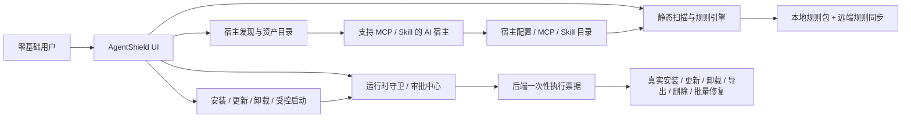

# 22 - 零基础用户商用冲刺收口方案

更新日期: 2026-03-11  
适用范围: AgentShield `macOS` / `Windows` / GitHub 直装桌面版  
目标状态: **完成 GitHub 公开试用版与付费版的真实能力收口，不走应用商店**

## 1. 执行摘要

本方案不再把 AgentShield 定义成“通用系统安全软件”，而是明确收口为：

> 面向零基础用户的 `MCP / Skill` AI 宿主安全管家。  
> 只发现、管理、扫描、更新、卸载、解释和审批那些支持 `MCP / Skill` 的 AI 工具及其组件。

商用首发采用 **受控管理链路优先** 的架构边界：

1. 只扫描和监听支持 `MCP / Skill` 的 AI 宿主。
2. 统一展示“本机有哪些 AI 宿主、每个宿主下有哪些 MCP / Skill、风险是什么、可做哪些管理动作”。
3. 由 AgentShield 发起或接管的安装、升级、卸载、导出、删除、批量修复、受控启动，全部走后端验票。
4. 免费版提供发现、查看、单项审批和手动处理。
5. 付费版提供批量修复、自动巡检、规则热更新和高级语义复核。
6. 默认界面先讲“后果”，技术术语下沉到“查看详情”。

当前不承诺：

- 通用系统级透明拦截所有第三方软件；
- 对所有第三方 AI 宿主外部动作做内核级强制接管；
- 应用商店分发。

## 2. 问题陈述与范围

### 2.1 用户真实痛点

零基础用户当前对 AI 编程工具的核心焦虑不是“不会写提示词”，而是：

1. 不知道本机到底装了哪些支持 `MCP / Skill` 的 AI 工具。
2. 不知道每个工具里已经接了哪些 `MCP / Skill`。
3. 看不懂命令、看不懂代码，不知道哪些组件存在高风险行为。
4. 担心在没有明确授权的情况下被删文件、发邮件、提交网页、转账、泄露密钥。
5. 不知道怎么安装、更新、删除 `OpenClaw` / `MCP` / `Skill`。

### 2.2 范围内

- 支持 `MCP / Skill` 的 AI 宿主发现与资产清单
- `MCP / Skill` 配置与目录扫描
- 风险解释与用户授权
- OpenClaw 一键安装 / 更新 / 卸载
- MCP / Skill 商店接入、真实安装目标预览、真实卸载与更新
- 规则同步、实时主动防御、受控启动与联网审计
- 免费版 / 付费版能力边界

### 2.3 明确不在范围内

- 非 AI 宿主的系统软件扫描
- 通用杀毒 / 系统防火墙替代
- 邮件客户端、浏览器、文件系统的内核级透明 Hook
- 应用商店上架要求

## 3. 当前状态与约束

### 3.1 已有真实能力

1. 宿主发现、MCP 配置扫描、Skill 目录扫描已经存在。
2. OpenClaw 安装、更新、卸载已经是真实后端命令。
3. 商店安装、卸载、批量修复、密钥导出/删除已经接入后端验票。
4. 实时主动防御已经基于发现快照只监听 AI 宿主相关路径。
5. GitHub 试点分发所需 repo-local gate 已可通过。

### 3.2 当前约束

1. 当前桌面端基于 `Tauri v2`，GitHub 直装是可行路径；公开 notarized macOS 发布仍依赖 Apple 签名与公证。
2. 第三方 AI 宿主的“所有运行时高危动作”并不能被无侵入透明接管。
3. 受控边界必须诚实限定在 “AgentShield 已发现 / 已托管 / 已接管的 MCP / Skill 与宿主配置链路”。
4. 当前审批交互仍是全屏弹窗，不符合“右下角轻量授权卡片”的极简目标。
5. `打开系统设置` 在部分 macOS 环境仍可能失败，需要更强兜底引导。

## 4. 目标架构概览



### 4.1 设计原则

1. 本地优先。
2. 宿主白名单发现。
3. 管理动作必须后端验票。
4. 风险解释优先于按钮暴露。
5. 免费版先满足“看得懂 + 不容易踩坑”，付费版再提升效率。

## 5. 详细组件设计

### 5.1 宿主发现与资产目录

目标：

1. 只发现支持 `MCP / Skill` 的 AI 宿主。
2. 每个宿主统一列出：
   - 宿主名称、版本、发现依据
   - MCP 配置文件路径
   - 已发现的 MCP 列表
   - 已发现的 Skill 列表
   - 当前是否是“真实宿主”还是“仅配置痕迹”

验收标准：

1. `Cursor`、`Kiro`、`Claude Code`、`Claude Desktop`、`Windsurf`、`Zed`、`VS Code`、`Codex CLI`、`Trae`、`Continue`、`OpenClaw` 至少能识别官方标准路径。
2. 深度发现和实时监听白名单一致，不允许“能识别但不能监听”的裂缝。
3. 不扫描 `Downloads`、`Desktop`、普通项目根和无关系统目录。

### 5.2 MCP / Skill 风险扫描

目标：

1. 对 MCP 命令、参数、网络地址、明文密钥、危险包做静态风险判定。
2. 对 Skill 目录里的脚本、符号链接、敏感模式做静态扫描。
3. 用零基础用户能懂的语言解释风险。

验收标准：

1. 至少覆盖命令执行、文件改写、邮箱发送、凭据访问、外部网络访问五类能力。
2. 命中规则时必须给出：
   - 触发宿主
   - 组件名
   - 路径
   - 命中的能力
   - 推荐动作

### 5.3 受控管理链路

目标：

1. 安装、更新、卸载、导出、删除、批量修复全部由后端验票。
2. UI 只能展示真实结果，不允许假进度和假按钮。
3. 所有高风险动作在执行前必须展示精确目标与后果。

动作矩阵：

| 动作 | 免费版 | 付费版 | 后端验票 | 当前优先级 |
| --- | --- | --- | --- | --- |
| 一键安装 MCP / Skill | 可用 | 可用 | 必须 | P0 |
| 一键更新托管组件 | 手动单项 | 批量自动化 | 必须 | P0 |
| 一键卸载托管组件 | 可用 | 可用 | 必须 | P0 |
| 密钥导出 / 删除 | 可用 | 可用 | 必须 | P0 |
| 一键修复全部 | 不开放 | 开放 | 必须 | P0 |
| 受控启动 Skill / MCP | 可用 | 可用 | 必须 | P1 |

### 5.4 运行时守卫

目标：

1. 已托管组件启动前审批。
2. 新外联地址审批。
3. 高风险动作使用统一审批语义。

首发边界：

- 首发以“受 AgentShield 管理链路中的动作”作为强控制面。
- 对外部第三方宿主透明触发的所有动作，不做超出事实的承诺。

高风险动作接入矩阵：

| request_kind | 语义 | 首发状态 |
| --- | --- | --- |
| `launch` | 受控启动组件 | 已接入 |
| `external_connection` | 放行新外联地址 | 已接入 |
| `file_delete` | 删除文件或配置 | 已接入 AgentShield 自管链路 |
| `bulk_file_modify` | 批量改写文件 | 已接入 AgentShield 自管链路 |
| `credential_export` | 导出/显示密钥 | 已接入 |
| `email_send` | 发送邮件 | 审批语义已具备，待第三方宿主事件接入 |
| `email_delete_or_archive` | 删除/归档邮件 | 审批语义已具备，待接入 |
| `browser_submit` | 网页表单提交 | 审批语义已具备，待接入 |
| `payment_submit` | 支付提交 | 审批语义已具备，待接入 |

### 5.5 零基础文案与授权交互（新增硬约束）

目标：

1. 审批入口改为右下角轻量卡片，默认不打断主界面。
2. 默认只讲“最差后果”和“是否会真实执行”，不展示专业术语。
3. 允许用户点“查看详情”后再看 `MCP / Skill / command / scope` 等技术字段。

验收标准：

1. 所有审批触发后，右下角在 300ms 内出现卡片，不再默认全屏覆盖。
2. 卡片正文必须包含“放行会发生什么”与“不放行会怎样”。
3. 全局文案中，首页与主流程页默认不出现英文技术词；详情页可展示。
4. 当系统设置跳转失败时，必须展示逐步手动路径与“重新检查”按钮。

## 6. 数据模型与接口契约

### 6.1 宿主资产视图

最小返回结构：

```ts
type HostInventory = {
  hostId: string
  hostName: string
  hostDetected: boolean
  configOnly: boolean
  version?: string
  configPaths: string[]
  mcps: { name: string; command: string; configPath: string }[]
  skills: { name: string; path: string }[]
}
```

### 6.2 高风险动作审批

最小审批字段：

```ts
type RuntimeApprovalRequest = {
  request_kind: string
  action_kind: string
  action_source: string
  action_targets: string[]
  action_preview: string[]
  sensitive_capabilities: string[]
  is_destructive: boolean
  is_batch: boolean
}
```

验收标准：

1. 所有需要审批的前端按钮都必须传入精确目标和预览。
2. 后端必须验证审批票据作用域，禁止 UI 绕过。

## 7. 非功能需求

### 7.1 安全

1. 不扫描无关程序。
2. 不默认上传项目文件。
3. 外部 IDE / CLI 配置默认只告警，不后台改写。
4. 所有高风险管理动作必须有后端票据校验。

### 7.2 可靠性

1. 宿主发现结果需要可复现。
2. 深度发现、实时监听、资产页展示必须使用同一套宿主根白名单。
3. 所有用户可点按钮都要有真实结果或明确失败原因。

### 7.3 成本

1. 免费版不做高成本语义复核批量化。
2. 付费版才开放批量修复、规则热更新、高级语义复核。

## 8. ADR

### ADR-001 只做支持 MCP / Skill 的 AI 宿主

- 决策: 不做系统级泛化扫描。
- 备选: 做通用系统安全产品。
- 原因: 会稀释产品定位，且当前架构无法诚实覆盖。
- 后果: 发现与防护逻辑必须严格宿主白名单化。

### ADR-002 首发采用“受控管理链路优先”而不是“系统级透明拦截”

- 决策: 商用首发只承诺 AgentShield 已接管链路。
- 备选: 承诺所有第三方宿主运行时动作都可拦截。
- 原因: 后者在当前 Tauri GitHub 直装产品中不可诚实交付。
- 后果: 所有对外文案、文档、定价页必须写清楚边界。

### ADR-003 GitHub 直装，不走应用商店

- 决策: 采用 GitHub 发布直装。
- 备选: App Store / Microsoft Store。
- 原因: 用户目标不是商店分发，且当前更需要快速迭代。
- 后果: 仍需补签名、更新链和安装教程，但无需商店审核流程。

## 9. 风险清单

| 风险 | 概率 | 影响 | 分数 | 缓解 |
| --- | --- | --- | --- | --- |
| 第三方宿主高危动作无法统一接入 | 5 | 5 | 25 | 限定首发承诺边界，补动作接入矩阵 |
| 宿主路径白名单漏项导致漏报 | 4 | 4 | 16 | 官方路径对齐 + 测试覆盖 |
| 外部宿主配置被误改写 | 4 | 4 | 16 | 外部宿主配置只告警、不后台重写 |
| 免费/付费边界不清引发投诉 | 4 | 4 | 16 | 后端 license gate + UI 明示 |
| GitHub 直装下签名解释不足 | 3 | 4 | 12 | 发布说明 + 安装引导 + 风险提示 |
| 授权弹窗过重导致用户跳过审批 | 4 | 4 | 16 | 右下角轻量卡片 + 后果导向文案 |
| 打开系统设置失败导致卡流程 | 4 | 5 | 20 | 深链 + App 打开双兜底 + 手动路径引导 |

## 10. 交付路线图

### P0 - 首发必须完成

1. 宿主覆盖清单补全并与实时监听对齐。
2. 宿主资产页真实展示每个宿主下的 MCP / Skill。
3. 所有用户可点的高风险管理动作完成后端验票。
4. 免费版 / 付费版边界落到后端和前端文案。
5. Win/mac 干净机验收跑完。
6. 运行时审批改为右下角轻量卡片，保留“展开详情”。
7. 修复 macOS `打开系统设置` 失败场景，并落地人工兜底流程。

### P1 - 公开售卖前补强

1. 邮件发送/删除、网页提交、支付提交的第三方宿主事件接入。
2. 许可证服务化，支持月付 / 年付 / 激活码 / 撤销。
3. 发布页与 README 的风险边界与安装指南收口。
4. 完成“默认零术语、详情可术语”的全局文案收口。

## 11. 运行手册与观测基线

上线前最小检查：

1. `cargo test`
2. `pnpm typecheck`
3. `pnpm test -- --runInBand`
4. `pnpm exec playwright test e2e/smoke.spec.ts --reporter=line`
5. `pnpm run release:gate`

运行时必须可见：

1. 已发现宿主数量
2. 当前监听路径数量
3. 最近审批请求
4. 最近拦截事件
5. 规则包版本

## 12. 参考资料

外部资料，均于 2026-03-11 核对：

1. Cursor MCP: <https://docs.cursor.com/context/model-context-protocol>
2. Kiro MCP: <https://kiro.dev/docs/mcp>
3. Kiro CLI MCP: <https://kiro.dev/docs/cli/mcp/>
4. Kiro MCP Security: <https://kiro.dev/docs/mcp/security>
5. Windsurf MCP: <https://docs.windsurf.com/windsurf/cascade/mcp>
6. Claude Code MCP: <https://code.claude.com/docs/en/mcp>
7. MCP Security Best Practices: <https://modelcontextprotocol.io/docs/tutorials/security/security_best_practices>
8. Tauri v2 distribute / signing docs: <https://v2.tauri.app/distribute/>

内部资料：

1. [19-商用发布前OpenClaw与MCP-Skill生态专项审查报告.md](/Users/luheng/Downloads/ai01/agentshield/docs/specs/19-商用发布前OpenClaw与MCP-Skill生态专项审查报告.md)
2. [21-商用发布前复核与阻塞项更新-2026-03-11.md](/Users/luheng/Downloads/ai01/agentshield/docs/specs/21-商用发布前复核与阻塞项更新-2026-03-11.md)
