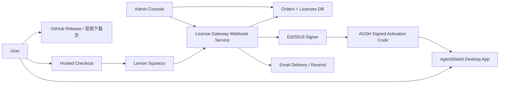

# 23 - 激活码售卖与最小商业化闭环方案

更新日期: 2026-03-11  
适用范围: AgentShield GitHub 直装版，面向 `macOS` / `Windows`，不走 Apple App Store / Microsoft Store  
目标用户: 担心 `MCP / Skill` 风险、需要零基础安全防护的欧美与中国用户

## 1. 执行摘要

当前最优商业化路径不是先做自动续费 SaaS，而是先做 **托管支付 + 单次付款激活码**：

1. **30 天激活码**
2. **365 天激活码**
3. **永久激活码**

这三类 SKU 在用户理解上可以分别对应“月度版 / 年度版 / 永久版”，但在支付和后端实现上统一按 **一次性购买的签名激活码** 处理，而不是先做自动续费订阅。

选择该路线的原因：

- 当前客户端已真实支持 `14 天试用 + AGSH 签名激活码 + expires_at`，改动最小。
- 一次性付款比订阅有更广的支付方式覆盖，尤其更适合中国用户。
- 可先验证真实资金流，再决定是否升级到在线 seat / 自动续费 / 设备绑定。
- 后台运营复杂度最低，退款、重发码、补单、人工客服都更容易收口。

本方案最终决策：

- **支付主方案**: `Lemon Squeezy` Hosted Checkout
- **授权主方案**: 继续使用 AgentShield 自己的 `AGSH.<payload>.<signature>` 签名激活码
- **SKU 设计**: 全部按一次性付款商品建模，月度/年度只是不同有效期的激活码
- **反破解策略**: 采用“唯一订单码 + 服务端签名 + 运营可撤销 + 后续黑名单同步”的渐进式方案，而不是承诺绝对防破解
- **价值分层**: 免费版提供“可用但偏手动”的安全流程，付费版提供“更省时间”的一键自动化与更快规则更新

## 2. 问题陈述与范围

### 2.1 要解决的问题

你要卖的不是“订阅系统”，而是一个围绕 `MCP / Skill` 生态的桌面安全产品。商业化最核心的要求是：

- 用户能在 GitHub 下载安装应用；
- 用户能直接在线付款；
- 付款后能马上拿到激活码；
- 激活码能解锁付费能力；
- 你后台能查订单、查用户、重发码、禁用码；
- 前期先跑起来，让你看到真实资金流。

### 2.2 本方案范围

本方案只覆盖：

- 支付选型
- 激活码 SKU 设计
- 最小后端服务
- 防滥用 / 防倒卖 / 防伪造策略
- 后台运营流程
- 客户端最小改造

### 2.3 明确不在本轮范围

- Apple App Store / Microsoft Store 上架
- 企业级 seat 管理
- 自动续费订阅的完整 SaaS 账单系统
- 绝对不可破解的 DRM
- 任意第三方支付的并行集成

## 3. 当前状态与约束

### 3.1 仓库当前已具备能力

截至 2026-03-11，客户端已有以下基础：

- `14 天试用`
- 本地离线签名激活码校验
- 只接受 `plan = pro | enterprise`
- 已支持 `billing_cycle`
- 已支持 `expires_at`
- 已支持 `issued_at`
- 已支持 `license_id`
- 已支持 `customer`

实现位置:

- [license.rs](/Users/luheng/Downloads/ai01/agentshield/src-tauri/src/commands/license.rs#L18)
- [license.rs](/Users/luheng/Downloads/ai01/agentshield/src-tauri/src/commands/license.rs#L30)
- [license.rs](/Users/luheng/Downloads/ai01/agentshield/src-tauri/src/commands/license.rs#L165)

### 3.2 当前短板

代码现状已变化，当前真实短板应更新为：

- 在线支付仍未接入生产环境（只有方案与本地服务脚本）
- 已有 `license-gateway` 脚本服务，但未形成生产部署/监控/告警链路
- 撤销后的客户端实时失效同步仍未打通（当前偏离线激活）
- leaked code 黑名单分发与自动拉黑尚未落地
- 仍没有真正的“月付 / 年付自动续费”状态同步

### 3.3 关键约束

- 产品走 GitHub 直装，不走商店。
- 目标用户包含中国与欧美用户。
- 初期要简单可运营，优先真实回款。
- 所有按钮和状态都必须是真实后端逻辑，不做演示态。
- 仍然只做 `MCP / Skill` 安全产品，不扩成系统级杀软。

## 4. 外部研究结论

### 4.1 Lemon Squeezy 的一次性付款更适合当前阶段

官方资料显示，Lemon Squeezy 的 **single payment** 商品支持：

- Cards
- PayPal
- Apple Pay
- Google Pay
- Alipay
- WeChat Pay
- China UnionPay

并且官方明确写明：

- **single payment** 商品可用全部支持的付款方式；
- **subscription** 商品当前只支持 `cards / Apple Pay / Google Pay / PayPal`。

这意味着：

- 如果你一上来就做自动续费订阅，中国用户支付覆盖会变差；
- 如果你把“月度版 / 年度版”做成一次性付款激活码，中国与欧美的覆盖会更好。

### 4.2 Lemon Squeezy 作为 Merchant of Record 能减少早期税务和合规负担

官方资料显示，Lemon Squeezy 作为 `Merchant of Record`，负责：

- payments
- sales tax / VAT
- chargebacks / refunds 流程中的平台责任
- PCI 合规责任

这比自建 Stripe 税务闭环更适合你现在“先跑起来”的目标。

### 4.3 Paddle 可作为备用，不适合作为 v1 主线

Paddle 官方资料显示：

- `WeChat Pay` 仅支持 **one-time items**
- 不支持 subscription
- 仅在 `CNY / USD` 条件下向中国用户展示

这说明 Paddle 也能做一次性付款，但不会比 Lemon Squeezy 在当前阶段更简单。

### 4.4 官方 webhook 与 custom data 足够支撑最小闭环

Lemon Squeezy 官方资料显示：

- 支持 Hosted Checkout
- 支持 Webhooks
- 支持把 `custom_data` 从 checkout 透传到 webhook
- `order_created / subscription_created / subscription_updated / license_key_created` 等事件足够驱动发码和对账

因此最小闭环不需要复杂嵌入式支付页，直接 Hosted Checkout + Webhook 即可。

### 4.5 免费/付费价值锚点（面向零基础）

文案与功能必须统一遵守：

1. 免费版: 能完成全流程，但需要更多手动点击与人工确认。
2. 付费版: 主打“省时间”，突出一键修复、批量处理、自动更新、实时防护。
3. 默认文案强调后果，不用术语；术语进入“查看详情”。

能力边界矩阵：

| 能力 | 免费版 | 付费版 |
| --- | --- | --- |
| 扫描与风险查看 | 可用 | 可用 |
| 单项手动修复 | 可用 | 可用 |
| 一键批量修复 | 不开放 | 开放 |
| 规则更新 | 手动刷新、低频 | 自动热更新、高频 |
| 运行时防护 | 基础提醒 | 完整实时防护与更快策略 |

文案钩子示例（默认层）：

1. “这次放行可能导致文件被批量改写，且无法自动撤回。”
2. “如果不升级规则，新的恶意组件可能绕过当前防护。”
3. “免费版可继续手动处理；完整版可一键完成并持续自动巡检。”

## 5. 方案比较

| 方案 | 描述 | 优点 | 缺点 | 结论 |
| --- | --- | --- | --- | --- |
| A | Lemon Squeezy + AgentShield 自签名激活码 + 单次付款 SKU | 改动最小、覆盖中西方支付、GitHub 直装最顺、最容易先收钱 | 早期仍需手动/半自动运营，防破解只能做渐进式 | 选中 |
| B | Lemon Squeezy 内建 license key + 客户端在线校验 | 平台自带 activation limit、订单关系更强 | 客户端要改成在线授权模型，复杂度上升，离线体验变差 | 延后 |
| C | Paddle + AgentShield 自签名激活码 | 中国支付可覆盖 WeChat one-time，MoR 模型成立 | 运维与本地资料链不比 Lemon 更简单 | 备用 |
| D | Stripe + 自建税务/发票/退款/订阅 | 最灵活 | 早期税务、风控、合规、订阅管理负担太重 | 不选 |

## 6. 目标架构



### 6.1 核心思路

- 支付完全托管给 `Lemon Squeezy`
- 授权完全掌握在你自己的 `License Gateway`
- 客户端继续离线验签，不在桌面端保存任何私钥
- 月度版 / 年度版 / 永久版全部统一为单次付款订单

## 7. 详细组件设计

### 7.1 Checkout 层

职责：

- 展示 3 个 SKU
- 打开 Hosted Checkout
- 把 `custom_data` 带入订单

SKU 设计：

1. `AgentShield Pro 30 Days`
2. `AgentShield Pro 365 Days`
3. `AgentShield Pro Lifetime`

实现规则：

- 这三种都建成 **one-time product**
- 不做 subscription product
- checkout 中传递：
  - `sku_code`
  - `campaign`
  - `source`
  - 可选 `user_email_hint`

### 7.2 License Gateway 服务

职责：

- 接收 webhook
- 验签
- 幂等处理订单
- 生成激活码
- 发送邮件
- 提供后台管理能力

最小接口：

- `POST /webhooks/lemonsqueezy`
- `POST /admin/licenses/:licenseId/reissue`
- `POST /admin/licenses/:licenseId/revoke`
- `POST /admin/orders/:providerOrderId/resend`
- `GET /admin/licenses`
- `GET /health`

### 7.3 Signer

职责：

- 仅在服务端使用 `Ed25519` 私钥签发 `AGSH` 激活码
- 私钥不进入仓库、不进入桌面客户端

激活码格式继续沿用：

`AGSH.<base64url(payload)>.<base64url(signature)>`

payload 建议字段：

```json
{
  "plan": "pro",
  "billing_cycle": "monthly",
  "expires_at": "2026-04-10T00:00:00Z",
  "issued_at": "2026-03-11T00:00:00Z",
  "license_id": "lic_01ABC...",
  "customer": "buyer@example.com"
}
```

决策说明：

- 三种 SKU 都用 `plan = pro`
- 通过 `billing_cycle = monthly | yearly | lifetime` 区分
- 永久版用 `expires_at = null`

原因：

- 当前前端对 `pro` 兼容最好
- 不需要额外改 UI 才能激活成功
- `enterprise` 预留给未来团队版

### 7.4 数据存储

最小表设计：

#### `orders`

- `id`
- `provider`
- `provider_order_id`
- `provider_customer_id`
- `customer_email`
- `sku_code`
- `currency`
- `amount_total`
- `payment_status`
- `raw_event_hash`
- `created_at`
- `updated_at`

#### `licenses`

- `id`
- `license_id`
- `provider_order_id`
- `plan`
- `billing_cycle`
- `expires_at`
- `customer_email`
- `status` (`active | revoked | refunded | replaced`)
- `issued_code_hash`
- `issued_at`
- `revoked_at`
- `replacement_for_license_id`
- `notes`

#### `license_deliveries`

- `id`
- `license_id`
- `channel` (`checkout_page | email | manual_resend`)
- `delivered_to`
- `delivered_at`

#### `audit_logs`

- `id`
- `actor`
- `action`
- `target_type`
- `target_id`
- `payload`
- `created_at`

### 7.5 后台管理界面

v1 不要求复杂后台。

最小后台能力：

- 按邮箱查订单
- 按 `license_id` 查激活码
- 手动重发码
- 标记退款并撤销
- 手动补发永久码 / 年度码
- 查看 webhook 失败记录

实现优先级：

- 第一阶段可以是受保护的简单网页或 Basic Auth 管理页
- 不必先做复杂角色权限系统

## 8. 数据模型与接口契约

### 8.1 Webhook 处理契约

#### Lemon Squeezy

最小订阅事件集合：

- `order_created`

如果后续仍使用 platform 内建 subscription，可扩展：

- `subscription_created`
- `subscription_payment_success`
- `subscription_updated`

v1 当前建议只依赖：

- `order_created`

因为所有 SKU 都是 one-time item。

### 8.2 幂等规则

幂等键：

- `provider + provider_order_id`

处理规则：

- 同一订单重复 webhook 不重复发码
- 仅在首次成功处理时生成激活码
- 后续重复事件只更新状态和审计日志

### 8.3 邮件与页面交付规则

用户付款成功后，激活码应同时出现在：

- 成功页
- 邮件

这样即使邮件延迟，用户也能立刻激活；即使页面关掉，用户也能从邮件找回。

## 9. 非功能要求

### 9.1 安全

- 私钥仅存在服务端环境变量或密钥托管服务中
- webhook 必须验签
- webhook 必须使用原始请求体验签
- 激活码只存哈希，不在数据库明文长期保存
- 后台管理接口必须有独立管理员认证
- 审计日志必须保留重发码、撤销、补单操作

### 9.2 可靠性

- webhook 处理必须幂等
- 邮件失败不能导致订单丢失
- 可重新触发补发
- 订单成功但发码失败时必须进入可重试队列

### 9.3 成本

- v1 只接受一个支付主渠道
- v1 不引入 seat 服务
- v1 不做复杂 CRM
- v1 允许人工客服介入补发与退款

### 9.4 用户体验

- 零基础用户只需要三步：
  1. 下载
  2. 付款
  3. 粘贴激活码
- 成功页必须展示：
  - 激活码
  - 有效期
  - 使用说明
  - 常见问题

## 10. ADR

### ADR-001: 月付 / 年付按单次付款激活码建模，而不是自动续费

决策：

- 30 天 / 365 天商品全部用 one-time payment 建模

备选：

- 自动续费 subscription

原因：

- 中国用户支付覆盖更广
- 当前客户端已支持 `expires_at`
- 后台更易管理
- 更快看到真实资金流

后果：

- 月付不是自动扣费，而是到期后重新购买
- 前端文案必须写清楚“月度激活码 / 年度激活码”

### ADR-002: v1 继续使用 AGSH 自签名激活码，而不是切到平台内建 license API

决策：

- 继续沿用本地离线签名校验

备选：

- 直接切换到 Lemon Squeezy 内建 License Key + 在线校验

原因：

- 当前客户端已支持 AGSH 验签
- 改动最小
- 离线体验更好
- 更适合 GitHub 直装桌面软件

后果：

- 退款后立即失效、设备限制、激活次数限制需要后续再补

### ADR-003: v1 支付主通道选 Lemon Squeezy，Paddle 作为备用

决策：

- 优先 Lemon Squeezy

原因：

- 一次性商品支持的支付方式覆盖面更广
- Merchant of Record 降低税务与合规负担
- Hosted Checkout + Webhook 足够支撑当前阶段

后果：

- 若中国区实际转化不达标，再评估 Paddle 补位

## 11. 防破解与防滥用设计

### 11.1 现实边界

桌面软件的离线激活码 **无法做到绝对不可破解**。  
本方案的目标不是“绝对防破解”，而是：

- 防伪造
- 降低分享码传播
- 降低退款白嫖
- 降低批量倒卖
- 让后台可追踪、可重发、可撤销

### 11.2 v1 必做

1. 每笔订单生成唯一 `license_id`
2. 每个订单单独签发唯一激活码
3. payload 中嵌入 `customer` 邮箱
4. payload 中嵌入 `issued_at`
5. payload 中嵌入 `billing_cycle`
6. 数据库保存 `issued_code_hash`
7. 后台支持 `reissue / revoke / replace`

### 11.3 v1.1 建议补强

1. 定期下载撤销清单 `revoked_licenses.json`
2. 客户端激活后定期同步撤销状态
3. 退款订单自动进入撤销队列
4. 同邮箱短时间多次重发触发风控提示

### 11.4 v2 再考虑

1. 首次激活 claim
2. 软设备绑定
3. 激活次数限制
4. 在线 seat 管理

## 12. 风险登记表

| 风险 | 概率 | 影响 | 分数 | 缓解 |
| --- | ---: | ---: | ---: | --- |
| 激活码被公开分享 | 4 | 4 | 16 | 单订单唯一激活码、邮箱水印、撤销能力、后续黑名单同步 |
| webhook 被伪造或重放 | 3 | 5 | 15 | 原始请求体验签、幂等键、审计日志 |
| 付款成功但发码失败 | 3 | 4 | 12 | 发码任务重试、后台补发 |
| 中国用户订阅支付转化差 | 4 | 4 | 16 | 不做订阅，统一按 one-time 激活码 |
| 退款后用户继续使用 | 3 | 4 | 12 | 后台撤销、后续撤销清单同步 |
| 私钥泄露 | 2 | 5 | 10 | 私钥只放服务端密钥管理，严格轮换 |
| Lemon 单渠道故障 | 2 | 4 | 8 | 预留 Paddle 备用路径 |

## 13. 交付路线图

### M0 - 文档冻结

交付物：

- 本文档

验收：

- 方案、SKU、支付渠道、反破解路线明确

### M1 - 最小发码能力

交付物：

- `AGSH` 激活码签发器
- 私钥环境变量读取
- 本地/测试订单生成码

验收：

- 能基于 `plan + expires_at + license_id + customer` 生成可被客户端激活的码

### M2 - Hosted Checkout + Webhook

交付物：

- 付款成功 webhook
- 幂等订单处理
- 自动发码
- 邮件发送

验收：

- 测试订单可以自动生成并交付激活码

### M3 - 后台管理

交付物：

- 查询订单
- 查询 license
- 重发码
- 撤销码

验收：

- 管理员无需进数据库即可处理客户售后

### M4 - 客户端付费体验收口

交付物：

- 升级页展示三种 SKU
- 打开购买链接
- 明确“月度激活码 / 年度激活码 / 永久激活码”

验收：

- 用户能从应用内直接跳转购买，并理解不是自动续费订阅

## 14. Runbook 与观测

### 14.1 关键指标

- `orders_created_total`
- `licenses_issued_total`
- `licenses_reissued_total`
- `licenses_revoked_total`
- `webhook_verify_failed_total`
- `webhook_duplicate_total`
- `delivery_email_failed_total`
- `checkout_conversion_rate`

### 14.2 日常运营动作

1. 每日检查 webhook 失败队列
2. 每日检查退款订单与撤销状态
3. 每周抽查被分享/异常重发的 license
4. 每周统计 30 天 / 365 天 / 永久版销量

### 14.3 客服标准动作

用户说“没收到激活码”：

1. 按邮箱查订单
2. 确认支付成功
3. 重发激活码

用户说“激活码失效”：

1. 查 `license_id`
2. 确认是否已撤销 / 已替换 / 已过期
3. 必要时补发 replacement code

## 15. 实施验收标准

上线前必须满足：

1. 用户可从 GitHub/官网下载安装 AgentShield。
2. 用户可在线购买 30 天 / 365 天 / 永久激活码。
3. 付款成功后，激活码能在 1 分钟内通过页面或邮件交付。
4. 客户端能真实激活并识别到期时间。
5. 管理员可按邮箱或订单号重发码。
6. 管理员可撤销退款对应的码。
7. 所有购买按钮、激活状态、有效期文案都是真实后端数据。

## 16. 参考资料

所有时间敏感信息均按 2026-03-11 核实。

- Lemon Squeezy Payment Methods: <https://docs.lemonsqueezy.com/help/checkout/payment-methods>
- Lemon Squeezy Single Payment: <https://docs.lemonsqueezy.com/help/products/single-payment>
- Lemon Squeezy Merchant of Record: <https://docs.lemonsqueezy.com/help/payments/merchant-of-record>
- Lemon Squeezy Sales Tax and VAT: <https://docs.lemonsqueezy.com/help/payments/sales-tax-vat>
- Lemon Squeezy Webhooks: <https://docs.lemonsqueezy.com/help/webhooks>
- Lemon Squeezy Event Types: <https://docs.lemonsqueezy.com/help/webhooks/event-types>
- Lemon Squeezy Passing Custom Data: <https://docs.lemonsqueezy.com/help/checkout/passing-custom-data>
- Lemon Squeezy License API: <https://docs.lemonsqueezy.com/api/license-api/validate-license-key>
- Paddle WeChat Pay: <https://developer.paddle.com/concepts/payment-methods/wechat-pay>
- Stripe Payment Links: <https://docs.stripe.com/api/payment_links>
