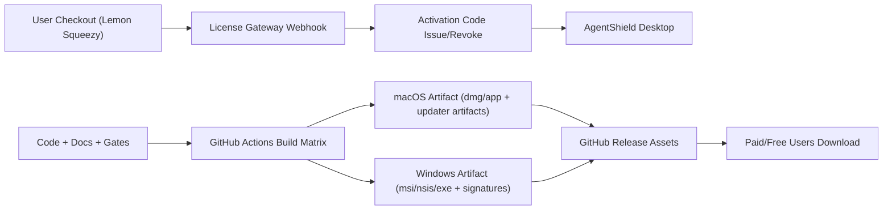

# AgentShield GitHub 开源仓库商用发布技术方案与资料清单（2026-03-13）

## 1. Executive Summary

目标是在 GitHub 开源仓库分发场景下，实现可持续商用：

1. 同时交付 macOS 与 Windows 可安装产物。
2. 保持开源代码透明，同时通过许可证体系实现付费功能。
3. 形成可重复执行的发布流水线（质量门禁 -> 签名/公证 -> 发布 -> 回滚）。
4. 把外部依赖（证书、支付、法务、域名）转为明确资料清单，减少上线阻塞。

结论（可行性）：

1. 当前仓库已经具备核心骨架：`release:gate`、`public-sale-gate`、双平台 GitHub Actions、License Gateway。
2. 以 GitHub Releases 作为下载分发主通道在技术上可行（单资产 < 2 GiB，单 Release 可挂 1000 个资产）。
3. 正式商用的真正阻塞不在代码主干，而在外部资料与凭据齐备度（Apple/Windows 签名、支付生产配置、法务终稿）。

## 2. Problem Statement And Scope

### 2.1 问题定义

目前项目可做试点分发，但要达到“大规模商用下载+付费”还需要：

1. 统一“发布标准答案”：开发、运营、法务都能按同一流程执行。
2. 把“必须有的外部输入”定义清楚，并给出获取路径。
3. 保证任何一次发布都可审计、可回滚、可复现。

### 2.2 范围

包含：

1. GitHub 分发流水线。
2. macOS/Windows 签名与安装包生成。
3. Lemon Squeezy 购买与 webhook 驱动发码/退款撤销。
4. 文档、门禁、运行手册。

不包含：

1. 系统级杀毒能力（项目定位不是 AV）。
2. 应用商店上架流程（本方案仅针对 GitHub 分发）。

## 3. Current State And Constraints

### 3.1 当前仓库真实能力（已存在）

1. `scripts/release-gate.sh`：质量门禁（Rust tests / frontend build / vitest / playwright）。
2. `scripts/public-sale-gate.sh`：公开售卖门禁（法务文件、支付链接、license 网关密钥、updater 配置）。
3. `.github/workflows/publish-pilot-artifacts.yml`：GitHub 试点产物发布（macOS + Windows）。
4. `.github/workflows/publish-signed-release.yml`：正式签名发布流程模板。
5. `scripts/license-gateway.mjs`：Lemon Squeezy webhook 验签、发码、退款撤销闭环。

### 3.2 约束

1. 发布渠道限定 GitHub Releases。
2. 产品定位是 AI 工具生态安全治理，不扩展到系统内核/杀毒能力。
3. 生产发布必须依赖外部证书与账号，无法仅靠本地代码“伪造通过”。

## 4. Target Architecture Overview

核心原则：

1. 本机用于预检，正式安装包以 CI 原生平台构建为准。
2. 付费闭环由“外部支付事件 -> License Gateway -> 激活码状态”驱动。
3. 任何可商用发布必须先过门禁脚本。

## 5. Detailed Component Design

### 5.1 发布流水线

1. `release:github:ready`：面向 GitHub 直分发（pilot）。
2. `release:public:ready`：面向正式商用（签名、公证、updater）。
3. `publish-pilot-artifacts.yml`：快速双平台产物（可先跑通下载链路）。
4. `publish-signed-release.yml`：正式版本（含证书导入与签名参数）。

### 5.2 许可证与支付

1. 接收最少事件：`order_created`、`order_refunded`、`subscription_payment_refunded`。
2. `order_created` -> 签发激活码。
3. 退款事件 -> 自动撤销或失效关联 license。
4. 通过幂等处理避免 webhook 重放导致重复发码。

### 5.3 更新能力（Tauri Updater）

1. `bundle.createUpdaterArtifacts = true`。
2. 需要 `plugins.updater.pubkey` + `endpoints`。
3. 产物侧需要 `.sig` 与 update manifest 对应字段（url/signature/version）。

## 6. Data Model And Interface Contracts

### 6.1 Webhook 契约（Lemon Squeezy）

关键字段：

1. `event_name`
2. `data.id`（订单/订阅/发票主键）
3. `data.attributes`（邮箱、金额、状态等）
4. 签名头（用于 HMAC 验证）

处理约束：

1. 先验签再入库。
2. 同一事件 ID 只处理一次（幂等）。
3. 退款事件必须可追溯到历史发码记录。

### 6.2 发布契约（GitHub Release）

1. 资产命名稳定（平台/架构/版本）。
2. 每次发布附带 `SHA256SUMS.txt`。
3. Release Notes 记录升级与回滚说明。

## 7. Non-Functional Requirements

### 7.1 Security

1. 签名密钥只存 GitHub Secrets 或企业密钥系统，不入库。
2. License Gateway webhook 必须验签。
3. 最小权限原则配置 Actions secrets 访问范围。

### 7.2 Reliability

1. 门禁失败立即中断，不允许“先发后补”。
2. webhook 处理支持重试与幂等。
3. 发布保留上一个稳定 tag 供快速回滚。

### 7.3 Cost

1. 下载分发优先 GitHub Releases（降低初期基础设施成本）。
2. 税务合规优先使用 MoR（Lemon Squeezy）减少自行处理 VAT/Sales Tax 负担。

## 8. ADRs

### ADR-001：分发渠道选择 GitHub Releases

1. 决策：使用 GitHub Releases 承载安装包。
2. 备选：自建 CDN、应用商店。
3. 理由：当前阶段最快上线、与开源仓库天然一致、流程简单。
4. 后果：需要自己承担签名、公证、更新元数据维护。

### ADR-002：支付与税务采用 MoR

1. 决策：用 Lemon Squeezy 作为 Merchant of Record。
2. 备选：Stripe 自建税务链路。
3. 理由：MoR 可代处理税务、退款、合规复杂度。
4. 后果：需适配其 webhook 与后台流程。

### ADR-003：双阶段发布（pilot -> public）

1. 决策：先跑 `pilot`，再切 `public`。
2. 备选：直接一次性上正式签名流。
3. 理由：降低首发风险，先验证购买/下载/激活链路。
4. 后果：需要维护两套发布 workflow。

## 9. Risk Register

| 风险 | 概率(1-5) | 影响(1-5) | 分数 | 处理策略 |
| --- | --- | --- | --- | --- |
| Apple 证书/公证资料不全导致 mac 包阻塞 | 4 | 5 | 20 | 先完成账号与证书导出，预演一次签名公证 |
| Windows 签名证书缺失导致 SmartScreen 信任差 | 4 | 4 | 16 | 上线前完成证书签名与时间戳配置，先小流量积累信誉 |
| webhook 未覆盖退款事件导致“退款后仍可用” | 3 | 5 | 15 | 强制订阅 refund 事件并加入回归测试 |
| 法务文档滞后导致投诉与下架风险 | 3 | 5 | 15 | 将法务终稿作为 No-Go 门禁 |
| secrets 泄漏 | 2 | 5 | 10 | GitHub Secrets + secret scanning + rotation 预案 |

## 10. Delivery Roadmap And Milestones

### M1（1-2 天）

1. 补齐 `.env.public-sale.local` 真实值。
2. 跑通 `release:github:ready`。
3. 生成一次 mac/win 试点发布资产。

### M2（2-4 天）

1. 完成 Apple/Windows 签名资料接入。
2. 跑通 `release:public:ready`。
3. 完成购买-发码-激活-退款撤销全链路演练。

### M3（1-2 天）

1. 发布正式签名版本。
2. 开启发布后监控（下载、激活成功率、退款撤销 SLA）。
3. 留出回滚窗口并验证可回滚。

## 11. Runbook And Observability Baseline

### 11.1 发布前清单

1. `pnpm run release:public:ready` 通过。
2. 支付与 webhook 事件在测试模式演练通过。
3. 法务文档已终审并落库。
4. 产物带校验和文件。

### 11.2 发布后观测（最小集）

1. 每日下载量（按平台）。
2. 激活成功率。
3. webhook 失败率和重试次数。
4. 退款后 license 撤销时延。

## 12. 你现在需要提供给我的资料（含获取方式）

以下为正式商用必需项（优先级从高到低）：

### 12.1 法律与主体

1. 公司/个体工商主体名称（法务一致口径）。
2. 对外法务终稿：
   - `Privacy Policy`
   - `Terms of Service`
   - `EULA`
   - `Refund Policy`
3. 获取路径：
   - 由你现有法务/律师提供；
   - 若无，先用模板起草，再做律师审校。

### 12.2 Apple 商用签名与公证

1. Apple Developer Program 账号（组织或个人）。
2. 组织账户需准备：
   - 法人实体信息
   - D-U-N-S Number
   - 具备 legal binding authority 的负责人
3. 你要给我：
   - `APPLE_ID`
   - `APPLE_PASSWORD`（app-specific password）
   - `APPLE_TEAM_ID`
   - `APPLE_SIGNING_IDENTITY`
   - `APPLE_CERTIFICATE`（base64）
   - `APPLE_CERTIFICATE_PASSWORD`
   - `KEYCHAIN_PASSWORD`
4. 获取入口：
   - Apple Developer Enrollment / Membership 帮助页
   - Apple Certificates, Identifiers & Profiles

### 12.3 Windows 签名

1. 代码签名证书（OV 或 EV，商用建议 EV）。
2. 你要给我：
   - `WINDOWS_CERTIFICATE`（base64 pfx）
   - `WINDOWS_CERTIFICATE_PASSWORD`
   - `WINDOWS_CERTIFICATE_THUMBPRINT`
   - `WINDOWS_TIMESTAMP_URL`
3. 获取入口：
   - 从证书颁发机构购买（DigiCert/Sectigo/GlobalSign 等）
   - 证书导出为 `.pfx`，并转换为 base64 供 CI 使用。

### 12.4 支付与发码

1. Lemon Squeezy 生产店铺开通与产品价格配置。
2. 你要给我：
   - 三个真实 checkout URL（`VITE_CHECKOUT_*`）
   - `LEMONSQUEEZY_WEBHOOK_SECRET`
   - `LICENSE_GATEWAY_ADMIN_PASSWORD`
   - `AGENTSHIELD_LICENSE_SIGNING_SEED`
3. 获取入口：
   - Lemon Squeezy Dashboard（Products / Checkout / Webhooks）。

### 12.5 邮件送达

1. 用于发送激活码邮件的域名与邮箱身份。
2. 你要给我：
   - `RESEND_API_KEY`
   - `LICENSE_DELIVERY_FROM_EMAIL`
   - `LICENSE_DELIVERY_REPLY_TO`
3. 获取入口：
   - Resend 控制台创建 API Key；
   - 按文档完成 SPF/DKIM（建议子域名发送）。

### 12.6 GitHub 仓库发布权限

1. 仓库管理员权限。
2. 可写入 `Actions Secrets` 权限。
3. Release 发布权限。

## 13. Acceptance Criteria

1. 在全新机器上（macOS/Windows）下载安装并启动成功。
2. 用户完成购买后能在目标 SLA 内收到激活码。
3. 退款后 license 自动撤销并记录审计日志。
4. 发布资产可通过 `SHA256SUMS.txt` 校验。
5. 整体流程可由新成员按文档独立复现。

## 14. 本轮开发落地（已完成）

1. 新增 `.env.public-sale.example`，统一商用资料字段模板。
2. `scripts/public-sale-gate.sh` 支持自动加载 `.env.public-sale.local`。
3. `scripts/public-sale-gate.sh` 在 `PUBLIC_RELEASE_PROFILE=public` 下强制检查签名相关环境变量。

## 15. Source References (Checked On 2026-03-13)

1. Tauri v2 GitHub Pipeline / Signing / Updater（官方文档，Context7 检索）：<https://github.com/tauri-apps/tauri-docs/tree/v2/src/content/docs>
2. Tauri updater 配置与签名要求：<https://github.com/tauri-apps/tauri-docs/blob/v2/src/content/docs/plugin/updater.mdx>
3. Tauri macOS signing/notarization（GitHub Actions 示例）：<https://github.com/tauri-apps/tauri-docs/blob/v2/src/content/docs/distribute/Sign/macos.mdx>
4. Tauri Windows signing（证书导入与签名参数）：<https://github.com/tauri-apps/tauri-docs/blob/v2/src/content/docs/distribute/Sign/windows.mdx>
5. Apple Developer ID 与 notarization：<https://developer.apple.com/support/developer-id/>
6. Apple notarization 要求：<https://developer.apple.com/documentation/security/notarizing-macos-software-before-distribution>
7. Apple 开发者组织账户注册要求（含 D-U-N-S）：<https://developer.apple.com/help/account/membership/program-enrollment/>
8. Microsoft Defender SmartScreen 机制：<https://learn.microsoft.com/en-us/windows/security/operating-system-security/virus-and-threat-protection/microsoft-defender-smartscreen/>
9. GitHub Releases 配额限制：<https://docs.github.com/repositories/releasing-projects-on-github/about-releases>
10. Lemon Squeezy Webhook 事件：<https://docs.lemonsqueezy.com/help/webhooks/event-types>
11. Lemon Squeezy Merchant of Record / VAT：<https://docs.lemonsqueezy.com/help/payments/merchant-of-record>
12. Resend 域名验证：<https://resend.com/docs/dashboard/domains/introduction>
