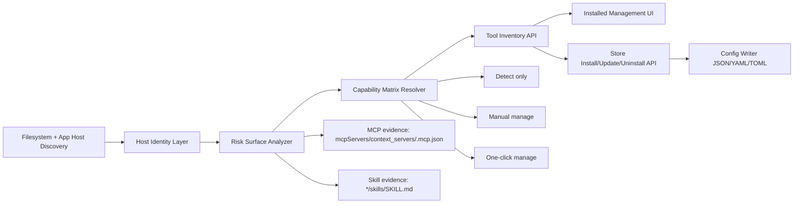

# 27 - MCP 与 Skill 风险工具全量发现与治理方案

更新日期: 2026-03-13  
状态: 方案已完成，待实现  
作者: AgentShield 架构与实现协同

## 1. 执行摘要

本方案解决一个核心断点：

- 后端 `discovery.rs` 已能扫描大量 AI 工具目录（含 `.doubao/.kimi/.tongyi/.coze/.yuanbao/.qoder/.kilocode/.commandcode`），但“检测可视化 + 可管理动作”仍主要围绕静态 `TOOL_DEFS`。
- 结果是用户看到“目录被扫到”，却在前端看不到完整工具资产，或者无法对其进行一致化治理。

本次目标是把 AgentShield 升级为“风险面优先的本机 AI 工具治理层”：

1. 只要本机出现 **MCP 或 Skill 可执行风险面**，就能被发现并展示。  
2. 对已验证宿主提供安装/更新/卸载能力；对未知宿主至少提供可审计与安全手动治理。  
3. 支持快速演进：新 AI 工具出现后，不必等发版也能被识别为“未知风险宿主”。

## 2. 问题定义与范围

### 2.1 目标问题

用户诉求是“不是杀毒”，而是：

- 找出电脑上所有使用 MCP/Skill 的 AI 宿主。
- 可视化看到各宿主的 MCP/Skill 风险面。
- 对可治理项执行安装、更新、卸载（按能力分级）。

### 2.2 本次纳入范围

- Rust 后端：发现、识别、解析、能力矩阵、写入策略。  
- 前端：工具总览、风险过滤、能力标签、动作入口一致化。  
- 数据契约：`DetectedTool`、`InstalledMcpServer`、管理接口输入输出。

### 2.3 非目标

- 不改内核防护引擎（runtime guard 行为模型不在本轮重构）。  
- 不承诺对“无 MCP/Skill 证据的普通 App”做全盘资产盘点。  
- 不对缺乏稳定配置协议的未知宿主开放默认一键写入。

## 3. 现状基线与约束

### 3.1 已有能力（已验证）

1. `discovery.rs` 已扫描大量候选根目录与配置文件名，覆盖多种 AI 工具路径模式。  
2. `scan.rs` 已存在未知宿主兜底逻辑：`derive_unknown_tool_identity` + `merge_discovery_snapshot_tools`。  
3. `scan_installed_mcps_internal` 已优先读取 deep discovery 快照，再回退到静态路径。  
4. `store.rs` 已支持多格式写入（JSON/YAML/TOML）与安装更新卸载主链路。  
5. 前端 `Platform = string` 已允许动态平台 ID。

### 3.2 主要缺口

1. `TOOL_DEFS` 与 `store.rs` 的平台列表仍偏静态，导致新宿主管理能力不足。  
2. 前端平台视觉配置与筛选仍主要围绕已知平台。  
3. 动态未知宿主可见性与治理策略（只读/手动/一键）缺乏统一能力矩阵。  
4. 风险面过滤规则没有在“工具总览层”做强约束（只展示 MCP/Skill 风险宿主）。

### 3.3 关键约束

1. 安全优先：未知宿主默认不能静默一键写入。  
2. 可解释优先：每个宿主必须说明“为何被检测到”。  
3. 兼容优先：不能破坏现有 Cursor/Claude/Codex/OpenClaw 等已上线治理能力。

## 4. 目标架构（完整版）

### 4.1 三层模型

1. 发现层（Discovery）: 扫目录 + 扫配置 + 扫技能目录。  
2. 识别层（Identity）: 已知宿主映射 + 未知宿主归一。  
3. 治理层（Governance）: 风险面过滤 + 能力矩阵 + 管理动作。

## 5. 平台分级与证据策略

### 5.1 证据置信度等级

- Tier A（官方文档明确）: 直接纳入“已知宿主 + 可一键治理”。  
- Tier B（官方仓库/官方产品文档强证据）: 纳入“已知宿主 + 默认手动，可按验证升级为一键”。  
- Tier C（社区/聚合站/间接证据）: 仅纳入“未知或候选宿主”，默认检测与手动治理。

### 5.2 当前建议平台分组（2026-03-13）

Tier A:

1. VS Code（`.vscode/mcp.json` 与用户 `mcp.json`）  
2. Cursor（`~/.cursor/mcp.json` + 项目 `.cursor/mcp.json`）  
3. Kiro（`~/.kiro/settings/mcp.json` + `.kiro/settings/mcp.json`）  
4. Claude Desktop（`claude_desktop_config.json`）  
5. Claude Code（`~/.claude.json` + `.mcp.json`）  
6. Codex（`~/.codex/config.toml`）  
7. Qwen Code（`~/.qwen/settings.json` + `.qwen/settings.json`）  
8. Kimi CLI（`~/.kimi/mcp.json`）  
9. CodeBuddy（`~/.codebuddy/.mcp.json`、`.codebuddy/skills`、`.mcp.json`）

Tier B:

1. Trae  
2. Windsurf  
3. Continue  
4. Zed（`context_servers`）

Tier C（仅风险面探测，不默认一键写入）:

1. Doubao（当前多为第三方 MCP server 生态证据）  
2. Yuanbao（缺少稳定公开 MCP 客户端本地配置规范）  
3. Coze（缺少统一本地宿主配置规范）  
4. 其他新出现国产 Agent（通过未知宿主归一处理）

## 6. 数据模型与接口契约

### 6.1 新增/扩展字段

`DetectedTool` 扩展建议：

1. `risk_surface: { has_mcp: bool, has_skill: bool, evidence_count: u32 }`  
2. `host_confidence: "high" | "medium" | "low"`  
3. `management_capability: "detect_only" | "manual" | "one_click"`  
4. `discovery_reasons: string[]`（例：`config_file_found`, `skills_root_found`, `app_bundle_found`）

### 6.2 接口行为约定

1. `detect_ai_tools` 返回全量候选，但前端默认只展示 `has_mcp || has_skill` 的宿主。  
2. `scan_installed_mcps` 只输出真实解析出的 MCP/Skill 组件，不输出空宿主。  
3. `install_store_item` 仅对 `management_capability=one_click` 的宿主开放自动写入。  
4. `update_installed_item/uninstall_item` 对已解析组件允许按 `source_path` 回退处理。

## 7. ADR（关键设计决策）

### ADR-1: 风险面优先而非应用名优先

- 决策: 以 MCP/Skill 证据作为主展示入口，不以“是否知名工具”作为展示条件。  
- 备选: 只展示 `TOOL_DEFS` 已知平台。  
- 结论: 采用风险面优先，避免新工具漏检。

### ADR-2: 未知宿主默认只读治理

- 决策: 未知宿主默认 `manual`，不自动一键写入。  
- 备选: 统一一键写入所有识别到的配置文件。  
- 结论: 采用保守策略，降低误写风险。

### ADR-3: 平台能力矩阵独立于视觉配置

- 决策: 把“治理能力”从 `PLATFORM_CONFIG` 抽离到后端数据字段。  
- 备选: 由前端硬编码映射能力。  
- 结论: 后端下发更可靠，避免前后端语义漂移。

## 8. 详细实施计划

### Phase 1 - 发现与识别增强（后端）

1. 扩展 `scan.rs` 的 `TOOL_DEFS` 与 `identify_tool_from_path`：新增 `qwen_code`、`kimi_cli`、`codebuddy`。  
2. 扩展 `discovery.rs` 根目录与 marker（补 `.qwen` 等）。  
3. 增强 `collect_detected_tools` 输出：补齐风险面与能力字段。  
4. 新增单元测试：
   1. Qwen/Kimi/CodeBuddy 路径识别。
   2. 未知宿主风险面过滤。
   3. 动态合并不丢失已知宿主路径。

### Phase 2 - 管理能力矩阵落地（后端）

1. 在 `store.rs` 中扩展平台映射与配置路径解析（含 qwen/kimi/codebuddy）。  
2. 为“未知宿主”建立手动治理入口：允许按 `source_path` 进行卸载与可判定更新，禁止默认自动安装。  
3. 返回明确错误语义（如 `capability_detect_only`）。

### Phase 3 - 前端总览与动作一致化

1. `installed-management.tsx` 增加“AI 工具总览”视图：宿主 -> MCP/Skill 组件二级结构。  
2. 新增风险面过滤开关：默认仅显示 `has_mcp || has_skill`。  
3. `colors.ts` 增补新平台视觉，并为未知宿主统一样式。  
4. 动作按钮文案统一为能力导向：
   1. 一键安装/更新/卸载（可用时）
   2. 手动治理指引（不可一键时）

### Phase 4 - 质量与回归

1. Rust 单元测试 + 前端关键流程测试。  
2. macOS/Windows 实机回归：
   1. 已知宿主识别准确性。
   2. 未知宿主检测可见性。
   3. 安装更新卸载回归无破坏。

## 9. 非功能要求

### 9.1 性能

1. 首次深度发现不超过 8 秒（冷启动）。  
2. 增量刷新不超过 2 秒（缓存命中）。

### 9.2 安全

1. 任何自动写入动作必须有审批票据。  
2. 未知宿主默认手动治理。  
3. 绝不写入未解析的二进制或系统关键目录。

### 9.3 可观测性

1. 检测日志包含证据来源与解析结果。  
2. 每次安装/更新/卸载记录目标配置路径与结果。

## 10. 风险清单（概率 * 影响）

| 风险 | 概率(1-5) | 影响(1-5) | 分数 | 处置 |
| --- | ---: | ---: | ---: | --- |
| 误把非 AI 目录识别为宿主 | 3 | 3 | 9 | 必须要求 MCP/Skill 证据才入主列表 |
| 未知宿主自动写入导致破坏配置 | 2 | 5 | 10 | 未知宿主默认禁一键写入 |
| 配置格式差异导致写入失败 | 4 | 3 | 12 | JSON/YAML/TOML 分层解析 + 原子写回 |
| 新平台路径变化导致漏检 | 4 | 4 | 16 | discovery 动态扫描 + known defs 定期更新 |
| 前后端平台 ID 不一致 | 3 | 3 | 9 | 统一后端下发能力字段，前端不再硬编码决策 |

## 11. 交付里程碑与验收

### 11.1 里程碑

1. M1（后端识别）: 新平台识别 + 风险面字段 + 单测通过。  
2. M2（治理能力）: store 平台扩展 + 未知宿主手动治理链路可用。  
3. M3（前端可视化）: 工具总览 + 风险过滤 + 动作文案统一。  
4. M4（发布前）: mac/win 回归 + 文档更新 + 商用门禁检查。

### 11.2 验收标准

1. 本机存在 Qwen/Kimi/CodeBuddy 任一 MCP 配置时，必须可见。  
2. 本机存在未知宿主且含 `mcpServers`/`skills` 证据时，必须可见并标注 `manual`。  
3. 已知宿主安装/更新/卸载动作必须真实落盘并能回读验证。  
4. 前端“默认视图”不显示无风险面的普通应用。

## 12. 运维与排障基线

1. 增加 `detection_sources` 和 `discovery_reasons` 到日志。  
2. 增加“导出检测报告”按钮，输出宿主->组件->能力矩阵。  
3. 出现漏检时优先检查：
   1. 路径是否在 discovery roots。  
   2. 配置文件名是否在候选集合。  
   3. `identify_tool_from_path` 是否覆盖。  
   4. 风险面过滤是否误剔除。

## 13. 假设与待确认

1. 用户核心场景是本机治理，不要求远程资产统一托管。  
2. “一键能力”仍受 Pro/Trial 许可证控制。  
3. 对 Doubao/Yuanbao/Coze 等缺少稳定宿主配置规范的平台，短期以 `unknown + manual` 为安全默认。

## 14. 来源与日期（按证据强度）

检索日期: 2026-03-13

Tier A 官方文档:

1. VS Code MCP 配置与安全: https://code.visualstudio.com/docs/copilot/reference/mcp-configuration  
2. VS Code MCP 使用指南: https://code.visualstudio.com/docs/copilot/customization/mcp-servers  
3. Cursor MCP 文档: https://cursor.com/docs/mcp  
4. Kiro MCP 配置: https://kiro.dev/docs/mcp/configuration/  
5. Claude Code 设置与配置路径: https://docs.anthropic.com/en/docs/claude-code/settings  
6. Claude Code 故障排查路径: https://docs.anthropic.com/en/docs/claude-code/troubleshooting  
7. MCP 官方 Claude Desktop 本地配置: https://modelcontextprotocol.io/docs/develop/connect-local-servers  
8. Qwen Code Settings 与 MCP: https://qwenlm.github.io/qwen-code-docs/en/users/configuration/settings/  
9. Qwen Code MCP 功能: https://qwenlm.github.io/qwen-code-docs/en/users/features/mcp/  
10. Kimi CLI MCP 文档: https://moonshotai.github.io/kimi-cli/en/customization/mcp.html  
11. Kimi CLI 配置命令: https://moonshotai.github.io/kimi-cli/en/reference/kimi-command.html  
12. CodeBuddy MCP 文档: https://www.codebuddy.ai/docs/cli/mcp  
13. CodeBuddy Skills 文档: https://www.codebuddy.ai/docs/cli/skills

Tier B 官方仓库/厂商文档:

1. Kimi CLI 仓库: https://github.com/MoonshotAI/kimi-cli  
2. Tencent Cloud MCP 接入示例（含 Cursor/Trae/CodeBuddy/Claude/Codex）: https://intl.cloud.tencent.com/document/product/1047/78210

Tier C（社区与聚合，作为候选证据，不直接做一键策略依据）:

1. Doubao MCP 社区条目聚合: https://lobehub.com/mcp/wwwzhouhui-doubao_mcp_server  
2. Zed MCP 生态案例与讨论（用于兼容性参考）: https://neon.com/guides/zed-mcp-neon

## 15. 结论

按照本方案实施后，AgentShield 将从“已知平台检测器”升级为“风险面驱动的 AI 宿主治理平台”：

1. 新旧 AI 工具都能被持续发现。  
2. 用户只看到真正有 MCP/Skill 风险面的宿主。  
3. 可治理能力有明确边界，不再出现“扫到了但管不了、能点但不安全”的断层。

