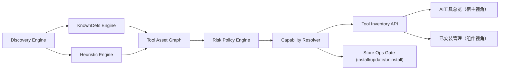

# 28 - 本机 MCP 与 Skill 智能体全量发现与风险治理（完整版）实施蓝图

更新日期: 2026-03-14  
状态: 深度研究完成，待开发  
作者: AgentShield 架构与实现协同

## 1. 执行摘要（先回答核心问题）

你的核心目标是正确的，而且可以做到：

1. **能扫描 OpenClaw 类智能体/Agent**，不应只靠静态名单，而要靠“是否存在 MCP/Skill 风险面”来判断。  
2. **目标对象应是“可执行风险面”**（可加载 MCP server、可执行 Skill/Agent、可改写配置），不是“所有 AI 应用”。  
3. **治理能力要分级**：`detect_only`（仅检测）/`manual`（可手动治理）/`one_click`（可托管安装更新卸载）。  
4. **对 Doubao/Yuanbao/Coze 等中文工具，当前应默认 Unknown + Manual**，直到拿到稳定可验证的本地配置协议，再升级到 One-click。

本方案是“完整版”落地蓝图：`已知工具扩展 + 未知工具动态发现 + 风险分级 + 管理能力矩阵 + 前端可视化总览`。

---

## 2. 假设与默认值（缺失输入补全）

为确保方案可执行，本轮采用如下默认值：

1. 产品类型: `桌面安全治理工具（AgentShield）`
2. 目标用户: `非安全专业背景的普通 AI 工具用户 + 开发者`
3. 核心目标: `在 3 分钟内识别本机高风险 MCP/Skill 宿主并给出可执行动作`
4. 主要平台: `macOS + Windows（Linux 次级）`
5. 技术约束: `Rust(Tauri) 后端 + React 前端，兼容现有 runtime guard`
6. 交付节奏: `分阶段上线，先契约后实现`
7. 合规约束: `最小扫描、可解释、显式审批、不可静默破坏配置`
8. 深度级别: `deep`

---

## 3. 现状基线与关键差距（基于仓库代码）

### 3.1 已有能力（可复用）

1. `discovery.rs` 已具备广泛目录扫描、候选配置名匹配、`skills` 目录识别与缓存。  
2. `scan.rs` 已支持已知平台 `TOOL_DEFS`，并含未知宿主归一（`unknown_ai_tool_*`）。  
3. `scan_installed_mcps` 已可从 JSON/YAML/TOML 提取 MCP，并可识别 Skill 目录。  
4. `store.rs` 已具备安装/更新/卸载主链路，支持按 `source_path` 对外部组件做真实配置写回。  
5. 前端已能显示 Unknown 平台，并支持按宿主分组展示组件。

### 3.2 主要断点

1. **发现结果仍受静态能力边界影响**：Unknown 虽可见，但缺少统一风险分级与治理能力字段。  
2. **管理能力与平台识别耦合**：前后端对“可一键/仅手动”的语义尚未完全后端化。  
3. **缺少“风险面优先”总览视图**：当前更偏“已安装组件列表”，不足以反映“宿主风险资产全貌”。  
4. **中文工具证据分级未固化**：缺官方本地配置协议时，仍需更强防误写策略。

---

## 4. 外部研究结论（2026-03-14 检索）

### 4.1 证据分级标准

1. `Tier A`: 官方文档明确本地 MCP 配置路径/格式，可作为 one-click 候选。  
2. `Tier B`: 官方文档明确支持 MCP，但本地路径或写入策略不稳定，默认 manual。  
3. `Tier C`: 仅云端/平台侧 MCP 能力或社区证据，默认 unknown + detect/manual。

### 4.2 工具分层结果（用于实现策略）

| 工具 | 当前证据级别 | 研究结论 | 建议治理能力 |
| --- | --- | --- | --- |
| VS Code | Tier A | 官方文档明确 MCP 服务器配置与工作区/用户作用域 | one_click |
| Cursor | Tier A | 官方指引与客户端配置格式可验证，且有 `mcp.json` 路径实践 | one_click |
| Claude Desktop | Tier A | 官方 MCP quickstart 给出标准 `claude_desktop_config.json` 位置 | one_click |
| Claude Code | Tier A | 官方文档明确支持 `.mcp.json`、`settings.json` 多级作用域 | one_click |
| Codex CLI/Desktop | Tier A | 官方文档给出 `~/.codex/config.toml` 与应用配置路径 | one_click |
| Qwen Code/CLI | Tier A | 官方文档给出 `~/.qwen/settings.json`、`~/.qwen/skills` 结构 | one_click |
| Kimi CLI | Tier A | 官方文档给出 `~/.kimi/` 数据目录与 MCP 配置方式 | one_click |
| CodeBuddy | Tier A | 官方文档给出 `.codebuddy/.mcp.json`、`project/.codebuddy/mcp.json` | one_click |
| Windsurf | Tier A | 官方文档明确 `~/.codeium/windsurf/mcp_config.json` | one_click |
| Continue | Tier B | 官方文档明确 MCP 接入，但宿主路径/策略依环境变化 | manual/one_click(逐步) |
| Zed | Tier B | 官方文档明确 `context_servers` 与 settings 结构 | manual/one_click(逐步) |
| Trae | Tier C | 当前缺稳定官方本地 MCP 配置规范证据 | unknown + manual |
| Doubao | Tier C | 能检索到平台/云侧 MCP 资料，缺稳定本地客户端配置规范 | unknown + manual |
| Yuanbao | Tier C | 目前可见平台侧“接入 MCP”资料，缺桌面端统一本地配置规范 | unknown + manual |
| Coze | Tier C | 官方文档聚焦平台侧 MCP/工作流，缺本地宿主统一配置路径规范 | unknown + manual |

### 4.3 关键推论（明确标注为推断）

以下是**基于官方资料形态的推断**：  
当官方文档只描述“云平台如何接入 MCP”，未定义“本地客户端配置路径与写入协议”时，不应直接开放 one-click 写入，应先归入 `unknown/manual`，以防误写非目标文件。

### 4.4 研究方法与限制

1. 按计划先调用 Sequential Thinking 做结构化推理。  
2. Tavily 在本次会话触发配额限制，无法继续返回结果；后续改用官方站点直连检索作为替代。  
3. 对“缺少官方本地配置规范”的平台，仅给出保守策略，不给出过度确定结论。

---

## 5. 目标架构（完整版）

### 5.1 双引擎发现模型

1. `KnownDefs Engine`: 继续使用 `TOOL_DEFS`（高置信度品牌宿主 + 官方路径）。  
2. `Heuristic Engine`: 当存在以下任一证据时，创建 Unknown Host：  
   - 配置中出现 `mcpServers / mcp_servers / context_servers / servers / mcp.servers`
   - 存在 `skills/*/SKILL.md` 或技能目录结构
   - 配置节点含 `command/url/args/env/headers` 等可执行字段

### 5.2 风险策略引擎

风险面定义（宿主级）：

1. `has_mcp_surface`: 存在可解析 MCP server 配置
2. `has_skill_surface`: 存在 Skill 目录或 Skill 清单
3. `has_exec_signal`: 存在命令执行入口（`command`, shell, npx, uvx 等）
4. `has_secret_signal`: 存在 `env`、headers、token 注入迹象

动作门禁（宿主级）：

1. `one_click`: 官方路径明确 + 解析器/写入器稳定 + 路径可验证
2. `manual`: 能定位风险面，但写入协议不稳定或证据不足
3. `detect_only`: 仅有弱证据，不可安全修改

---

## 6. 数据模型与接口契约变更

### 6.1 `DetectedTool` 扩展（后端下发，前端不再猜）

建议新增字段：

1. `host_confidence: "high" | "medium" | "low"`
2. `risk_surface: { has_mcp: bool; has_skill: bool; has_exec_signal: bool; has_secret_signal: bool; evidence_count: u32 }`
3. `management_capability: "detect_only" | "manual" | "one_click"`
4. `evidence_items: Array<{ type: string; path: string; detail?: string }>`
5. `source_tier: "A" | "B" | "C"`（官方证据分层）

### 6.2 API 行为约定

1. `detect_ai_tools` 返回“宿主资产清单”，默认只含有风险面的宿主。  
2. `scan_installed_mcps` 返回“组件清单”（MCP/Skill），并附宿主 `management_capability`。  
3. `install_store_item` 仅允许目标宿主 `management_capability=one_click`。  
4. `update_installed_item/uninstall_item` 对 `manual` 宿主允许 `source_path` 精准操作；`detect_only` 禁止自动动作。

---

## 7. 实施方案（先文档后开发）

### Phase 0 - 契约先行（1-2 天）

1. 扩展 `types/scan.rs` 的 `DetectedTool` 字段。  
2. 新增 `ToolRiskSurface`、`ManagementCapability` 枚举。  
3. 前后端类型同步（`src/services/scanner.ts`）。

**DoD**

1. `cargo test` 全绿，前端类型编译通过。  
2. 老接口调用不崩溃（新增字段默认值兼容）。

### Phase 1 - 发现与识别引擎（2-4 天）

1. `discovery.rs`：补充“风险证据抽取器”，不仅收集路径，还收集配置键证据。  
2. `scan.rs`：在 `merge_discovery_snapshot_tools` 后计算 `risk_surface` 与 `host_confidence`。  
3. `identify_tool_from_path` 保留，但 Unknown 走“证据驱动命名 + hash 回退”。

**DoD**

1. 能从未知目录中识别出 `unknown_ai_tool_*` 且带证据链。  
2. 误报控制：无 MCP/Skill 证据的目录不进入宿主清单。

### Phase 2 - 治理能力矩阵（2-3 天）

1. `store.rs`：将平台可写判定从“平台名是否已知”升级为“能力矩阵”。  
2. 对 `manual` 宿主开放“手动治理”路径解析与操作提示。  
3. 对 `detect_only` 返回明确错误语义（例如 `capability_detect_only`）。

**DoD**

1. `one_click` 宿主可安装/更新/卸载。  
2. `manual` 宿主可定位目标路径并给出可执行指引。  
3. `detect_only` 无自动写入入口。

### Phase 3 - 前端双视图（2-3 天）

1. `installed-management.tsx` 增加“AI 工具总览（宿主优先）”。  
2. 保留“已安装组件（MCP/Skill）”视图，支持宿主 -> 组件 drill-down。  
3. `colors.ts` 增加 unknown 系列视觉语义与能力标签渲染。

**DoD**

1. 默认视图展示“有风险面宿主”。  
2. 每个宿主都显示：证据数量、风险标签、动作能力。  
3. Unknown 宿主不出现误导性“一键安装”按钮。

### Phase 4 - 回归与发布门禁（2 天）

1. 单测：路径识别、证据抽取、能力矩阵、写入门禁。  
2. 集成测试：安装/更新/卸载在 one_click/manual/detect_only 三类宿主的行为。  
3. 实机验证：macOS + Windows 各至少 1 台干净机回归。

**DoD**

1. 通过 lint/typecheck/test。  
2. 关键流程日志可追溯（发现原因、动作目标、审批票据）。

---

## 8. 验收标准（可执行）

1. 本机出现任意 `mcpServers/context_servers/skills` 证据时，必须在“AI 工具总览”出现对应宿主。  
2. Unknown 宿主必须显示 `management_capability=manual` 或 `detect_only`，不得默认 one-click。  
3. 已知 Tier A 宿主（如 Codex/VS Code/Cursor/Qwen/Kimi/CodeBuddy）可完成一键安装并回读验证。  
4. 卸载与升级优先使用真实 `source_path`，避免跨宿主误删。  
5. 无风险面的普通目录不应进入默认主列表（误报率需可观测）。

---

## 9. 风险清单（概率 * 影响）

| 风险 | 概率 | 影响 | 分数 | 缓解 |
| --- | ---: | ---: | ---: | --- |
| 误把普通目录识别为 AI 宿主 | 3 | 3 | 9 | 必须满足 MCP/Skill 证据门槛 |
| Unknown 宿主自动写入导致破坏配置 | 2 | 5 | 10 | Unknown 默认 manual/detect_only |
| 中文工具路径变化导致漏检 | 4 | 4 | 16 | 保留启发式发现 + 证据抽取，不仅依赖 TOOL_DEFS |
| 前后端能力语义不一致 | 3 | 3 | 9 | capability 由后端下发，前端只渲染 |
| 扫描范围过大引发性能问题 | 3 | 2 | 6 | 增量缓存 + 限深扫描 + skip 列表 |

---

## 10. 开发前确认清单（你确认后再动手）

1. 是否按本方案把 `Trae/Doubao/Yuanbao/Coze` 首版统一设为 `unknown/manual`？  
2. 是否同意首版先做“宿主总览 + 能力标签”，暂不做复杂图表分析页？  
3. 是否接受 `detect_only` 宿主只给“定位路径+手动指引”，不提供自动写入？

---

## 11. 来源与日期（时间敏感信息）

说明：以下链接均在 **2026-03-14** 检索；若页面未公开更新时间，采用检索日期作为时效锚点。

1. MCP 官方 Quickstart（Claude Desktop 配置路径示例）  
   https://modelcontextprotocol.io/quickstart/user
2. OpenAI 官方 Remote MCP 指南（含 Codex/Cursor/Windsurf 等配置路径示例）  
   https://platform.openai.com/docs/guides/tools-remote-mcp
3. VS Code 官方 MCP 服务器文档  
   https://code.visualstudio.com/docs/copilot/chat/mcp-servers
4. Anthropic Claude Code MCP 文档  
   https://docs.anthropic.com/en/docs/claude-code/mcp
5. Anthropic Claude Code Settings（作用域配置）  
   https://docs.anthropic.com/en/docs/claude-code/settings
6. Qwen 官方 CLI 文档（MCP 与 Skills 配置）  
   https://qwenlm.github.io/zh/blog/qwen-cli/
7. Kimi 官方 CLI 文档（MCP 管理）  
   https://kimi.com/docs/cli/mcp
8. Kimi 开源文档（`~/.kimi` 数据与 MCP 配置）  
   https://moonshotai.github.io/Kimi-K2-Open-Source/zh/guide/kimi-cli/mcp.html
9. Tencent CodeBuddy 官方 MCP 文档  
   https://copilot.tencent.com/doc/mcp
10. Windsurf 官方 MCP 文档  
    https://docs.windsurf.com/windsurf/mcp
11. Continue 官方 MCP 深度配置文档  
    https://docs.continue.dev/customize/deep-dives/mcp
12. Zed 官方 MCP 文档（`context_servers`）  
    https://zed.dev/docs/assistant/model-context-protocol
13. Coze 官方文档（平台侧 MCP/Loop）  
    https://www.coze.cn/open/docs/loop/mcp
14. 腾讯元器文档（平台侧接入 MCP）  
    https://docs.qq.com/doc/DRGJ4ZmJYeVFMVnJw

---

## 12. 结论

你要的“扫描本机所有包含 Skill/MCP 的高风险 AI 工具，并可视化管理安装/更新/卸载”是可落地的。  
关键不在“再加几个 TOOL_DEFS”，而在于：**风险证据驱动发现 + 能力矩阵驱动动作 + Unknown 安全默认策略**。  
本文件作为开发前冻结方案，确认后进入代码实施阶段。
