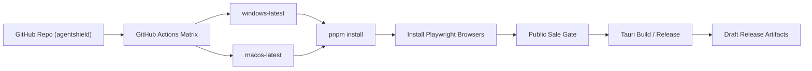

# 31-GitHub-Actions独立仓库发布链路官方最佳实践执行方案-2026-03-15

- 日期: 2026-03-15
- 适用范围: `pengluai/agentshield` 独立 GitHub 私有仓库、Tauri 双端构建、许可证网关变量注入、GitHub Actions 发布链路
- 作者: Codex
- 状态: 执行基线

## 1. Executive Summary

本方案用于把 AgentShield 从“本地可打包”推进到“独立 GitHub 仓库下可重复执行的 macOS + Windows 发布流水线”。

2026-03-15 的首轮 `publish-pilot-artifacts` 运行结果显示，两类阻塞项已经明确：

1. `windows-latest` 上 `Pilot public-sale gate` 失败，原因是 `package.json` 中 `PUBLIC_RELEASE_PROFILE=pilot ...` 这一类 POSIX 内联环境变量写法运行在 Windows 默认 PowerShell 中。
2. `macos-latest` 上 `Pilot public-sale gate` 失败，原因是发布工作流在执行 `release-gate.sh` 之前没有安装 Playwright 浏览器，导致 smoke test 无法启动 Chromium。

根据 GitHub Actions、GitHub CLI、Tauri、tauri-action、Playwright、pnpm 官方文档，本仓库的推荐执行方案是：

1. 保持独立仓库根目录作为唯一工作目录，所有 workflow 与缓存路径都以仓库根为基准。
2. 继续使用 GitHub `Variables` 存放公开配置，`Secrets` 存放敏感凭据。
3. 对需要跨平台一致执行的 workflow job 统一设置 `defaults.run.shell: bash`。
4. 避免在 `package.json` scripts 中保留 Windows 不兼容的 POSIX 内联环境变量；对 `release:github:ready` 这类命令改用显式 `bash` 包装脚本。
5. 在运行 `release-gate.sh` 之前，显式安装 Playwright 浏览器。
6. `publish-pilot-artifacts` 通过 GitHub 官方 `actions/upload-artifact` 上传 Actions workflow artifacts，不再把试点产物写入 GitHub draft release。
7. 继续使用 Tauri 官方推荐的 matrix 构建与 Rust cache 布局。
8. 对 GitHub 官方 JavaScript actions 跟进 `Node.js 24` 兼容主版本，避免在 2026-06-02 后被动切换运行时。

## 2. Problem Statement And Scope

### 2.1 目标

把当前项目的 GitHub 发布链路收敛成一个可验证、可复制、适用于零基础商用发布的最小闭环：

1. 开发者在独立 GitHub 仓库中维护代码。
2. GitHub Actions 能稳定产出 `macOS` 与 `Windows` 试点包。
3. 发布过程能读取许可证网关相关配置，并在 gate 阶段完成基础质量校验。
4. 后续可在此基础上演进到正式签名发布。

### 2.2 不在本次范围内

1. 支付平台正式生产密钥切换。
2. Render / Railway 正式公网部署。
3. Apple notarization 与 Windows EV 证书采购。
4. 非 GitHub 渠道的安装器上架策略。

## 3. Current State And Constraints

### 3.1 当前代码状态

当前仓库已经具备以下基础条件：

1. 独立仓库位于 `agentshield/`，并已连接 GitHub 远程仓库 `pengluai/agentshield`。
2. 发布工作流已经按独立仓库结构改为根目录相对路径。
3. 仓库级 `Variables` / `Secrets` 已写入测试环境所需的许可证网关配置。
4. `publish-pilot-artifacts.yml` 与 `publish-signed-release.yml` 已具备 Tauri 双端 matrix 构建骨架。

### 3.2 当前阻塞证据

2026-03-15 首轮失败运行：

- Run: `23101471593`
- URL: <https://github.com/pengluai/agentshield/actions/runs/23101471593>

已确认的失败点：

1. Windows job `67102870652`
   - 失败步骤: `Pilot public-sale gate`
   - 失败现象: `PUBLIC_RELEASE_PROFILE is not recognized as an internal or external command`
2. macOS job `67102870654`
   - 失败步骤: `Pilot public-sale gate`
   - 失败现象: `browserType.launch: Executable doesn't exist`
   - Playwright 明确提示需要执行 `playwright install`

2026-03-15 第二轮验证运行：

- Run: `23101712100`
- URL: <https://github.com/pengluai/agentshield/actions/runs/23101712100>

新增确认到的事实：

1. `Install Playwright Chromium` 已解决浏览器缺失问题。
2. 即使 workflow step 已设置 `shell: bash`，`pnpm run release:github:ready` 在 Windows 上仍然把 `package.json` script 中的 `PUBLIC_RELEASE_PROFILE=pilot ...` 按 Windows 脚本语法解释，继续失败。
3. 因此，workflow 默认 shell 统一只能解决 `run:` 步骤层面的 shell 语义，不能单独解决 pnpm scripts 内联环境变量问题。

2026-03-15 第三轮验证运行：

- Run: `23101811114`
- URL: <https://github.com/pengluai/agentshield/actions/runs/23101811114>

新增确认到的事实：

1. `macos-latest` 已经通过 `Pilot public-sale gate`，说明 Playwright 依赖和 gate 链路修复有效。
2. `Build GitHub pilot artifacts` 在上传 `AgentShield 智盾_1.0.1_aarch64.dmg` 时因 GitHub Release 已存在同名 draft asset 失败。
3. 这说明 pilot 流水线若继续复用固定 `tagName` 的 draft release，会在重复运行时失去幂等性。

2026-03-15 第四轮验证运行：

- Run: `23101956394`
- URL: <https://github.com/pengluai/agentshield/actions/runs/23101956394>

新增确认到的事实：

1. `macos-latest` 已完整成功，说明 pilot artifact-only 方案有效。
2. `windows-latest` 已通过 `Pilot public-sale gate`，说明 shell、pnpm script 和 Playwright 依赖问题已解决。
3. `windows-latest` 在 `Build GitHub pilot artifacts` 阶段调用 WiX `light.exe` 失败。
4. Tauri 官方 Windows 先决条件文档把 `failed to run light.exe` 明确指向 `VBSCRIPT` 功能未启用的场景。
5. GitHub runner 官方文档建议为稳定性使用显式 OS 版本标签，而不是依赖 `windows-latest` 的迁移行为。

2026-03-15 第五轮验证运行：

- Run: `23102543071`
- URL: <https://github.com/pengluai/agentshield/actions/runs/23102543071>

新增确认到的事实：

1. `macos-latest` 在 artifact-only pilot 流程下继续成功，说明最新工作流没有回归。
2. `windows-2022` 不再落到 `light.exe` 黑盒失败，而是在新的 `VBSCRIPT` 预检查步骤提前失败。
3. 失败日志显示 `windows-2022` runner 上既没有暴露 `VBSCRIPT` optional feature，也没有暴露 `VBSCRIPT` capability。
4. 结合 Tauri 官方“在遇到 `failed to run light.exe` 时可能需要启用 `VBSCRIPT`”的措辞，可以确认把 `VBSCRIPT` 检查做成硬性前置条件过于严格。
5. 因此下一轮修复应保留 `windows-2022` 固定版本，但把 `VBSCRIPT` 步骤降级为“诊断 + 尝试启用”，不能因 runner 未暴露该功能而直接失败。

2026-03-15 第六轮验证运行：

- Run: `23102646949`
- URL: <https://github.com/pengluai/agentshield/actions/runs/23102646949>

新增确认到的事实：

1. `windows-2022` 上的 `Pilot public-sale gate` 已完整成功，说明 shell、pnpm、Playwright 和 gate 流程都稳定。
2. `Build GitHub pilot artifacts` 在 Rust 编译完成后仍然失败于 WiX `light.exe`，因此问题已被缩小到 Windows MSI/WiX bundling 层。
3. 同一轮 run 暴露出 `tauri-action@v0` 不识别 `uploadWorkflowArtifacts`，说明当前 workflow 与已发布 action 版本存在不匹配。
4. Tauri 官方 Windows 安装器文档明确允许使用 `NSIS` 作为 Windows 安装器，而不必强制使用 `MSI/WiX`。
5. Tauri 官方讨论中维护者给出了在 CI 中只打 `nsis` 的直接做法（`-b nsis` 或 bundle targets），因此下一轮应改为 Windows 只构建 `NSIS`，并重新核对 `tauri-action` 的已发布版本。

2026-03-15 第七轮验证运行：

- Run: `23103029689`
- URL: <https://github.com/pengluai/agentshield/actions/runs/23103029689>

新增确认到的事实：

1. workflow 在 `Set up job` 就失败，错误是无法解析 `tauri-apps/tauri-action@v1`。
2. 官方仓库 tag / release 列表确认当前已发布 tag 为 `v0.6.2` 系列，不存在 `v1`。
3. 官方 `action.yml`（`v0.6.2`）确认 `uploadWorkflowArtifacts` 不在已发布输入集合中。
4. 因此 pilot workflow 不能依赖未发布输入，正确方案应是 `tauri-action@v0.6.2` 负责构建，`actions/upload-artifact@v4` 负责上传产物。

2026-03-15 第八轮验证观察：

- Run: `23103093344`
- URL: <https://github.com/pengluai/agentshield/actions/runs/23103093344>

新增确认到的事实：

1. `macos-latest` 与 `windows-2022` 已全部成功，证明双端 pilot 构建链路已经打通。
2. GitHub Actions run 注释明确提示 `actions/checkout@v4`、`actions/setup-node@v4`、`actions/upload-artifact@v4` 仍运行在 `Node.js 20`。
3. GitHub 官方 changelog 明确说明从 `2026-06-02` 起，JavaScript actions 将默认切到 `Node.js 24`。
4. `actions/checkout`、`actions/setup-node`、`actions/upload-artifact` 的官方资料都已提供 `v6` 用法，其中 `checkout@v6` 与 `upload-artifact@v6` 明确切到 `node24`。
5. 因此下一轮修复应把这些官方 action 升级到 `v6`，主动完成 Node 24 兼容迁移。

2026-03-15 第九轮验证运行：

- Run: `23104076234`
- URL: <https://github.com/pengluai/agentshield/actions/runs/23104076234>

新增确认到的事实：

1. 将 `actions/checkout`、`actions/setup-node`、`actions/upload-artifact` 升级到 `v6` 后，`publish-pilot-artifacts` 仍可在 `macos-latest` 与 `windows-2022` 双端成功。
2. 新 run 未再出现 GitHub 的 `Node.js 20` 弃用注释，说明本仓库已完成这部分兼容迁移。

2026-03-15 第十轮验证运行：

- Run: `publish-signed-release` 手动 dispatch 解析失败

新增确认到的事实：

1. GitHub 在 workflow dispatch 前端解析阶段直接拒绝了 `publish-signed-release.yml`。
2. 失败原因是 step `if:` 表达式直接引用了 `secrets.WINDOWS_CERTIFICATE` / `secrets.APPLE_CERTIFICATE` 等 secret 上下文。
3. GitHub 官方文档明确说明 `secrets` 不能直接用于 `if:` 条件；正确做法是先映射到 job-level `env`，再用 `env.*` 判断。
4. 因此下一轮修复应把这些证书类 secrets 提升到 job env，并将 step 条件改写为 `env.* != ''`。

### 3.3 约束

1. 代码与命令必须优先遵守官方文档，不靠经验猜测。
2. 不允许把敏感密钥写入仓库文件。
3. 改动必须尽量小，优先修复当前阻塞项，不扩大变更面。
4. 试点工作流与正式发布工作流应保持一致的跨平台执行模型，避免同类问题重复出现。

## 4. Target Architecture Overview

目标链路的关键约束是：

1. 所有 `run:` 步骤在两个平台上都以同一 shell 语义执行。
2. 所有测试依赖在 gate 运行前显式准备完成。
3. Tauri 打包、许可证变量、签名变量遵守 GitHub `vars`/`secrets` 分层。

## 5. Detailed Component Design

### 5.1 GitHub Actions 工作流

受影响文件：

1. `.github/workflows/publish-pilot-artifacts.yml`
2. `.github/workflows/publish-signed-release.yml`

推荐设计：

1. 在 job 级设置 `defaults.run.shell: bash`，统一 `run:` 步骤执行模型。
2. 保留 `Import Windows certificate` 的 `shell: pwsh` 显式覆盖，因为证书导入依赖 PowerShell。
3. 在 `Install dependencies` 后、执行 gate 前增加 Playwright 浏览器安装步骤。
4. 对需要预置环境变量的 pnpm script，不在 `package.json` 中使用 POSIX 内联环境变量，改为显式调用 `bash` 包装脚本。
5. `publish-pilot-artifacts` 使用 `tauri-action@v0.6.2` 负责构建，再使用 GitHub 官方 `actions/upload-artifact@v6` 上传测试包，不在 pilot 流水线里创建或复用 GitHub Release。
6. Windows 构建 runner 固定为 `windows-2022`，并在发布流水线中改为只生成 `NSIS` 安装器，绕开 `MSI/WiX` 的不稳定路径。
7. `tauri-action` 固定到已发布的 `v0.6.2`，避免 workflow 引用不存在的 tag。
8. `actions/checkout`、`actions/setup-node`、`actions/upload-artifact` 升级到官方 `v6`，对齐 Node 24 运行时。
9. 任何需要按 secret 是否存在来决定执行的步骤，必须先把 secret 映射到 job env，再在 `if:` 中使用 `env.*`。

### 5.2 Gate 脚本

受影响文件：

1. `scripts/release-gate.sh`
2. `scripts/public-sale-gate.sh`
3. `package.json`

当前问题不在脚本主体逻辑，而在“工作流如何调用这些脚本”：

1. `package.json` 中 `release:github:ready` 使用了 POSIX 内联环境变量。
2. 在 Linux/macOS shell 中该写法可运行，在 Windows PowerShell 中不可运行。
3. 第二轮验证表明，即使 workflow step 运行在 `bash` 中，`pnpm run` 在 Windows 上仍然不会自动按 POSIX 方式解析该 script。
4. pnpm 官方文档提供了 `shellEmulator` / `scriptShell` 这两类全局配置能力，但它们会影响整个仓库的脚本执行模型。
5. 当前仓库的低风险做法是把这一条命令迁移到显式 `bash` 包装脚本里，只修复受影响脚本，不扩大变更面。

### 5.3 测试依赖准备

当前 `release-gate.sh` 在执行：

1. `cargo test`
2. `pnpm build`
3. `pnpm test`
4. `pnpm audit`
5. `playwright smoke`

因此发布工作流必须在进入 gate 前满足 Playwright 浏览器存在，否则 smoke test 不是在校验产品，而是在暴露 CI 准备不完整。

## 6. Data Model And Interface Contracts

### 6.1 GitHub Variables

用于公开配置：

1. `VITE_CHECKOUT_MONTHLY_URL`
2. `VITE_CHECKOUT_YEARLY_URL`
3. `VITE_CHECKOUT_LIFETIME_URL`
4. `AGENTSHIELD_LICENSE_GATEWAY_URL`
5. `AGENTSHIELD_LICENSE_PUBLIC_KEY`
6. `LICENSE_DELIVERY_FROM_EMAIL`
7. `LICENSE_DELIVERY_REPLY_TO`
8. `TAURI_UPDATER_ENDPOINT`
9. `WINDOWS_TIMESTAMP_URL`

### 6.2 GitHub Secrets

用于敏感配置：

1. `LEMONSQUEEZY_WEBHOOK_SECRET`
2. `LICENSE_GATEWAY_ADMIN_PASSWORD`
3. `AGENTSHIELD_LICENSE_SIGNING_SEED`
4. `RESEND_API_KEY`
5. `APPLE_ID`
6. `APPLE_PASSWORD`
7. `APPLE_TEAM_ID`
8. `APPLE_SIGNING_IDENTITY`
9. `APPLE_CERTIFICATE`
10. `APPLE_CERTIFICATE_PASSWORD`
11. `KEYCHAIN_PASSWORD`
12. `TAURI_SIGNING_PRIVATE_KEY`
13. `TAURI_SIGNING_PRIVATE_KEY_PASSWORD`
14. `TAURI_UPDATER_PUBLIC_KEY`
15. `WINDOWS_CERTIFICATE`
16. `WINDOWS_CERTIFICATE_PASSWORD`
17. `WINDOWS_CERTIFICATE_THUMBPRINT`

## 7. Non-Functional Requirements

### 7.1 Reliability

1. 同一 workflow 在 macOS 与 Windows 上必须遵循同一运行模型。
2. 发布 gate 必须自足，不依赖 runner 的“隐式预装状态”。
3. 失败信息必须能够直接定位到缺失配置或缺失依赖。

### 7.2 Security

1. 敏感值仅保存在 GitHub Secrets。
2. workflow 推送权限需包含 `workflow` scope，但不扩大到不必要的额外权限。
3. 不在日志与文档中暴露真实密钥内容。

### 7.3 Operability

1. 零基础用户只需在仓库配置 `vars` / `secrets` 后即可复用该流水线。
2. 工作流失败时，优先暴露“配置缺失”或“依赖未安装”这类可操作信号。

### 7.4 Cost

1. 不新增第三方付费 CI 服务。
2. 尽量复用 GitHub 托管 runner 与现有 workflow。

## 8. ADRs

### ADR-31-01: 独立仓库根目录作为唯一工作目录

- 决策: 所有 workflow 路径、缓存路径、Tauri `projectPath` 统一以仓库根目录为准。
- 备选:
  1. 继续保留 `agentshield/...` 前缀
  2. 改为 monorepo 子目录模式
- 结论: 采用仓库根目录模式。
- 原因:
  1. 当前 GitHub 仓库本身就是 `agentshield`。
  2. Tauri 官方 GitHub Actions 示例默认以 checkout 根目录工作。
  3. 可减少路径错误与缓存失配。
- 后果:
  1. 当前已做的根路径修复保留。
  2. 以后新增 workflow 必须继续沿用根目录模式。

### ADR-31-02: 使用 `defaults.run.shell: bash` 统一跨平台 `run` 步骤

- 决策: 在发布相关 workflow 的 job 级统一设置 `defaults.run.shell: bash`。
- 备选:
  1. 保持 Windows 默认 PowerShell，并重写所有 npm script/step
  2. 为每个 `run` 步骤单独指定 shell
- 结论: 采用 job 级统一 bash。
- 原因:
  1. GitHub 官方明确支持 `bash` 作为 all-platform shell，并说明 Windows 上使用 Git for Windows bash。
  2. 当前失败源于 POSIX shell 语义与 Windows 默认 PowerShell 不一致。
  3. 统一 shell 可降低以后新增步骤的跨平台分叉。
- 后果:
  1. PowerShell 专用步骤仍需显式 `shell: pwsh` 覆盖。
  2. 需要在文档中明确此决策，避免后续改回默认 shell。

### ADR-31-03: `release:github:ready` 改为显式 `bash` 包装脚本

- 决策: 新增 `scripts/release-github-ready.sh`，由 `package.json` 直接调用该脚本，不再在 `package.json` 中保留 POSIX 内联环境变量。
- 备选:
  1. 开启 pnpm `shellEmulator=true`
  2. 全局设置 pnpm `scriptShell` 指向 Git Bash
  3. 保持现状，仅依赖 workflow 级 `shell: bash`
- 结论: 采用显式 `bash` 包装脚本。
- 原因:
  1. 第二轮验证已证明 workflow 级 `bash` 不能改变 `pnpm run` 在 Windows 上执行 scripts 的方式。
  2. pnpm 官方提供的 `shellEmulator` / `scriptShell` 会扩大整个仓库的脚本执行语义变化。
  3. 包装脚本只影响一条已知失败命令，风险最小，行为最可控。
- 后果:
  1. 以后若新增带 POSIX 内联环境变量的 npm script，优先改成包装脚本或显式 step env。
  2. 不在仓库层面引入全局脚本解释器变更。

### ADR-31-04: 在发布工作流中显式安装 Playwright 浏览器

- 决策: 在执行 `release-gate.sh` 前显式安装 Playwright 浏览器。
- 备选:
  1. 依赖 runner 缓存或历史安装结果
  2. 跳过 smoke test
  3. 在 `release-gate.sh` 内部动态安装
- 结论: 采用 workflow 显式安装。
- 原因:
  1. Playwright 官方 CI 文档要求显式安装浏览器。
  2. 当前失败直接说明 runner 没有可用 Chromium。
  3. 安装步骤放在 workflow 中更便于观察与缓存。
- 后果:
  1. `publish-pilot-artifacts` 与 `publish-signed-release` 都应补齐该步骤。
  2. 可根据平台裁剪参数，但不能省略安装。

### ADR-31-05: `publish-pilot-artifacts` 只上传 workflow artifacts，不上传 GitHub Release 资产

- 决策: 在 pilot workflow 中省略 `tagName` / `releaseName` / `releaseId`，并使用 GitHub 官方 `actions/upload-artifact@v6` 上传构建产物。
- 备选:
  1. 继续写入固定 tag 的 draft release
  2. 每次运行生成唯一 tag
  3. 在并发矩阵 job 中先删除旧 release assets
- 结论: pilot 仅上传 workflow artifacts。
- 原因:
  1. GitHub 官方 `upload-artifact` 是上传 workflow artifacts 的标准做法。
  2. pilot 的目标是验证和下载测试包，不是发布稳定版本。
  3. 固定 tag 的 draft release 在重复运行时会发生同名资产冲突，并且并发 job 先删后传会引入共享状态竞争。
- 后果:
  1. 测试包下载入口转到 Actions run 的 artifacts。
  2. 正式对外发布仍由 `publish-signed-release` 负责 GitHub Release。

### ADR-31-06: Windows 构建 runner 显式固定到 `windows-2022`

- 决策: 发布 workflow 中的 Windows runner 从 `windows-latest` 固定为 `windows-2022`。
- 备选:
  1. 继续使用 `windows-latest`
  2. 改用 `windows-2025`
- 结论: 当前阶段固定到 `windows-2022`。
- 原因:
  1. GitHub 官方 runner 文档明确建议如果不希望受到 `-latest` 迁移影响，应显式指定 OS 版本。
  2. 当前失败发生在 `windows-latest` 对应的 `Windows Server 2025` runner 上。
  3. 对商用发布流水线来说，构建环境稳定性优先于追随最新镜像。
- 后果:
  1. 以后若要切回 `windows-2025`，应先单独验证 WiX/MSI 能力。
  2. 现阶段先保证发布稳定。

### ADR-31-07: 在 Windows 打包前显式校验并启用 `VBSCRIPT`

- 决策: 在 Windows 构建阶段新增 `VBSCRIPT` 检查和启用步骤。
- 备选:
  1. 不做检查，继续等 WiX 在 runner 中失败
  2. 直接放弃 MSI，只打其他 Windows 包格式
- 结论: 先保留 MSI，前置环境能力检查。
- 原因:
  1. Tauri 官方文档已把 `failed to run light.exe` 指向 `VBSCRIPT` 依赖。
  2. 这类依赖应在进入 Tauri bundling 前被显式验证，而不是在 `light.exe` 内部黑盒失败。
- 后果:
  1. 如果 runner 无法启用 `VBSCRIPT`，失败信息会更明确。
  2. 若未来 Windows 镜像进一步收紧 FoD 行为，仍能快速发现。

### ADR-31-08: `VBSCRIPT` 预检查降级为诊断与尽力启用

- 决策: `VBSCRIPT` 步骤不再因 runner 未暴露 optional feature/capability 而直接失败；若可枚举到该能力，则记录状态并尝试启用。
- 备选:
  1. 继续把 `VBSCRIPT` 当成硬性前置校验
  2. 完全移除这一步，不保留任何诊断信息
- 结论: 保留步骤，但改为诊断型。
- 原因:
  1. Tauri 官方文档的表述是“遇到 `failed to run light.exe` 时，可能需要启用 `VBSCRIPT`”，不是所有 Windows runner 都必须先枚举到该功能。
  2. 第五轮验证已确认 `windows-2022` runner 不暴露该功能，但这本身不能证明 MSI 一定无法构建。
  3. 诊断型步骤既能保留排障信息，又不会制造新的假阳性失败。
- 后果:
  1. 如果未来切回 `windows-2025` 或其他镜像，仍能看到 `VBSCRIPT` 状态日志。
  2. Windows 构建的真正成败将重新回到 `tauri build` / WiX 阶段判断。

### ADR-31-09: Windows 发布流水线切换为 `NSIS`

- 决策: `publish-pilot-artifacts` 与 `publish-signed-release` 的 Windows 构建参数改为 `--bundles nsis`。
- 备选:
  1. 继续坚持 `MSI/WiX`
  2. 同时生成 `MSI + NSIS`
- 结论: 当前阶段只生成 `NSIS`。
- 原因:
  1. 第六轮验证已证明 `windows-2022` 下 gate 全部通过后，仍会在 `WiX light.exe` 失败。
  2. Tauri 官方 Windows 安装器文档明确支持 `NSIS` 作为等价的 Windows 分发格式。
  3. Tauri 官方讨论给出了在 CI 中直接使用 `-b nsis` / bundle targets 的推荐做法。
- 后果:
  1. Windows 发布链路不再依赖 WiX/MSI。
  2. 若未来需要重新启用 MSI，应作为单独议题重新验证。

### ADR-31-10: `tauri-action` 固定到 `v0.6.2`，pilot 改用 GitHub 官方 artifact 上传

- 决策: `tauri-action` 固定到官方已发布的 `v0.6.2`，并在 pilot workflow 中新增 `actions/upload-artifact@v6` 上传 `bundle` 目录。
- 备选:
  1. 保持 `@v0`，忽略未知输入警告
  2. 继续尝试未发布的 `uploadWorkflowArtifacts` 输入
  3. 改写为完全自定义打包命令
- 结论: 使用 `v0.6.2 + actions/upload-artifact@v6`。
- 原因:
  1. 第七轮验证已确认 `@v1` tag 不存在。
  2. 官方 `action.yml`（`v0.6.2`）不包含 `uploadWorkflowArtifacts`，因此不能依赖该输入。
  3. GitHub 官方 `upload-artifact` 本身就是标准做法，适合 pilot 产物分发。
- 后果:
  1. pilot workflow 的 artifact 上传路径更加透明。
  2. `tauri-action` 只负责构建和发布，不再承担未发布的 artifact 语义。

### ADR-31-11: 公开配置与敏感配置继续分离到 GitHub Variables / Secrets

- 决策: 继续使用 `vars` 管理公开配置，`secrets` 管理敏感值。
- 备选:
  1. 全部放到 Secrets
  2. 全部写入版本库环境文件
- 结论: 采用分层存储。
- 原因:
  1. GitHub 官方推荐这样分离。
  2. 公开值可见性更好，敏感值泄露风险更低。
- 后果:
  1. README 与执行文档必须同步维护清单。
  2. 新增配置时需先判断其是否敏感。

### ADR-31-12: GitHub 官方 JavaScript actions 提前升级到 Node 24 兼容版本

- 决策: 将发布 workflow 中的 `actions/checkout`、`actions/setup-node`、`actions/upload-artifact` 升级到官方 `v6`。
- 备选:
  1. 保持 `v4`，等待 GitHub 在 2026-06-02 自动切换到 Node 24
  2. 在 workflow 中临时设置 `FORCE_JAVASCRIPT_ACTIONS_TO_NODE24=true`
- 结论: 直接升级到官方 Node 24 兼容主版本。
- 原因:
  1. GitHub 官方 changelog 已给出确定的切换日期，属于确定性的时点风险。
  2. `actions/checkout`、`actions/setup-node`、`actions/upload-artifact` 官方资料都已提供 `v6` 用法。
  3. 直接升级比依赖全局环境变量强制切换更透明，也更容易回溯问题。
- 后果:
  1. GitHub Actions 的 Node 20 弃用注释应在后续 run 中消失或显著减少。
  2. 若未来接入 self-hosted runner，需要同时核对 runner 版本是否满足 `2.327.1` 最低要求。

### ADR-31-13: GitHub Actions 中禁止在 `if:` 直接引用 `secrets.*`

- 决策: `publish-signed-release.yml` 中所有按 secret 是否存在来决定执行的步骤，统一改为 `job env + if: env.*` 模式。
- 备选:
  1. 保持 `if: secrets.* != ''`
  2. 移除条件判断，让导入证书步骤总是执行
- 结论: 使用 job-level `env` 作为条件判断来源。
- 原因:
  1. GitHub 官方文档明确说明 `secrets` 不能直接在 `if:` 条件中引用。
  2. 当前失败发生在 workflow dispatch 解析阶段，属于结构性错误，必须在 YAML 层修复。
  3. `env.*` 条件判断是 GitHub 官方给出的直接替代方案。
- 后果:
  1. workflow 将恢复可 dispatch 状态。
  2. 证书缺失时会以正常 gate / step skip 形式暴露，而不是在解析阶段失败。

## 9. Risk Register And Mitigation

| 风险 | 概率 | 影响 | 分数 | 缓解措施 | Owner |
| --- | --- | --- | --- | --- | --- |
| Windows shell 与 POSIX 脚本再次不兼容 | 4 | 4 | 16 | 在发布 job 固定 `bash`，并保留 PowerShell 例外步骤显式声明 | 工程 |
| Playwright 浏览器未安装导致 gate 假失败 | 4 | 3 | 12 | 在发布 workflow 增加显式安装步骤 | 工程 |
| 新增 workflow 忘记沿用根目录路径规范 | 3 | 3 | 9 | 在文档与模板中固化根目录约束 | 工程 |
| 变量/密钥配置错位导致运行时失败 | 3 | 4 | 12 | 继续通过 `public-sale-gate` 和 README 清单校验 | 工程 |
| 正式签名步骤被 bash 默认壳影响 | 2 | 4 | 8 | 对 PowerShell 专用步骤显式 `shell: pwsh`，对证书导入单独验证 | 工程 |
| GitHub Actions 在 2026-06-02 后默认切到 Node 24 导致旧 action 失效 | 4 | 3 | 12 | 提前升级 `checkout/setup-node/upload-artifact` 到 `v6` 并重跑验证 | 工程 |
| 正式发布 workflow 因 `if: secrets.*` 语法限制无法 dispatch | 4 | 4 | 16 | 改为 job env 承载 secrets，再以 `env.*` 条件判断 | 工程 |

## 10. Delivery Roadmap And Milestones

### Milestone A: 文档固化

1. 新增本执行方案文档。
2. 将官方约束、当前失败 run、修复顺序记录为可审计基线。

### Milestone B: 最小修复

1. 为发布 workflow 设置 `defaults.run.shell: bash`。
2. 为发布 workflow 添加 Playwright 浏览器安装步骤。
3. 保持 PowerShell 证书导入步骤显式声明不变。

### Milestone C: 本地与 CI 验证

1. 本地校验 workflow YAML 与 gate 逻辑。
2. push 到 GitHub。
3. 重跑 `publish-pilot-artifacts`。

### Milestone D: 通过后再推进正式签名

1. 确认 `pilot` 双端成功。
2. 再继续验证 `publish-signed-release` 的正式签名链路。

## 11. Runbook And Observability Baseline

### 11.1 运行顺序

1. 检查 GitHub 仓库 `Variables` / `Secrets` 是否齐全。
2. 推送 workflow 改动前，确保 GitHub CLI token 含 `workflow` scope。
3. 运行 `publish-pilot-artifacts`。
4. 查看 `Pilot public-sale gate` 是否通过。
5. 再查看 `Build GitHub pilot artifacts` 是否成功产出安装包。

### 11.2 观测点

重点看以下步骤：

1. `Install dependencies`
2. `Install Playwright Browsers`
3. `Pilot public-sale gate` / `Public sale gate`
4. `Build GitHub pilot artifacts` / `Build and publish signed release`

### 11.3 验收标准

本轮修复完成的验收标准：

1. `publish-pilot-artifacts` 在 `windows-latest` 不再因 shell 语义失败。
2. `publish-pilot-artifacts` 在 `windows-latest` 不再因 pnpm script 内联环境变量失败。
3. `publish-pilot-artifacts` 在 `macos-latest` 不再因 Playwright 浏览器缺失失败。
4. `publish-pilot-artifacts` 的两个平台均能通过 `Pilot public-sale gate`。
5. 工作流仍然能读取许可证网关相关 `vars` / `secrets`。
6. PowerShell 专用证书导入步骤未被 bash 默认壳破坏。
7. `publish-pilot-artifacts` 可重复运行而不会因 GitHub Release 同名资产冲突失败。
8. Windows 发布工作流不再依赖 `WiX light.exe`。
9. pilot workflow 使用 GitHub 官方 `actions/upload-artifact@v6` 上传构建产物。
10. 发布 workflow 不再依赖 `windows-latest` 的隐式系统升级。
11. 发布 workflow 不再使用 GitHub 官方 `Node.js 20` 时代的 action 主版本。
12. `publish-signed-release` 可以被 GitHub 正常解析和 dispatch，不再被 `if: secrets.*` 阻断。

## 12. Source References With Dates

1. GitHub Actions workflow 语法，关于 `jobs.<job_id>.defaults.run.shell` 与 `bash` 在 Windows 上使用 Git for Windows bash 的说明，检索日期 2026-03-15  
   <https://docs.github.com/en/actions/reference/workflows-and-actions/workflow-syntax>
2. GitHub Actions 变量存储与不同 shell 语法差异，检索日期 2026-03-15  
   <https://docs.github.com/en/actions/how-tos/writing-workflows/choosing-what-your-workflow-does/store-information-in-variables>
3. GitHub Actions 手动运行 workflow，要求 workflow 位于默认分支且执行者具备写权限，检索日期 2026-03-15  
   <https://docs.github.com/en/actions/how-tos/manage-workflow-runs/manually-run-a-workflow>
4. GitHub workflow `workflow_dispatch` 约束，检索日期 2026-03-15  
   <https://docs.github.com/en/actions/reference/workflow-syntax-for-github-actions#onworkflow_dispatch>
5. GitHub CLI `gh auth login`，检索日期 2026-03-15  
   <https://cli.github.com/manual/gh_auth_login>
6. GitHub CLI `gh auth setup-git`，检索日期 2026-03-15  
   <https://cli.github.com/manual/gh_auth_setup-git>
7. GitHub CLI `gh auth refresh`，用于补充 `workflow` scope，检索日期 2026-03-15  
   <https://cli.github.com/manual/gh_auth_refresh>
8. Playwright CI 官方文档，要求 CI 中显式安装浏览器，检索日期 2026-03-15  
   <https://playwright.dev/docs/ci>
9. Playwright GitHub Actions 示例，检索日期 2026-03-15  
   <https://playwright.dev/docs/ci-intro>
10. pnpm `shellEmulator` 与 `scriptShell` 官方文档，说明 pnpm scripts 在跨平台 shell 语义上的官方配置方式，检索日期 2026-03-15  
    <https://pnpm.io/settings#shellemulator>  
    <https://pnpm.io/settings#scriptshell>
11. tauri-action 官方 `action.yml`（`v0.6.2`），用于确认已发布输入集合，检索日期 2026-03-15
    <https://github.com/tauri-apps/tauri-action/blob/v0.6.2/action.yml>
12. Tauri Windows 先决条件文档，关于 `failed to run light.exe` 与 `VBSCRIPT` 的说明，检索日期 2026-03-15
    <https://v2.tauri.app/start/prerequisites/>
13. GitHub runner images 官方说明，关于显式指定 OS 版本以避免 `-latest` 迁移影响，检索日期 2026-03-15
    <https://github.com/actions/runner-images>
14. Microsoft Learn，Windows Server 2025 中 VBScript 作为 Features on Demand 的说明，检索日期 2026-03-15
    <https://learn.microsoft.com/en-us/windows-server/get-started/removed-deprecated-features-windows-server>
15. Tauri GitHub Actions / 发布流水线文档，matrix 构建与根目录模式参考，检索日期 2026-03-15
    <https://tauri.app/distribute/pipelines/github/>
16. Tauri 官方 Windows 安装器文档，关于 Windows 可使用 NSIS 分发的说明，检索日期 2026-03-15
    <https://v2.tauri.app/distribute/windows-installer/>
17. Tauri 官方讨论，维护者关于使用 `-b nsis` / bundle targets 排除 MSI 的说明，检索日期 2026-03-15
    <https://github.com/tauri-apps/tauri/discussions/3744>
18. tauri-action 官方 releases，用于确认当前已发布版本，检索日期 2026-03-15
    <https://github.com/tauri-apps/tauri-action/releases>
19. GitHub 官方 changelog，关于 GitHub Actions runner 中 JavaScript actions 从 Node 20 迁移到 Node 24 的弃用通知，检索日期 2026-03-15
    <https://github.blog/changelog/2025-09-19-deprecation-of-node-20-on-github-actions-runners/>
20. GitHub Actions 元数据语法，`runs.using` 支持 `node24`，检索日期 2026-03-15
    <https://docs.github.com/en/actions/reference/workflows-and-actions/metadata-syntax>
21. actions/checkout 官方 README，`v6` 切到 Node 24 且要求最小 runner 版本，检索日期 2026-03-15
    <https://github.com/actions/checkout>
22. actions/setup-node 官方文档，`v6` 用法示例，检索日期 2026-03-15
    <https://github.com/actions/setup-node>
23. actions/upload-artifact 官方 README，`v6` 切到 Node 24 的说明，检索日期 2026-03-15
    <https://github.com/actions/upload-artifact>
24. GitHub Actions secrets 使用文档，关于 secrets 不能直接用于 `if:` 且应改用 job env 的说明，检索日期 2026-03-15
    <https://docs.github.com/en/actions/security-guides/using-secrets-in-github-actions>
