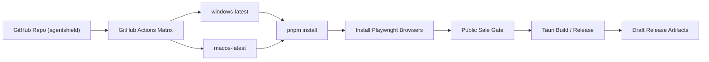

# 31-GitHub-Actions独立仓库发布链路官方最佳实践执行方案-2026-03-15

- 日期: 2026-03-15
- 适用范围: `pengluai/agentshield` 独立 GitHub 私有仓库、Tauri 双端构建、许可证网关变量注入、GitHub Actions 发布链路
- 作者: Codex
- 状态: 执行基线

## 1. Executive Summary

本方案用于把 AgentShield 从“本地可打包”推进到“独立 GitHub 仓库下可重复执行的 macOS + Windows 发布流水线”。

2026-03-15 的首轮 `publish-pilot-artifacts` 运行结果显示，两类阻塞项已经明确：

1. `windows-latest` 上 `Pilot public-sale gate` 失败，原因是 `package.json` 中 `PUBLIC_RELEASE_PROFILE=pilot ...` 这一类 POSIX 内联环境变量写法运行在 Windows 默认 PowerShell 中。
2. `macos-latest` 上 `Pilot public-sale gate` 失败，原因是发布工作流在执行 `release-gate.sh` 之前没有安装 Playwright 浏览器，导致 smoke test 无法启动 Chromium。

根据 GitHub Actions、GitHub CLI、Tauri、Playwright 官方文档，本仓库的推荐执行方案是：

1. 保持独立仓库根目录作为唯一工作目录，所有 workflow 与缓存路径都以仓库根为基准。
2. 继续使用 GitHub `Variables` 存放公开配置，`Secrets` 存放敏感凭据。
3. 对需要跨平台一致执行的 workflow job 统一设置 `defaults.run.shell: bash`。
4. 在运行 `release-gate.sh` 之前，显式安装 Playwright 浏览器。
5. 继续使用 Tauri 官方推荐的 matrix 构建与 Rust cache 布局。

## 2. Problem Statement And Scope

### 2.1 目标

把当前项目的 GitHub 发布链路收敛成一个可验证、可复制、适用于零基础商用发布的最小闭环：

1. 开发者在独立 GitHub 仓库中维护代码。
2. GitHub Actions 能稳定产出 `macOS` 与 `Windows` 试点包。
3. 发布过程能读取许可证网关相关配置，并在 gate 阶段完成基础质量校验。
4. 后续可在此基础上演进到正式签名发布。

### 2.2 不在本次范围内

1. 支付平台正式生产密钥切换。
2. Render / Railway 正式公网部署。
3. Apple notarization 与 Windows EV 证书采购。
4. 非 GitHub 渠道的安装器上架策略。

## 3. Current State And Constraints

### 3.1 当前代码状态

当前仓库已经具备以下基础条件：

1. 独立仓库位于 `agentshield/`，并已连接 GitHub 远程仓库 `pengluai/agentshield`。
2. 发布工作流已经按独立仓库结构改为根目录相对路径。
3. 仓库级 `Variables` / `Secrets` 已写入测试环境所需的许可证网关配置。
4. `publish-pilot-artifacts.yml` 与 `publish-signed-release.yml` 已具备 Tauri 双端 matrix 构建骨架。

### 3.2 当前阻塞证据

2026-03-15 首轮失败运行：

- Run: `23101471593`
- URL: <https://github.com/pengluai/agentshield/actions/runs/23101471593>

已确认的失败点：

1. Windows job `67102870652`
   - 失败步骤: `Pilot public-sale gate`
   - 失败现象: `PUBLIC_RELEASE_PROFILE is not recognized as an internal or external command`
2. macOS job `67102870654`
   - 失败步骤: `Pilot public-sale gate`
   - 失败现象: `browserType.launch: Executable doesn't exist`
   - Playwright 明确提示需要执行 `playwright install`

### 3.3 约束

1. 代码与命令必须优先遵守官方文档，不靠经验猜测。
2. 不允许把敏感密钥写入仓库文件。
3. 改动必须尽量小，优先修复当前阻塞项，不扩大变更面。
4. 试点工作流与正式发布工作流应保持一致的跨平台执行模型，避免同类问题重复出现。

## 4. Target Architecture Overview

目标链路的关键约束是：

1. 所有 `run:` 步骤在两个平台上都以同一 shell 语义执行。
2. 所有测试依赖在 gate 运行前显式准备完成。
3. Tauri 打包、许可证变量、签名变量遵守 GitHub `vars`/`secrets` 分层。

## 5. Detailed Component Design

### 5.1 GitHub Actions 工作流

受影响文件：

1. `.github/workflows/publish-pilot-artifacts.yml`
2. `.github/workflows/publish-signed-release.yml`

推荐设计：

1. 在 job 级设置 `defaults.run.shell: bash`，统一 `run:` 步骤执行模型。
2. 保留 `Import Windows certificate` 的 `shell: pwsh` 显式覆盖，因为证书导入依赖 PowerShell。
3. 在 `Install dependencies` 后、执行 gate 前增加 Playwright 浏览器安装步骤。

### 5.2 Gate 脚本

受影响文件：

1. `scripts/release-gate.sh`
2. `scripts/public-sale-gate.sh`
3. `package.json`

当前问题不在脚本主体逻辑，而在“工作流如何调用这些脚本”：

1. `package.json` 中 `release:github:ready` 使用了 POSIX 内联环境变量。
2. 在 Linux/macOS shell 中该写法可运行，在 Windows PowerShell 中不可运行。
3. 官方推荐的低风险做法是让工作流使用兼容该语法的 `bash`，而不是在每个脚本命令上做平台分支。

### 5.3 测试依赖准备

当前 `release-gate.sh` 在执行：

1. `cargo test`
2. `pnpm build`
3. `pnpm test`
4. `pnpm audit`
5. `playwright smoke`

因此发布工作流必须在进入 gate 前满足 Playwright 浏览器存在，否则 smoke test 不是在校验产品，而是在暴露 CI 准备不完整。

## 6. Data Model And Interface Contracts

### 6.1 GitHub Variables

用于公开配置：

1. `VITE_CHECKOUT_MONTHLY_URL`
2. `VITE_CHECKOUT_YEARLY_URL`
3. `VITE_CHECKOUT_LIFETIME_URL`
4. `AGENTSHIELD_LICENSE_GATEWAY_URL`
5. `AGENTSHIELD_LICENSE_PUBLIC_KEY`
6. `LICENSE_DELIVERY_FROM_EMAIL`
7. `LICENSE_DELIVERY_REPLY_TO`
8. `TAURI_UPDATER_ENDPOINT`
9. `WINDOWS_TIMESTAMP_URL`

### 6.2 GitHub Secrets

用于敏感配置：

1. `LEMONSQUEEZY_WEBHOOK_SECRET`
2. `LICENSE_GATEWAY_ADMIN_PASSWORD`
3. `AGENTSHIELD_LICENSE_SIGNING_SEED`
4. `RESEND_API_KEY`
5. `APPLE_ID`
6. `APPLE_PASSWORD`
7. `APPLE_TEAM_ID`
8. `APPLE_SIGNING_IDENTITY`
9. `APPLE_CERTIFICATE`
10. `APPLE_CERTIFICATE_PASSWORD`
11. `KEYCHAIN_PASSWORD`
12. `TAURI_SIGNING_PRIVATE_KEY`
13. `TAURI_SIGNING_PRIVATE_KEY_PASSWORD`
14. `TAURI_UPDATER_PUBLIC_KEY`
15. `WINDOWS_CERTIFICATE`
16. `WINDOWS_CERTIFICATE_PASSWORD`
17. `WINDOWS_CERTIFICATE_THUMBPRINT`

## 7. Non-Functional Requirements

### 7.1 Reliability

1. 同一 workflow 在 macOS 与 Windows 上必须遵循同一运行模型。
2. 发布 gate 必须自足，不依赖 runner 的“隐式预装状态”。
3. 失败信息必须能够直接定位到缺失配置或缺失依赖。

### 7.2 Security

1. 敏感值仅保存在 GitHub Secrets。
2. workflow 推送权限需包含 `workflow` scope，但不扩大到不必要的额外权限。
3. 不在日志与文档中暴露真实密钥内容。

### 7.3 Operability

1. 零基础用户只需在仓库配置 `vars` / `secrets` 后即可复用该流水线。
2. 工作流失败时，优先暴露“配置缺失”或“依赖未安装”这类可操作信号。

### 7.4 Cost

1. 不新增第三方付费 CI 服务。
2. 尽量复用 GitHub 托管 runner 与现有 workflow。

## 8. ADRs

### ADR-31-01: 独立仓库根目录作为唯一工作目录

- 决策: 所有 workflow 路径、缓存路径、Tauri `projectPath` 统一以仓库根目录为准。
- 备选:
  1. 继续保留 `agentshield/...` 前缀
  2. 改为 monorepo 子目录模式
- 结论: 采用仓库根目录模式。
- 原因:
  1. 当前 GitHub 仓库本身就是 `agentshield`。
  2. Tauri 官方 GitHub Actions 示例默认以 checkout 根目录工作。
  3. 可减少路径错误与缓存失配。
- 后果:
  1. 当前已做的根路径修复保留。
  2. 以后新增 workflow 必须继续沿用根目录模式。

### ADR-31-02: 使用 `defaults.run.shell: bash` 统一跨平台 `run` 步骤

- 决策: 在发布相关 workflow 的 job 级统一设置 `defaults.run.shell: bash`。
- 备选:
  1. 保持 Windows 默认 PowerShell，并重写所有 npm script/step
  2. 为每个 `run` 步骤单独指定 shell
- 结论: 采用 job 级统一 bash。
- 原因:
  1. GitHub 官方明确支持 `bash` 作为 all-platform shell，并说明 Windows 上使用 Git for Windows bash。
  2. 当前失败源于 POSIX shell 语义与 Windows 默认 PowerShell 不一致。
  3. 统一 shell 可降低以后新增步骤的跨平台分叉。
- 后果:
  1. PowerShell 专用步骤仍需显式 `shell: pwsh` 覆盖。
  2. 需要在文档中明确此决策，避免后续改回默认 shell。

### ADR-31-03: 在发布工作流中显式安装 Playwright 浏览器

- 决策: 在执行 `release-gate.sh` 前显式安装 Playwright 浏览器。
- 备选:
  1. 依赖 runner 缓存或历史安装结果
  2. 跳过 smoke test
  3. 在 `release-gate.sh` 内部动态安装
- 结论: 采用 workflow 显式安装。
- 原因:
  1. Playwright 官方 CI 文档要求显式安装浏览器。
  2. 当前失败直接说明 runner 没有可用 Chromium。
  3. 安装步骤放在 workflow 中更便于观察与缓存。
- 后果:
  1. `publish-pilot-artifacts` 与 `publish-signed-release` 都应补齐该步骤。
  2. 可根据平台裁剪参数，但不能省略安装。

### ADR-31-04: 公开配置与敏感配置继续分离到 GitHub Variables / Secrets

- 决策: 继续使用 `vars` 管理公开配置，`secrets` 管理敏感值。
- 备选:
  1. 全部放到 Secrets
  2. 全部写入版本库环境文件
- 结论: 采用分层存储。
- 原因:
  1. GitHub 官方推荐这样分离。
  2. 公开值可见性更好，敏感值泄露风险更低。
- 后果:
  1. README 与执行文档必须同步维护清单。
  2. 新增配置时需先判断其是否敏感。

## 9. Risk Register And Mitigation

| 风险 | 概率 | 影响 | 分数 | 缓解措施 | Owner |
| --- | --- | --- | --- | --- | --- |
| Windows shell 与 POSIX 脚本再次不兼容 | 4 | 4 | 16 | 在发布 job 固定 `bash`，并保留 PowerShell 例外步骤显式声明 | 工程 |
| Playwright 浏览器未安装导致 gate 假失败 | 4 | 3 | 12 | 在发布 workflow 增加显式安装步骤 | 工程 |
| 新增 workflow 忘记沿用根目录路径规范 | 3 | 3 | 9 | 在文档与模板中固化根目录约束 | 工程 |
| 变量/密钥配置错位导致运行时失败 | 3 | 4 | 12 | 继续通过 `public-sale-gate` 和 README 清单校验 | 工程 |
| 正式签名步骤被 bash 默认壳影响 | 2 | 4 | 8 | 对 PowerShell 专用步骤显式 `shell: pwsh`，对证书导入单独验证 | 工程 |

## 10. Delivery Roadmap And Milestones

### Milestone A: 文档固化

1. 新增本执行方案文档。
2. 将官方约束、当前失败 run、修复顺序记录为可审计基线。

### Milestone B: 最小修复

1. 为发布 workflow 设置 `defaults.run.shell: bash`。
2. 为发布 workflow 添加 Playwright 浏览器安装步骤。
3. 保持 PowerShell 证书导入步骤显式声明不变。

### Milestone C: 本地与 CI 验证

1. 本地校验 workflow YAML 与 gate 逻辑。
2. push 到 GitHub。
3. 重跑 `publish-pilot-artifacts`。

### Milestone D: 通过后再推进正式签名

1. 确认 `pilot` 双端成功。
2. 再继续验证 `publish-signed-release` 的正式签名链路。

## 11. Runbook And Observability Baseline

### 11.1 运行顺序

1. 检查 GitHub 仓库 `Variables` / `Secrets` 是否齐全。
2. 推送 workflow 改动前，确保 GitHub CLI token 含 `workflow` scope。
3. 运行 `publish-pilot-artifacts`。
4. 查看 `Pilot public-sale gate` 是否通过。
5. 再查看 `Build GitHub pilot artifacts` 是否成功产出安装包。

### 11.2 观测点

重点看以下步骤：

1. `Install dependencies`
2. `Install Playwright Browsers`
3. `Pilot public-sale gate` / `Public sale gate`
4. `Build GitHub pilot artifacts` / `Build and publish signed release`

### 11.3 验收标准

本轮修复完成的验收标准：

1. `publish-pilot-artifacts` 在 `windows-latest` 不再因 shell 语义失败。
2. `publish-pilot-artifacts` 在 `macos-latest` 不再因 Playwright 浏览器缺失失败。
3. 两个平台均能通过 `Pilot public-sale gate`。
4. 工作流仍然能读取许可证网关相关 `vars` / `secrets`。
5. PowerShell 专用证书导入步骤未被 bash 默认壳破坏。

## 12. Source References With Dates

1. GitHub Actions workflow 语法，关于 `jobs.<job_id>.defaults.run.shell` 与 `bash` 在 Windows 上使用 Git for Windows bash 的说明，检索日期 2026-03-15  
   <https://docs.github.com/en/actions/reference/workflows-and-actions/workflow-syntax>
2. GitHub Actions 变量存储与不同 shell 语法差异，检索日期 2026-03-15  
   <https://docs.github.com/en/actions/how-tos/writing-workflows/choosing-what-your-workflow-does/store-information-in-variables>
3. GitHub Actions 手动运行 workflow，要求 workflow 位于默认分支且执行者具备写权限，检索日期 2026-03-15  
   <https://docs.github.com/en/actions/how-tos/manage-workflow-runs/manually-run-a-workflow>
4. GitHub workflow `workflow_dispatch` 约束，检索日期 2026-03-15  
   <https://docs.github.com/en/actions/reference/workflow-syntax-for-github-actions#onworkflow_dispatch>
5. GitHub CLI `gh auth login`，检索日期 2026-03-15  
   <https://cli.github.com/manual/gh_auth_login>
6. GitHub CLI `gh auth setup-git`，检索日期 2026-03-15  
   <https://cli.github.com/manual/gh_auth_setup-git>
7. GitHub CLI `gh auth refresh`，用于补充 `workflow` scope，检索日期 2026-03-15  
   <https://cli.github.com/manual/gh_auth_refresh>
8. Playwright CI 官方文档，要求 CI 中显式安装浏览器，检索日期 2026-03-15  
   <https://playwright.dev/docs/ci>
9. Playwright GitHub Actions 示例，检索日期 2026-03-15  
   <https://playwright.dev/docs/ci-intro>
10. Tauri GitHub Actions / 发布流水线文档，matrix 构建与根目录模式参考，检索日期 2026-03-15  
    <https://tauri.app/distribute/pipelines/github/>

