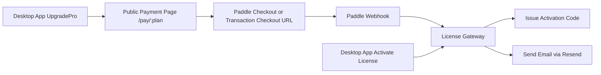

# 41. Paddle 支付替换研究与迁移方案

- 日期：2026-03-16
- 状态：研究完成，待确认后实施
- 适用范围：`/Users/luheng/Downloads/ai01/agentshield`
- 研究方法：
  - 已使用 Sequential Thinking MCP 做结构化推理
  - 已尝试 Tavily MCP 拉取外部资料，但当前账号配额超限，无法继续使用
  - 已改用 Paddle 官方文档与 Context7 官方实现指引补齐证据

## 1. Executive Summary

结论先说：`Paddle` 可以作为 AgentShield 的支付主路线，而且从中国卖家可用性和中国买家支付体验上看，整体比当前准备接入的 `Lemon Squeezy` 更合适。

但这里有一个关键事实必须先说清楚：**Paddle 不是把现有的 3 条 checkout URL 换掉就结束了。**

当前 AgentShield 的商业化代码是围绕 `Lemon webhook + 固定外链 checkout + 激活码发放/退款撤销` 写的，而 Paddle 官方推荐的主流程是：

1. 通过 `Paddle.js` 在已审批的网站页里拉起 checkout，或通过服务端创建 transaction 后使用 `checkoutUrl`
2. 用 `paddle-signature` + 原始请求体做 webhook 验签
3. 在 `transaction.completed` 等事件到达后执行业务发货（这里就是发激活码）

所以，**推荐迁移方案不是“静态 URL 替换”，而是“最小支付页 + Paddle transaction 创建 + Paddle webhook 发码”**。

## 2. Problem Statement And Scope

### 2.1 当前问题

用户已经明确验证：

1. 之前建议的 `Lemon Squeezy` 路线在中国卖家侧存在实际可用性问题。
2. 现有商业化发布链路仍依赖 Lemon 专属环境变量、Lemon webhook 事件名、Lemon 验签头和 Lemon 文案。
3. 用户需要一个真正能在中国环境下推进的支付方案，并且后续仍然保持：
   - 公开下载
   - 14 天试用
   - 购买后自动发码
   - 激活码本地激活
   - 在线验码
   - 退款撤销授权

### 2.2 本次研究范围

本次只回答三个问题：

1. Paddle 是否适合作为当前项目的支付替代方案。
2. 如果切换，现有代码哪些地方必须改。
3. 第一阶段怎么改最稳，最少返工。

本次**不直接修改代码**，先完成研究与实施方案。

## 3. Current State And Constraints

### 3.1 当前前端购买流

当前桌面端升级页直接读取三个环境变量并打开外部链接：

- `VITE_CHECKOUT_MONTHLY_URL`
- `VITE_CHECKOUT_YEARLY_URL`
- `VITE_CHECKOUT_LIFETIME_URL`

代码证据：

- `src/components/pages/upgrade-pro.tsx:100-129`
- `src/components/pages/upgrade-pro.tsx:193-205`

当前还会往 URL 上附加 Lemon 风格的 `custom_data[...]` 参数：

- `src/components/pages/upgrade-pro.tsx:80-90`

这说明现在的 App 购买入口默认假设：

1. 外部 checkout 链接是提前生成好的固定链接
2. 购买元数据可以通过 URL query 透传

### 3.2 当前后端发码流

当前 license gateway 明确写死了 Lemon：

- webhook secret：`LEMONSQUEEZY_WEBHOOK_SECRET`
- webhook 路径：`POST /webhooks/lemonsqueezy`
- 验签头：`x-signature`
- 事件：`order_created` / `order_refunded` / `subscription_payment_refunded`

代码证据：

- `scripts/license-gateway.mjs:18`
- `scripts/license-gateway.mjs:65-68`
- `scripts/license-gateway.mjs:92-95`
- `scripts/license-gateway.mjs:295-342`
- `scripts/license-gateway.mjs:344-430`

### 3.3 当前发布门禁

发布前 gate 也把 Lemon 当成必填项：

- `scripts/public-sale-gate.sh:167`

所以即使只换支付平台，如果不改 gate，公开发布流程也会继续卡在 Lemon secret 上。

### 3.4 不需要重写的部分

下面这些核心许可证能力与支付平台并不绑定，可以保留：

1. 14 天试用逻辑
2. 激活码签发格式
3. 客户端本地激活/验签
4. `/client/licenses/verify` 在线验码契约
5. 管理端补发、撤销、重发邮件能力

这意味着迁移重点应限制在“支付边界层”，而不是重写整个许可证系统。

## 4. Official Findings

> 检索日期统一为 2026-03-16。以下结论优先以 Paddle 官方文档为准。

### 4.1 Paddle 对中国卖家是否可行

官方帮助文档说明：Paddle 支持“几乎全球”的卖家，只有 unsupported countries 列表中的国家/地区不能使用。中国大陆不在 unsupported list 中。

官方来源：

- Paddle Supported Countries
  - <https://www.paddle.com/help/start/set-up-payouts-supported-countries/supported-countries>

推论：

- 与之前用户在 Lemon 的实际受阻情况相比，Paddle 作为中国卖家路线更可行。
- 这条结论来自官方支持国家说明，不是经验猜测。

### 4.2 Paddle 卖家收款方式

官方帮助文档说明，Paddle 卖家 payouts 支持：

- `Wire transfer`
- `Payoneer`

官方来源：

- Paddle Getting paid
  - <https://www.paddle.com/help/manage/get-paid/getting-paid>

关键结论：

- **Paddle 的卖家出款不是 PayPal。**
- 如果用户原先打算“用 PayPal 作为卖家提现主路线”，那在 Paddle 下不能这么理解。
- Paddle 买家可以用 PayPal 支付，但卖家提现方式是另外一回事。

### 4.3 Paddle 支持哪些买家支付方式

官方开发文档明确列出了：

- WeChat Pay
- PayPal

官方来源：

- WeChat Pay：<https://developer.paddle.com/concepts/payment-methods/wechat-pay>
- PayPal：<https://developer.paddle.com/concepts/payment-methods/paypal>

关键结论：

- 对中国买家来说，`WeChat Pay` 是比 Lemon 更友好的信号。
- 对海外买家来说，`PayPal` 也继续保留了支付习惯兼容性。

### 4.4 Paddle checkout 不是简单静态链接替换

官方开发文档显示，Paddle 主推两种方式：

1. 用 `Paddle.Checkout.open(...)` 在网站页里拉起 checkout
2. 用服务端创建 transaction，再使用 transaction 返回的 `checkoutUrl`

官方来源：

- Build with Paddle / Open a checkout：<https://developer.paddle.com/build/checkout/build-branded-inline-checkout>
- Paddle.js / Checkout open（Context7 解析自官方）：`Paddle.Checkout.open({ items: [...] })`
- Transactions create（Context7 解析自官方 SDK README）：`paddle.transactions.create(...)`

同时，官方文档对 default payment links 还强调：

- 需要 `approved website`
- 需要在网站中使用 `Paddle.js`

官方来源：

- Default payment links：<https://developer.paddle.com/build/checkout/default-payment-links>

关键结论：

- 当前 AgentShield 直接在桌面端打开 3 条外链的模式，**不能按 Lemon 的思路原样照搬到 Paddle**。
- 我们需要一个最小网站页或最小 payment page 来承接 Paddle checkout。

### 4.5 WeChat Pay 的约束

官方开发文档明确说明：

- WeChat Pay 只适用于 `one-time purchases`

官方来源：

- <https://developer.paddle.com/concepts/payment-methods/wechat-pay>

关键结论：

- 第一阶段不适合把月付/年付做成真正的自动续费订阅。
- 更稳的做法是把：
  - 月付 = 30 天一次性授权
  - 年付 = 365 天一次性授权
  - 终身 = 永久授权
- 这样既保留现有 license 逻辑，又能兼容 WeChat Pay。

### 4.6 Paddle webhook 验签要求

官方 SDK 文档与 Context7 官方实现指引都明确要求：

1. 使用原始请求体
2. 读取 `paddle-signature`
3. 用 webhook secret 验签

官方来源：

- Paddle Node SDK README（Context7 官方代码示例）
- Webhooks overview：<https://developer.paddle.com/build/webhooks>

关键结论：

- 当前 `license-gateway.mjs` 里的 Lemon HMAC 逻辑不能直接复用。
- 需要换成 Paddle 官方推荐的 raw body 验签方式。

### 4.7 Paddle 发码事件建议

官方交易事件中，`transaction.completed` 是最适合发货/发码的完成态信号。

官方来源：

- Events / transactions：<https://developer.paddle.com/webhooks/respond-to-webhooks>
- Authentication 示例里也展示了 `transaction.completed`

关键结论：

- AgentShield 的自动发码应该改为以 `transaction.completed` 为主事件源。
- 退款/撤销则应接 Paddle 对应的退款/adjustment 相关事件处理。

## 5. Recommendation

推荐采用：**Paddle 第一阶段最小闭环方案**。

### 5.1 推荐架构



### 5.2 为什么这是最优先方案

1. 许可证核心不变，返工最小。
2. 买家可获得更适合中国的支付体验。
3. 卖家侧不再卡 Lemon 的地区问题。
4. 将支付平台适配收敛在 `payment page + license gateway + env gate` 三层。
5. 后续如果还要接别的支付平台，也会更容易抽象。

## 6. Detailed Component Design

### 6.1 Desktop App

当前实现：

- 直接打开 `VITE_CHECKOUT_*`
- 并附加 `custom_data[...]`

建议调整为两种可选实现之一：

#### 方案 A：桌面端打开我们自己的公开支付页

例如：

- `https://pay.agentshield.app/pay/monthly`
- `https://pay.agentshield.app/pay/yearly`
- `https://pay.agentshield.app/pay/lifetime`

页面内部再用 Paddle.js 拉起 checkout。

优点：

- 最符合 Paddle 官方网站承接思路
- 更容易做营销文案、FAQ、退款说明、客服入口
- 后续加优惠码、来源跟踪更容易

#### 方案 B：桌面端先请求后端创建 transaction，再直接跳转 `checkoutUrl`

优点：

- 流程更短
- 可以不用先手动创建静态 payment links

缺点：

- 仍然建议有一个官网或最小支付页做品牌与审核承接
- 需要桌面端增加“请求创建交易”的 API 调用

**推荐：方案 A 优先。**

### 6.2 Payment Page

新增一个最小公开支付页，职责：

1. 展示三档价格与权益
2. 根据 plan 决定 Paddle `priceId`
3. 调用 `Paddle.Checkout.open(...)`
4. 传入 `customData`：
   - `sku_code`
   - `campaign`
   - `source`
   - 可选 `app_build`

### 6.3 License Gateway

保留当前服务形态，但把支付平台适配层换掉。

当前 Lemon 专属点：

- `LEMONSQUEEZY_WEBHOOK_SECRET`
- `/webhooks/lemonsqueezy`
- `x-signature`
- `extractLemonOrder(...)`
- `provider: 'lemonsqueezy'`

迁移后建议：

- `PADDLE_API_KEY`
- `PADDLE_WEBHOOK_SECRET`
- `/webhooks/paddle`
- `paddle-signature`
- `extractPaddleTransaction(...)`
- `provider: 'paddle'`

### 6.4 Data Mapping

建议把当前 order/license 数据模型保留，只替换 provider 映射：

| 现有字段 | Paddle 对应建议 |
| --- | --- |
| `provider_order_id` | `transaction.id` |
| `provider_customer_id` | `customer.id` |
| `customer_email` | `customer.email` |
| `sku_code` | `custom_data.sku_code` 或价格映射 |
| `amount_total` | `details.totals.total` |
| `currency` | `currency_code` |
| `payment_status` | `status` |

## 7. Data Model And Interface Contracts

### 7.1 新环境变量建议

```bash
PADDLE_API_KEY=
PADDLE_WEBHOOK_SECRET=
PADDLE_MONTHLY_PRICE_ID=
PADDLE_YEARLY_PRICE_ID=
PADDLE_LIFETIME_PRICE_ID=
PADDLE_CHECKOUT_VENDOR_DOMAIN=
```

补充保留：

```bash
AGENTSHIELD_LICENSE_SIGNING_SEED=
AGENTSHIELD_LICENSE_PUBLIC_KEY=
AGENTSHIELD_LICENSE_GATEWAY_URL=
LICENSE_GATEWAY_ADMIN_PASSWORD=
RESEND_API_KEY=
LICENSE_DELIVERY_FROM_EMAIL=
```

### 7.2 最小接口建议

#### 公开支付页配置接口

`GET /public/payment-config`

返回：

```json
{
  "monthly": { "price_id": "pri_xxx" },
  "yearly": { "price_id": "pri_xxx" },
  "lifetime": { "price_id": "pri_xxx" },
  "vendor": "paddle"
}
```

#### 可选：交易创建接口

`POST /public/paddle/transactions`

请求：

```json
{
  "plan": "monthly",
  "source": "desktop_upgrade"
}
```

返回：

```json
{
  "checkout_url": "https://checkout.paddle.com/..."
}
```

#### Webhook

`POST /webhooks/paddle`

要求：

- 必须读取原始 body
- 必须校验 `paddle-signature`
- 完成态以 `transaction.completed` 为准

## 8. Non-Functional Requirements

### 8.1 Security

1. Webhook 必须按 Paddle 官方方式验签。
2. 激活码仍由本地签名 seed 生成，不暴露私钥。
3. 公开支付页不得包含任何管理密码或发码私钥。
4. 退款事件到达后必须可撤销授权。

### 8.2 Reliability

1. webhook 处理必须幂等，重复事件不重复发码。
2. 邮件发送失败不应导致交易记录丢失。
3. 管理端必须支持补发激活码。

### 8.3 Cost

第一阶段只新增一个最小支付页与 Paddle 适配，不引入新的重型后端。

### 8.4 UX

1. 中国买家优先看到 WeChat Pay 可用路径。
2. 桌面端保持“点击购买 -> 浏览器支付 -> 收邮件拿码 -> 回桌面粘贴激活”的简单链路。

## 9. ADRs

### ADR-001：支付主路线从 Lemon 切换为 Paddle

- 决策：切换
- 备选：继续卡 Lemon；改用 Gumroad/Payhip；纯手工卖码
- 原因：Paddle 对中国卖家整体更可行，且买家支付方式更适合中国市场
- 后果：需要改 payment page、webhook 适配与文档

### ADR-002：第一阶段全部按一次性商品售卖

- 决策：月/年/终身都按 one-time 商品售卖
- 备选：月付/年付改自动续费 subscription
- 原因：WeChat Pay 只适用于 one-time purchases，且当前激活码模型本来就是时长授权
- 后果：第一阶段不做自动续费，减少复杂度

### ADR-003：增加最小公开支付页

- 决策：增加支付页承接 Paddle checkout
- 备选：只在桌面端里硬跳 checkout URL
- 原因：更符合 Paddle 官方承接方式，也更利于审核和转化
- 后果：需要额外部署一个小页面，但文案、FAQ、客服、追踪都会更清晰

## 10. Risk Register And Mitigation

| 风险 | 概率 | 影响 | 分数 | 缓解 |
| --- | --- | --- | --- | --- |
| Paddle 账户开通/审核耗时 | 4 | 5 | 20 | 先完成官方账户与产品创建，再进入代码替换 |
| 误以为可直接用 3 条静态链接导致返工 | 5 | 4 | 20 | 先落支付页方案，不按 Lemon 思路硬改 |
| 退款事件映射不完整导致授权未撤销 | 3 | 5 | 15 | 用测试订单覆盖 completed/refund/adjustment 全链路 |
| 卖家误以为 Paddle 用 PayPal 提现 | 4 | 3 | 12 | 在操作文档里明确 payout 与 buyer payment 的区别 |
| WeChat Pay 与订阅模式不兼容 | 4 | 4 | 16 | 第一阶段统一使用 one-time 商品 |
| 文档与法律页仍保留 Lemon 文案 | 3 | 3 | 9 | 迁移时统一替换 README、隐私政策、下载页、FAQ |

## 11. Delivery Roadmap And Milestones

### Milestone 1：账户与产品准备

1. 开通 Paddle seller 账户
2. 创建三个 one-time 产品/price
3. 记录三个 `priceId`
4. 确认 webhook secret 与 API key

验收：

- 能在 Paddle 后台看到三个有效产品价格
- 能拿到 priceId、API key、webhook secret

### Milestone 2：支付页落地

1. 新增最小支付页
2. 集成 Paddle.js
3. 按 plan 打开 checkout
4. 补中英文支付说明

验收：

- 页面能成功拉起 Paddle checkout
- 月/年/终身三档都可进入支付

### Milestone 3：License Gateway 切换

1. 新增 `/webhooks/paddle`
2. 改用 Paddle 验签
3. 映射 transaction.completed -> 发码
4. 映射 refund/adjustment -> 撤销授权

验收：

- 完成支付后自动发码成功
- 退款后授权状态正确撤销

### Milestone 4：发布 gate 与文案修正

1. `public-sale-gate.sh` 改 Paddle 变量校验
2. GitHub secret/variable 同步脚本改 Paddle
3. README、下载页、隐私政策、FAQ 全部去 Lemon 化

验收：

- public gate 全绿
- 文档不再出现 Lemon 错误指引

## 12. Runbook And Validation Baseline

### 12.1 上线前检查

1. `PADDLE_API_KEY` 已配置
2. `PADDLE_WEBHOOK_SECRET` 已配置
3. 三个 `PADDLE_*_PRICE_ID` 已配置
4. `AGENTSHIELD_LICENSE_SIGNING_SEED` 已配置
5. `RESEND_API_KEY` 已配置
6. 公网 HTTPS gateway 与支付页地址已部署

### 12.2 必测链路

1. 试用 14 天仍正常
2. 月付支付后自动发码
3. 年付支付后自动发码
4. 终身支付后自动发码
5. 收到激活码后可在桌面端激活
6. 在线验码正常
7. 重复 webhook 不重复发码
8. 退款后授权撤销
9. 管理端可手动补发

### 12.3 对零基础运营者的最终心智模型

切 Paddle 后，真实操作会变成：

1. 你在 Paddle 后台配置产品价格
2. 用户从 AgentShield 或官网进入支付页
3. Paddle 收钱并回调你的 license gateway
4. gateway 自动生成激活码并发邮件
5. 用户回到桌面端输入激活码完成升级

## 13. Acceptance Criteria

本研究文档交付完成的标准：

1. 已明确 Paddle 是否适合中国卖家
2. 已明确当前 Lemon 专属耦合点
3. 已给出最小改造架构，而不是模糊建议
4. 已给出第一阶段产品形态建议：全部 one-time 商品
5. 已给出实施里程碑、风险和验收标准

## 14. Sources

- Paddle Supported Countries（官方，检索日期：2026-03-16）
  - <https://www.paddle.com/help/start/set-up-payouts-supported-countries/supported-countries>
- Paddle Getting Paid（官方，检索日期：2026-03-16）
  - <https://www.paddle.com/help/manage/get-paid/getting-paid>
- Paddle Payment Methods / WeChat Pay（官方，检索日期：2026-03-16）
  - <https://developer.paddle.com/concepts/payment-methods/wechat-pay>
- Paddle Payment Methods / PayPal（官方，检索日期：2026-03-16）
  - <https://developer.paddle.com/concepts/payment-methods/paypal>
- Paddle Default Payment Links（官方，检索日期：2026-03-16）
  - <https://developer.paddle.com/build/checkout/default-payment-links>
- Paddle Webhooks Overview（官方，检索日期：2026-03-16）
  - <https://developer.paddle.com/build/webhooks>
- Paddle Node SDK README via Context7（官方实现指引，检索日期：2026-03-16）
  - `@paddle/paddle-node-sdk` webhook 验签与 transaction 创建示例
- 当前项目代码（检索日期：2026-03-16）
  - `src/components/pages/upgrade-pro.tsx`
  - `scripts/license-gateway.mjs`
  - `scripts/public-sale-gate.sh`
