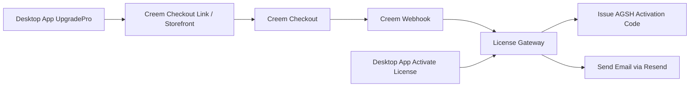

# 42. Creem 支付替换研究与迁移方案

- 日期：2026-03-16
- 状态：研究完成，待确认后实施
- 适用范围：`/Users/luheng/Downloads/ai01/agentshield`
- 研究方法：
  - 已使用 `technical-architecture-writer` 技能组织方案
  - 已使用 Sequential Thinking MCP 进行结构化推理
  - 已尝试 Tavily MCP 拉取外部资料，但当前账号配额超限
  - 已改用 Creem 官方文档、官方站点与 Context7 官方实现指引补齐证据

## 1. Executive Summary

结论先说：**Creem 比 Paddle 和 Lemon 都更贴合 AgentShield 当前这套卖码架构。**

原因不是抽象上“更先进”，而是它和你现有代码的工作方式更接近：

1. 支持直接生成 `checkout_url`
2. 支持 `checkout links`
3. 支持官方托管 `storefront`
4. 支持 webhook
5. 还内建了 `License Keys`

这意味着：

- 第一阶段我们完全可以**不重写许可证核心**
- 继续保留现在的 `14 天试用 + AGSH 激活码 + 本地激活 + 在线验码`
- 只把 `Lemon` 的支付边界替换成 `Creem`

与 Paddle 相比，Creem 的最大优势是：**不一定需要你先补一个额外支付页网站。**

如果使用官方 `checkout links` 或 `storefront`，你当前桌面端“点击购买 -> 浏览器外链支付”这条链路可以继续保留。

## 2. Problem Statement And Scope

### 2.1 当前问题

当前项目的商用链路已经写了一版，但那版是围绕 `Lemon Squeezy` 设计的，用户实测在中国环境里推进不顺。

你现在需要的是：

1. 找到一个中国卖家更可落地的平台
2. 保留现有 AgentShield 的授权模型
3. 尽快形成“下载 -> 试用 -> 购买 -> 自动发码 -> 激活”的闭环
4. 尽量少改桌面端和许可证底层

### 2.2 本次研究范围

本次只研究：

1. Creem 是否适合当前项目
2. 如果接 Creem，代码应该怎么改
3. 是否要用 Creem 内建 License Keys
4. 第一阶段最小闭环怎么设计

本次**不直接改代码**，先完成研究与方案文档。

## 3. Current State And Constraints

### 3.1 当前前端购买流

当前升级页依赖三个固定外链：

- `VITE_CHECKOUT_MONTHLY_URL`
- `VITE_CHECKOUT_YEARLY_URL`
- `VITE_CHECKOUT_LIFETIME_URL`

代码位置：

- `src/components/pages/upgrade-pro.tsx:100-129`
- `src/components/pages/upgrade-pro.tsx:193-205`

并且当前会追加 Lemon 风格 query：

- `custom_data[sku_code]`
- `custom_data[campaign]`
- `custom_data[source]`

代码位置：

- `src/components/pages/upgrade-pro.tsx:80-90`

### 3.2 当前后端发码流

当前发码网关完全写死 Lemon：

- `LEMONSQUEEZY_WEBHOOK_SECRET`
- `/webhooks/lemonsqueezy`
- `x-signature`
- `order_created`
- `order_refunded`
- `subscription_payment_refunded`

代码位置：

- `scripts/license-gateway.mjs:18`
- `scripts/license-gateway.mjs:65-68`
- `scripts/license-gateway.mjs:92-95`
- `scripts/license-gateway.mjs:295-342`
- `scripts/license-gateway.mjs:344-430`

### 3.3 当前发布 gate

现在公开发布 gate 也还要求 Lemon secret：

- `scripts/public-sale-gate.sh:167`

这意味着：

- 只改购买链接还不够
- 还必须一起替换 webhook secret、事件名、文案和发布校验

### 3.4 当前许可证能力可保留

以下能力与支付平台不强绑定，可直接保留：

1. `start_trial`
2. `activate_license`
3. 本地公钥验签
4. 在线 `/client/licenses/verify`
5. 管理端补发/撤销/重发邮件

因此，Creem 第一阶段应该只替换支付边界，不重写许可证底座。

## 4. Official Findings

> 所有时间敏感结论均以 2026-03-16 检索的 Creem 官方资料为准。

### 4.1 Creem 是否支持中国卖家

Creem 官方 `Supported countries` 页面明确提供了国家列表与 payout 指引。中国在其支持范围内，且有中国专门说明页。

官方来源：

- Supported countries：<https://www.creem.io/supported-countries>
- China guide：<https://www.creem.io/countries/china>

关键结论：

- `Creem` 对中国卖家是可行路线。
- 这一点比你之前实操受阻的 Lemon 更贴近现实可落地性。

### 4.2 中国卖家如何收款

Creem 官方中国页面写明：

- 中国个人：可通过 `Alipay` 提现/收款
- 中国企业：可通过本地银行账户收款

官方来源：

- <https://www.creem.io/countries/china>

关键结论：

- 这对你非常关键，因为平台没有把你逼到“必须香港主体/必须海外银行”那种路线。
- 从卖家提现可行性看，Creem 明显更适合当前阶段。

### 4.3 Creem checkout 形态

Creem 官方文档确认了三种对你有用的能力：

1. `Create Checkout` API 返回 `checkout_url`
2. `Checkout links`
3. `Storefront`

官方来源：

- Quickstart / Create Checkout：<https://docs.creem.io/getting-started/quickstart>
- Checkout links：<https://docs.creem.io/features/checkout-links>
- Storefront：<https://docs.creem.io/features/storefront>

关键结论：

- 与 Paddle 不同，Creem 不强依赖你先做一个额外网站支付页。
- 当前桌面端直接打开外链购买的模式，可以继续沿用。
- 如果你不想先做官网吗，Creem 的 `storefront` 就能先顶上。

### 4.4 Creem 支持 metadata 透传

官方 `Checkout Links` 文档明确支持通过 query 参数传递 metadata，例如：

- `metadata[user_id]=123`
- `metadata[plan]=pro`

官方来源：

- <https://docs.creem.io/features/checkout-links>

关键结论：

- 你当前 `appendCheckoutCustomData(...)` 这层逻辑可以保留思想，只需把 Lemon 的 `custom_data[...]` 改成 Creem 的 `metadata[...]`。
- 这意味着升级页几乎可以最小改动迁移。

### 4.5 Creem webhook 验签与事件

官方 Quickstart 与文档说明：

- 头：`creem-signature`
- 验签方式：`HMAC-SHA256`
- 典型事件：
  - `checkout.completed`
  - `subscription.paid`
  - `subscription.canceled`
  - `subscription.expired`
  - `refund.created`

官方来源：

- Quickstart webhook example：<https://docs.creem.io/getting-started/quickstart>
- Webhook docs（Context7 官方解析）

关键结论：

- 如果我们第一阶段卖的是一次性时长授权，主事件就用：
  - `checkout.completed` -> 发码
  - `refund.created` -> 撤销授权
- 当前 Lemon webhook 逻辑可复用大部分状态持久化与邮件发送逻辑，只替换 provider 层。

### 4.6 Creem 内建 License Keys

官方文档明确提供：

- 激活：`POST /v1/licenses/activate`
- 校验：`POST /v1/licenses/validate`
- 解绑：`POST /v1/licenses/deactivate`

官方来源：

- License Keys：<https://docs.creem.io/features/addons/licenses>

关键结论：

- Creem 天然适合“软件卖激活码”场景。
- 但这并不代表我们第一阶段应该立刻全切到 Creem 原生 license。

### 4.7 Creem 买家支付方式的真实情况

Creem 官方首页/FAQ 与官方文档给出的信号有两层：

1. 文档和营销页提到：支持卡、Apple Pay、Google Pay、本地支付方式等
2. 官方 `payment methods` 页面同时写了：`Alipay and WeChat Pay support is coming soon`

官方来源：

- Payment methods：<https://docs.creem.io/features/finance/payment-methods>
- Official site / FAQ：<https://www.creem.io/>

关键结论：

- **不要现在就把“买家可直接用微信/支付宝支付”当成既成事实去宣传。**
- 截止 2026-03-16，官方文档对买家端 `Alipay / WeChat Pay` 的措辞仍是 `coming soon`。
- 所以第一阶段宣传口径应保守，只宣传已经在后台可实际验证的支付方式。

## 5. Recommendation

### 5.1 唯一推荐方案

推荐：**Creem Phase 1 最小闭环替换方案**

也就是：

1. 继续保留你现有的 AGSH 激活码体系
2. 把 Lemon 的 checkout / webhook 层替换为 Creem
3. 先不切 Creem 原生 license keys
4. 等商业闭环跑顺后，再评估是否第二阶段切 Creem 原生 license

### 5.2 为什么不建议第一阶段直接切 Creem 原生 License Keys

虽然 Creem 已经提供 built-in license key API，但如果你第一阶段直接切，影响会扩大到：

1. 桌面端激活逻辑
2. 本地离线激活逻辑
3. 当前 AGSH 激活码格式
4. 现有发码、补发和在线验码契约

这会从“支付替换”变成“支付 + 授权系统双重重构”。

你现在最需要的是尽快商用，而不是一次改两层基础设施。

## 6. Target Architecture Overview



这个架构的好处是：

- 你现有桌面购买入口保留
- 你现有 AGSH 码保留
- 你现有邮件发码保留
- 你现有在线验码保留
- 只换支付平台边界

## 7. Detailed Component Design

### 7.1 UpgradePro 页面

当前行为：

- 读取 3 个 checkout URL
- 追加 Lemon `custom_data[...]`
- 打开浏览器

推荐修改：

1. 保留三个环境变量命名，减少前端改动：
   - `VITE_CHECKOUT_MONTHLY_URL`
   - `VITE_CHECKOUT_YEARLY_URL`
   - `VITE_CHECKOUT_LIFETIME_URL`
2. 把 query 参数从：
   - `custom_data[sku_code]`
   - `custom_data[campaign]`
   - `custom_data[source]`
   改成：
   - `metadata[sku_code]`
   - `metadata[campaign]`
   - `metadata[source]`

这样可以最大限度保留现有交互与 UI。

### 7.2 License Gateway

推荐把当前 Lemon 适配层改为 Creem：

| 当前 | 改为 |
| --- | --- |
| `LEMONSQUEEZY_WEBHOOK_SECRET` | `CREEM_WEBHOOK_SECRET` |
| `/webhooks/lemonsqueezy` | `/webhooks/creem` |
| `x-signature` | `creem-signature` |
| `order_created` | `checkout.completed` |
| `order_refunded` / `subscription_payment_refunded` | `refund.created` |
| `provider: 'lemonsqueezy'` | `provider: 'creem'` |

尽量复用：

- 订单幂等处理
- 发码逻辑
- 退款撤销逻辑
- 邮件发送逻辑
- 审计日志逻辑

### 7.3 Checkout Source

第一阶段建议 2 个实现选项：

#### 方案 A：直接用 Checkout Links

优点：

- 改动最小
- 最符合你现在桌面端结构
- 零基础最容易运营

缺点：

- 价格/变体灵活性弱一点

#### 方案 B：用 Checkout API 动态创建

优点：

- 后续更灵活
- metadata、request_id、用户上下文更可控

缺点：

- 需要再加一个轻量 public API

**推荐顺序：先 A，后 B。**

### 7.4 Storefront 的作用

如果你现在不想建官网，可以直接先让：

- GitHub Releases 负责下载
- Creem Storefront 负责购买

这条路线对零基础最省事。

## 8. Data Model And Interface Contracts

### 8.1 新环境变量建议

```bash
CREEM_API_KEY=
CREEM_WEBHOOK_SECRET=
CREEM_MONTHLY_PRODUCT_ID=
CREEM_YEARLY_PRODUCT_ID=
CREEM_LIFETIME_PRODUCT_ID=
```

如果先走 checkout links：

```bash
VITE_CHECKOUT_MONTHLY_URL=
VITE_CHECKOUT_YEARLY_URL=
VITE_CHECKOUT_LIFETIME_URL=
```

保留现有许可证环境变量：

```bash
AGENTSHIELD_LICENSE_SIGNING_SEED=
AGENTSHIELD_LICENSE_PUBLIC_KEY=
AGENTSHIELD_LICENSE_GATEWAY_URL=
LICENSE_GATEWAY_ADMIN_PASSWORD=
RESEND_API_KEY=
LICENSE_DELIVERY_FROM_EMAIL=
```

### 8.2 Webhook 最小契约

`POST /webhooks/creem`

要求：

1. 读取 raw body
2. 读取 `creem-signature`
3. 用 `CREEM_WEBHOOK_SECRET` 做 `HMAC-SHA256`
4. `checkout.completed` 发码
5. `refund.created` 撤销授权

### 8.3 可选第二阶段 License API 契约

如果以后切 Creem 原生 license：

- `POST /v1/licenses/activate`
- `POST /v1/licenses/validate`
- `POST /v1/licenses/deactivate`

但这不是第一阶段必须做的事。

## 9. Non-Functional Requirements

### 9.1 Security

1. webhook 必须验签
2. API key 不得暴露到前端
3. 仍然不暴露 AGSH 私钥
4. refund 必须触发撤销逻辑

### 9.2 Reliability

1. 重复 webhook 不得重复发码
2. 邮件失败时订单与 license 记录不能丢
3. 管理端必须保留手动补发能力

### 9.3 UX

1. 继续维持桌面端一键跳浏览器购买
2. 用户购买完成后自动收到激活码邮件
3. 回到桌面端粘贴即可升级

### 9.4 Cost And Complexity

相比 Paddle：

- Creem 第一阶段复杂度更低
- 不必先做额外支付页
- 更适合你要尽快卖出去的目标

## 10. ADRs

### ADR-001：支付主路线优先选 Creem

- 决策：选 Creem
- 备选：继续 Lemon；切 Paddle；纯手动收款发码
- 原因：更适合中国卖家，且与现有代码结构更匹配
- 后果：需替换 webhook/provider/env/doc 文案

### ADR-002：第一阶段保留现有 AGSH 激活码体系

- 决策：保留
- 备选：直接切 Creem 原生 license keys
- 原因：先完成支付替换，避免支付和授权双重重构
- 后果：后续仍可平滑升级到 Creem 原生 license

### ADR-003：第一阶段优先用 Checkout Links 或 Storefront

- 决策：优先用官方托管购买入口
- 备选：先做自定义 API 动态创建 checkout
- 原因：更快上线、更少代码、更适合零基础运营
- 后果：后续如果需要更强上下文控制，再升级到 API 创建 checkout

## 11. Risk Register And Mitigation

| 风险 | 概率 | 影响 | 分数 | 缓解 |
| --- | --- | --- | --- | --- |
| Creem 账号审核/商家资料补充耗时 | 4 | 5 | 20 | 先开通真实账户与产品，再开始代码替换 |
| 文档里“买家端微信/支付宝”尚未正式可用 | 4 | 4 | 16 | 宣传口径保守，只宣传后台已验证方式 |
| 误把 Creem 原生 license 当成第一阶段必须项 | 4 | 4 | 16 | 第一阶段只换支付边界，许可证不动 |
| webhook 事件映射不完整导致退款未撤销 | 3 | 5 | 15 | 用 checkout.completed / refund.created 做端到端测试 |
| checkout link metadata 映射错误导致 sku 识别错乱 | 3 | 4 | 12 | 支付前在测试模式下校验 metadata 回传 |
| README/法律页仍残留 Lemon 文案 | 3 | 3 | 9 | 代码替换时一起做 docs sweep |

## 12. Delivery Roadmap And Milestones

### Milestone 1：Creem 后台准备

1. 注册并完成商家资料
2. 创建三个商品：
   - Monthly 30D
   - Yearly 365D
   - Lifetime
3. 拿到：
   - checkout links 或 storefront link
   - webhook secret
   - API key（如后续需要）

验收：

- 三个商品可在测试模式下正常生成购买入口

### Milestone 2：最小代码替换

1. `UpgradePro` metadata 参数改 Creem 风格
2. `license-gateway.mjs` 改为 `/webhooks/creem`
3. 替换 Creem 验签和事件映射
4. `public-sale-gate.sh` 改为检查 `CREEM_WEBHOOK_SECRET`

验收：

- 测试支付后能收到 AGSH 激活码
- refund 后授权可撤销

### Milestone 3：文案与发布链路修正

1. README 去 Lemon 化
2. 法律页/隐私政策 Merchant of Record 改成 Creem
3. 下载仓库文案改 Creem
4. GitHub secrets/vars 同步脚本改 Creem

验收：

- 文档和发布 gate 不再出现 Lemon 配置要求

### Milestone 4：可选第二阶段

1. 评估是否切 Creem 原生 license keys
2. 如果切换，再重构桌面激活协议与本地缓存策略

验收：

- 再单独立项，不混入第一阶段

## 13. Runbook And Validation Baseline

### 13.1 上线前必须具备

1. `CREEM_WEBHOOK_SECRET`
2. 三个真实 checkout links 或 storefront 路径
3. `AGENTSHIELD_LICENSE_SIGNING_SEED`
4. `RESEND_API_KEY`
5. 稳定公网 HTTPS `AGENTSHIELD_LICENSE_GATEWAY_URL`

### 13.2 必测链路

1. 试用仍正常
2. 月版购买后自动发码
3. 年版购买后自动发码
4. 终身购买后自动发码
5. 客户端输入 AGSH 码能激活
6. 在线验码正常
7. refund.created 到达后授权撤销
8. 管理端可手动补发

## 14. Acceptance Criteria

本方案文档完成标准：

1. 已明确 Creem 是否适合中国卖家
2. 已明确它与当前代码结构的匹配点
3. 已明确第一阶段是否需要改授权体系
4. 已明确 webhook / env / checkout / docs 的替换范围
5. 已给出里程碑、风险与验收标准

## 15. Sources

- Creem Supported countries（官方，检索日期：2026-03-16）
  - <https://www.creem.io/supported-countries>
- Creem China guide（官方，检索日期：2026-03-16）
  - <https://www.creem.io/countries/china>
- Creem Quickstart / Create Checkout（官方，检索日期：2026-03-16）
  - <https://docs.creem.io/getting-started/quickstart>
- Creem Checkout Links（官方，检索日期：2026-03-16）
  - <https://docs.creem.io/features/checkout-links>
- Creem Storefront（官方，检索日期：2026-03-16）
  - <https://docs.creem.io/features/storefront>
- Creem Payment Methods（官方，检索日期：2026-03-16）
  - <https://docs.creem.io/features/finance/payment-methods>
- Creem Licenses（官方，检索日期：2026-03-16）
  - <https://docs.creem.io/features/addons/licenses>
- Context7 / Creem Documentation（官方实现指引，检索日期：2026-03-16）
  - `/websites/creem_io`
- 当前项目代码（检索日期：2026-03-16）
  - `src/components/pages/upgrade-pro.tsx`
  - `scripts/license-gateway.mjs`
  - `scripts/public-sale-gate.sh`
