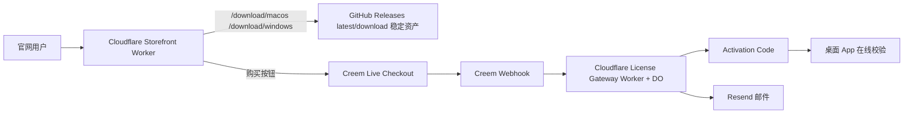

# 52-正式商用上线收口方案-2026-03-16

- 日期：2026-03-16
- 适用范围：AgentShield 官网、下载分发、Creem 正式收款、License Gateway、GitHub 发布链路
- 检索方式：Sequential Thinking + 官方文档直查 + Context7 官方实现校验
- 说明：Tavily MCP 在本次执行中因配额限制不可用，已退回到官方来源直查，不使用第三方二手资料。

## 1. 执行摘要

AgentShield 当前已经具备以下可交付基础：

1. 官网已上线到 Cloudflare Worker。
2. 稳定下载地址已上线，网页按钮不再直接暴露 GitHub 版本化链接。
3. Creem -> Cloudflare License Gateway -> 激活码签发 -> 在线校验 -> 退款撤销，这条代码链路已具备生产实现。
4. Webhook 验签、幂等、订阅续期、退款撤销、邮件发送、后台补发/撤销接口均已实现。

当前阻塞正式商用的剩余问题，分成两类：

### 1.1 我可以直接完成的技术收口

1. 将 GitHub 发布资产补成“稳定文件名别名”，避免每次升级都修改下载目标。
2. 将 Cloudflare storefront 下载重定向改为稳定 latest/download 链接。
3. 完成公开发布脚本与文档同步，确保后续版本升级时不需要再手工改官网按钮。
4. 再做一轮代码审查、质量门禁和线上验证。

### 1.2 必须由商家本人完成的后台审核项

1. Creem `Payout Account` 设置。
2. Creem / SUMSUB 身份认证（KYC / KYB）。
3. 绑定真实收款账户。
4. 等待 Creem 账户审核通过并启用 `Live payments`。
5. 在 Creem live 模式中创建正式产品并拿到 live webhook secret / live payment links。

结论：

- 代码与部署可以继续推进到“正式商用准备完成”。
- 但真正开始收款前，仍必须完成 Creem 商家审核，不可跳过。

## 2. 问题定义与范围

用户目标不是继续做 demo，而是：

1. 让官网、下载、支付、激活码、邮件、校验形成正式商用闭环。
2. 让后续每次发新版时，不需要再改官网里的下载按钮。
3. 让零基础用户点开官网后能直接下载、购买、激活。
4. 避免把平台审核问题误判成代码缺陷。

本方案不包含以下替代路径：

1. 不更换支付平台（继续使用 Creem）。
2. 不改成自建支付系统。
3. 不新增 App Store / Microsoft Store 上架流程。

## 3. 当前状态与约束

## 3.1 当前已完成

1. 官网：`https://app.51silu.com`
2. License Gateway：`https://api.51silu.com`
3. 下载稳定入口：
   - `/download/macos`
   - `/download/windows`
4. Storefront 已具备：
   - 产品介绍
   - 下载入口
   - 定价入口
   - 隐私 / 条款 / 退款 / EULA
5. License Gateway 已具备：
   - `POST /webhooks/creem`
   - `POST /client/licenses/verify`
   - `GET /admin/licenses`
   - `POST /admin/licenses/:id/reissue`
   - `POST /admin/licenses/:id/revoke`

## 3.2 官方约束

### Creem 官方约束

1. `Test mode` 与 `Production` 隔离，切生产时必须换成 production keys、production webhooks、production products。
2. 官方审核页明确要求商家资料、官网、支持邮箱、产品信息、Payout account、KYC/KYB 等资料。
3. 中国主体属于官方支持的 payout 国家/地区范围，但仍受具体 payout 方式和 transfer limits 约束。
4. Webhook 集成必须使用原始请求体 + `creem-signature` 做签名校验。

### Cloudflare 官方约束

1. 静态站点 + 自定义重定向的推荐实现，是 Worker 中先处理自定义路由，再回落 `env.ASSETS.fetch(request)`。
2. 如需保证 Worker 先处理下载路由，应使用 assets binding + worker-first 路径控制。

### GitHub 官方约束

1. Release 页面支持 `releases/latest`。
2. 直达最新资产支持 `releases/latest/download/<asset-name>`，但 GitHub 官方的 latest release 语义不包含 draft / prerelease。
3. 若要让 latest asset 链接长期稳定，资产文件名必须稳定不变；若当前走 prerelease 分发，则应使用“固定 tag + 稳定资产名”的组合。

## 4. 目标架构总览

## 5. 详细组件设计

## 5.1 官网与下载层

目标：

1. 官网按钮永远不变。
2. 后续版本升级时，尽量只发 release，不改网页。

方案：

1. GitHub release 同时上传两组资产：
   - 版本化资产：用于归档
   - 稳定文件名资产：用于 `latest/download/...`
2. 若 release 是正式 release，可直接跳 `latest/download/...`；若 release 是 prerelease，则 storefront Worker 应固定跳转到：
   - `https://github.com/<repo>/releases/download/<tag>/AgentShield-macos-arm64.dmg`
   - `https://github.com/<repo>/releases/download/<tag>/AgentShield-windows-x64-setup.exe`
3. 官网按钮继续只指向：
   - `/download/macos`
   - `/download/windows`

这样以后发新版时：

1. GitHub 新 release 只要继续上传同名稳定资产；
2. 官网和 Worker 跳转地址都不用再改。

## 5.2 支付与激活层

保留现有架构：

1. Creem payment links 负责 checkout。
2. License Gateway 负责：
   - 验签
   - 发码
   - 续期
   - 退款撤销
   - 邮件发送
   - 在线校验
3. 桌面端继续通过在线校验接口同步授权状态。

## 5.3 商用审核层

这部分不能通过代码替代：

1. Creem `Payout Account`
2. SUMSUB 认证
3. 收款账户绑定
4. Live mode 启用
5. live 产品和 live webhook secret

## 6. 接口与配置合同

## 6.1 Storefront Worker

稳定下载路由：

- `GET /download/macos`
- `GET /download/windows`
- `GET /download/releases`

目标行为：

- 302 到 GitHub latest/download 稳定资产。

## 6.2 License Gateway 必需环境变量

- `CREEM_WEBHOOK_SECRET`
- `LICENSE_GATEWAY_ADMIN_PASSWORD`
- `AGENTSHIELD_LICENSE_SIGNING_SEED`
- `RESEND_API_KEY`
- `LICENSE_DELIVERY_FROM_EMAIL`
- `CREEM_SKU_BILLING_MAP_JSON`
- `CREEM_PRODUCT_BILLING_MAP_JSON`（可选但推荐）

## 6.3 Live 切换前必须补齐

- `VITE_CHECKOUT_MONTHLY_URL`
- `VITE_CHECKOUT_YEARLY_URL`
- `VITE_CHECKOUT_LIFETIME_URL`
- `AGENTSHIELD_LICENSE_GATEWAY_URL`
- `AGENTSHIELD_LICENSE_PUBLIC_KEY`

## 7. 非功能要求

## 7.1 安全

1. Webhook 必须验签。
2. Webhook 必须幂等。
3. 激活码只存 hash，不存明文。
4. Admin 动作必须鉴权。
5. 不在仓库暴露 live secret。

## 7.2 可靠性

1. 重复 webhook 不重复发码。
2. 订阅续费只延长一次。
3. 退款后自动撤销授权。
4. 下载链接升级后仍保持稳定入口。

## 7.3 可运维性

1. 保留 webhook failure 查看能力。
2. 保留后台 revoke / reissue 能力。
3. 发布前通过 `public-sale-gate.sh` 做门禁。

## 8. ADR

### ADR-001：继续使用 Cloudflare Worker 作为 storefront 入口

- 决策：保留
- 备选：GitHub Pages / 直接 GitHub Releases 页面
- 原因：支持稳定下载路由、后续可接自定义域名、可控性强
- 后果：继续维护一份 Worker 配置，但可换来更稳定的下载与官网入口

### ADR-002：GitHub 发布资产增加稳定文件名别名

- 决策：采纳
- 备选：每次改官网链接；只跳 GitHub Releases 列表页
- 原因：最新版本直达下载体验最好，同时减少维护成本
- 后果：需要在发布脚本中额外上传一组稳定命名的资产

### ADR-003：支付仍保持 Creem payment links + webhook 发码

- 决策：保留
- 备选：改成动态 checkout session 或更换平台
- 原因：现有链路已完成并验过，继续迁移只会延后商用
- 后果：live 上线仍依赖 Creem 审核，不是纯代码问题

## 9. 风险登记

| 风险 | 概率 | 影响 | 分数 | 处理 |
|---|---:|---:|---:|---|
| Creem 审核未通过导致无法 live 收款 | 4 | 5 | 20 | 先补官网、支持邮箱、法律页、产品资料，提交后等待审核 |
| GitHub 资产仍使用版本化名称导致每次升级手改链接 | 4 | 3 | 12 | 上传稳定文件名别名并改 storefront 跳转 |
| live webhook secret / live links 未替换干净 | 3 | 5 | 15 | public gate + 配置核查 + 线上验证 |
| 退款或订阅续期事件遗漏 | 2 | 5 | 10 | 保持现有 webhook 测试并做回归 |
| 商用邮箱或法律页与后台资料不一致 | 3 | 3 | 9 | 网站、收据、后台统一为同一支持邮箱 |

## 10. 交付路线图

### 阶段 A：我直接完成

1. 写本方案文档。
2. 修改 GitHub 发布脚本，增加稳定资产别名。
3. 修改 storefront Worker，切到 latest/download 稳定资产。
4. 补 README / 站点 / 文档中的下载说明。
5. 跑质量门禁与线上验证。

### 阶段 B：用户本人完成

1. 完成 Creem `Payout Account`。
2. 完成 SUMSUB 身份验证。
3. 绑定真实收款方式。
4. 获得 `Live payments enabled`。
5. 提供 live payment links 与 live webhook secret。

### 阶段 C：我继续完成

1. 回填 live payment links / live webhook secret。
2. 再跑正式商用门禁。
3. 复测购买 -> 发码 -> 邮件 -> 激活 -> 退款撤销整链路。

## 11. 运行与观测基线

发布前最少检查：

1. 官网首页 200。
2. 法律页 200。
3. `/download/macos` 302。
4. `/download/windows` 302。
5. `license-gateway /health` 200。
6. `pnpm run lint`
7. `pnpm run typecheck`
8. `pnpm run build`
9. `pnpm test`
10. `cargo test --manifest-path src-tauri/Cargo.toml`
11. `PUBLIC_RELEASE_PROFILE=pilot PUBLIC_REQUIRE_TAURI_RELEASE_CONFIG=0 bash ./scripts/public-sale-gate.sh`

## 12. 本次执行假设

1. 当前官网仍使用 Cloudflare `workers.dev` 预览域名，后续可再换自定义域名。
2. 当前 GitHub 下载仓库仍为 `pengluai/agentshield-downloads`。
3. 当前要优先解决“可商用收口”，不是先做 Apple notarization 或 Windows 商业签名证书。

## 13. 官方来源（检索日期：2026-03-16）

1. Creem Account Reviews：<https://docs.creem.io/merchant-of-record/account-reviews/account-reviews>
2. Creem Test Mode：<https://docs.creem.io/getting-started/test-mode>
3. Creem Supported Countries：<https://docs.creem.io/merchant-of-record/supported-countries>
4. Creem Webhooks：<https://docs.creem.io/code/webhooks>
5. Cloudflare Assets Binding：<https://developers.cloudflare.com/workers/runtime-apis/bindings/assets>
6. Cloudflare Static Assets Binding：<https://developers.cloudflare.com/workers/static-assets/binding>
7. GitHub Linking to Releases：<https://docs.github.com/en/repositories/releasing-projects-on-github/linking-to-releases>
